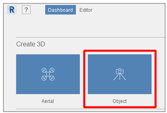
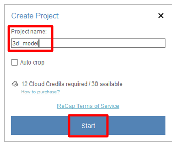
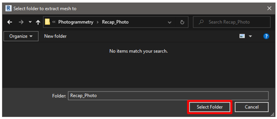
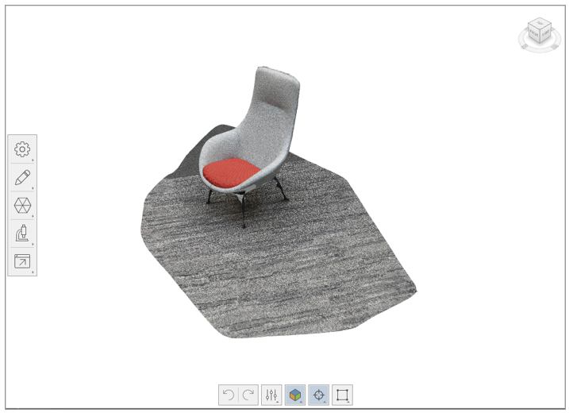
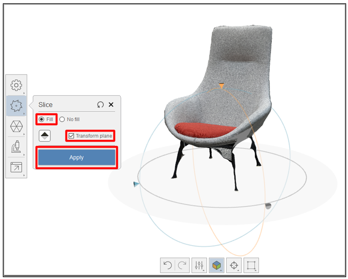
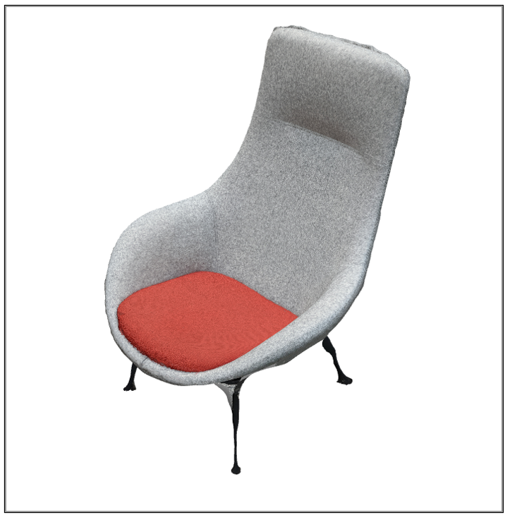
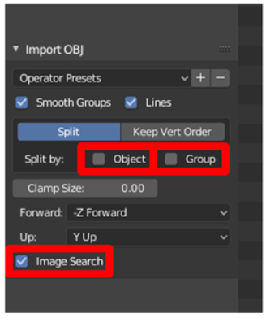
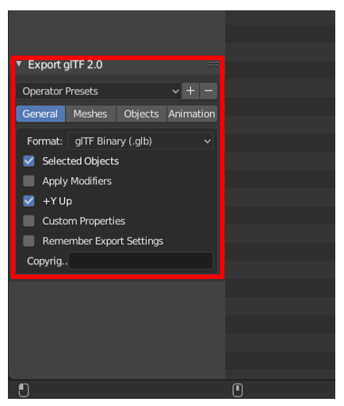
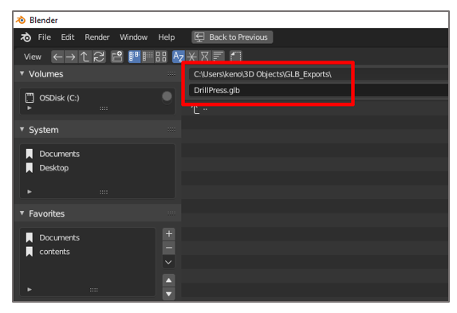
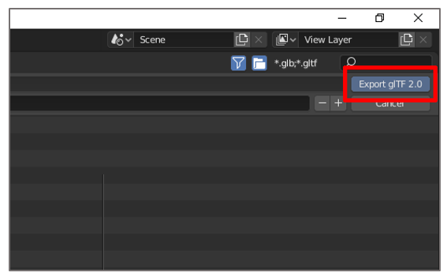

# Use Autodesk ReCap Photo to create 3D models for Dynamics 365 Guides and for mixed-reality components included in apps created with Power Apps

This tutorial guides you through the process of using Autodesk ReCap Photo photogrammetry software to create 3D models that can be used with Microsoft Dynamics Guides and for mixed-reality components included in apps created with Power Apps.

This tutorial is created only for informational purposes, to show how ReCap Photo works with Microsoft Dynamics 365 Guides and Power Apps. Microsoft Corporation isn't affiliated with, isn't a partner of, and doesn't endorse or sponsor Autodesk or any of its products.

## What is Autodesk ReCap Photo?

Autodesk ReCap Photo processes photographs that are taken from drones to create 3D representations of current conditions of sites, objects, and more. [Learn more about Autodesk ReCap Photo](https://www.autodesk.com/products/recap/overview).

## Installing Autodesk ReCap Photo

You can [sign up for a free trial](https://aka.ms/autodesk_recap_photo_overview) of Autodesk ReCap Photo.

## Photography tips

The following tips will help you take quality photos for photogrammetry:

- If you can, take photos in a location where lighting is consistent and doesn't cast shadows.

- Try to keep your own shadow out of the picture.

- Make sure that there are no moving objects in the background when you take the photos.

- If the camera that you're using has a high dynamic range (HDR) setting, turn the feature off, and try not to adjust the exposure of your photographs while you capture images.

- Take pictures about one meter apart while you circle the object.

- If you can, maintain a perpendicular location relative to the object while you take photos.

- If the object is large, move in a lateral motion from one end of it to the other, and change the height at each pass, until you've captured all surfaces.

## Start a new project

1. Open Autodesk ReCap Photo. When you first open Autodesk ReCap Photo, you see the dashboard.

    > [!NOTE]
    > On the dashboard, you can select either **Aerial** or **Object** to create a new 3D project. This tutorial covers the **Object** workflow.

2. Under **Create 3D**, select **Object**.

    

3. Click anywhere on the page that appears, according to the prompt, and then add the photos that you want to use to create your 3D model. After you've finished importing the photos, select **Create**.

    

4. On the **Create Project** page, enter a name for your project, and then select **Start** to process your photos. Processing can take some time, depending on the number of photos that you added and the speed of your internet connection.

    

    > [!NOTE]
    > At this point, you can use the **Autocrop** feature if you want. This tutorial shows how to crop the 3D model later in the process.

5. After your 3D model has been processed, it appears in the **My Cloud Drive** section of the dashboard. Select the **Download this project from the cloud** (down arrow) button to download your 3D model.

    

6. Select a location to save your model to, and then select **Select Folder**.

    

7. You see a new 3D model that has the name that you entered. Select the model to open it in the editor.

    

    Your 3D model is loaded on the editor page.

    

## Edit the 3D model

Several tools are available on the left side and at the bottom of the editor page. You can use these tools to clean up your 3D model. Experiment with these tools to clean up the parts of your 3D model that you don't want to keep. This tutorial shows how to remove the floor from the model.

1. At the bottom of the editor page, select the **Lasso/Fence** tool.

    

2. Use the **Lasso/Fence** tool to select everything except the object that you want to keep.

    

3. Press **Enter**, and then press **Delete**. You might have to repeat these steps a few times to remove most of the floor.

4. Select the **Slice** tool to remove the rest of the floor. This tool creates a slicing plane that you can use to cut away geometry below a specific point. The following settings are available in the **Slice** dialog box:

    - **Fill**: Select this option to close the model, based on the boundary of the open area of the model. In some cases, filling might not be easy.

    - **No Fill**: Select this option to leave the model as an open model.

    - **Transform plane**: Select this check box to align the plane so that the floor isn't visible.

    

5. When the model looks the way that you want it, select **Apply**.

The rest of the floor is now removed from your 3D model, and the mesh on the bottom is filled.

## Decimate the 3D model to help increase performance

After you've finished removing the parts of the mesh that you don't want to keep, you can decimate it to a polygon count that meets the [performance targets for Dynamics 365 Guides and Power Apps](https://docs.microsoft.com/dynamics365/mixed-reality/import-tool/optimize-models#performance-targets).

1. On the left side of the editor page, select the **Decimate mesh** tool.

    

2. In the **Decimate** dialog box, in the **Target face count** field, specify a polygon count that balances visual fidelity with performance requirements.

    > [!NOTE]
    > Unless precise geometry is very important to you, don't select the **Best geometry** check box, because it will remove your textures. The textures that are produced through photogrammetry add significant detail to the 3D model.

    

3. Select **Decimate all**.

The 3D model is now optimized and ready for export.

## Export the 3D model as an .obj file

Before you can use the 3D model in Dynamics 365 Guides and Power Apps, it must be in the GLB file format. In this step, you will export the model as an .obj file that can then be converted to a .glb file.

1. On the left side of the editor page, select the **Export** button, and then select the **Export model** button to open the export settings.

    

2. In the **Export model** dialog box, in the **Export as** field, select **OBJ** as the export file type, and then, in the **Size** field, select **4096x4096** as the texture size. When you've finished, select **Export**.

    > [!NOTE]
    > Although you can select a larger or smaller texture size, be aware that the size will affect either performance or visual fidelity. 

    

3. Select a location to save your file to, and then select **Select Folder**.

    

The 3D model is exported to the folder that you selected.

## Use Blender to convert the .obj file to a .glb file

There are several applications that you can use to convert an .obj file to a .glb file. This tutorial shows how to use Blender.

### What is Blender?

[Blender](https://www.blender.org/) is a free, open-source 3D creation suite. It supports the whole 3D pipeline: modeling, rigging, animation, simulation, rendering, compositing and motion tracking, and video editing and game creation.

If you use Blender to prepare your 3D models, review the information on the Blender website, and [download the latest version for Windows](https://www.blender.org/download/).

### Import your 3D model into Blender

1. Open Blender. A new scene is automatically created.
2. Right-click the cube, and then select **Delete** to delete it.

    

2. On the **File** menu, select **Import** \> **Wavefront (.obj)** to import the .obj file.

     command")

3. Under **Import OBJ**, follow these steps:

    1. Clear the **Object** and **Group** check boxes, and select the **Image Search** check box.

        

    2. Select **Import OBJ** in the upper right of the window. Blender imports the 3D model as a single item and searches the subfolder for any materials.

        

### Export the 3D model as a .glb file

The last step is to export the model as a .glb file, so that it can be used with Dynamics 365 Guides and Power Apps.

1. In Blender, on the **File** menu, select **Export** \> **glTF 2.0 (.glb/.gltf)**.

     command")

2. Under **Export glTF 2.0** in the lower left of the window, in the **Format** field, select **glTF Binary (.glb)**, and select the **Selected Objects** check box.

    

3. In the upper left of the window, enter a name for your file.

    

4. In the upper right of the window, select **Export glTF 2.0**.

    

## View a 3D model in Dynamics 365 Guides or Power Apps

After you've prepared a 3D model, use the following links to learn more about using the model in Dynamics 365 Guides or Power Apps

[Dynamics 365 Guides](../index.md)  
[Power Apps](https://docs.microsoft.com/powerapps/maker/canvas-apps/mixed-reality-overview)

## More information

Screenshots in this tutorial were taken from the Autodesk ReCap Photo software program to provide clear instructions about how to use the ReCap Photo software. To learn more about ReCap Photo and Blender, see the following pages:

- [Autodesk ReCap Photo](https://www.autodesk.com/products/recap/overview)

- [Blender](https://www.blender.org/)

Microsoft Corporation is not responsible for, and expressly disclaims all liability for damages of any kind arising out of the use of Autodesk ReCap Photo, or reliance on these instructions. This document is created only to provide general information to our customers and does not take into consideration any individualized business plans or specifications.

The use in this document of trademarked names and images is strictly for informative and descriptive purposes, and no commercial claim to their use, or suggestion of sponsorship or endorsement, is made by Microsoft Corporation.
