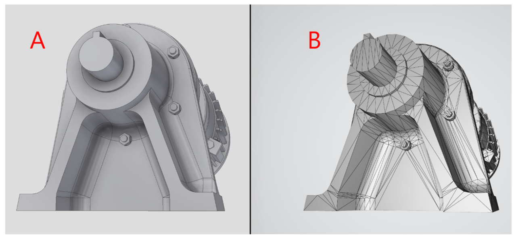
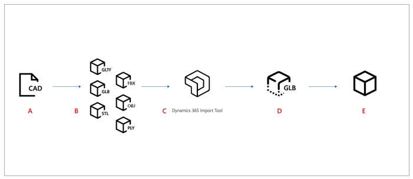

# Overview of preparing 3D models for Dynamics 365 mixed-reality applications

If you're using [!include[cc-microsoft](../../includes/cc-microsoft.md)] [!include[pn-dyn-365](../../includes/pn-dyn-365.md)] mixed-reality apps, you might want to import your own 3D models into the applications. This article shows you how to prepare your 3D models for use with [!include[pn-dyn-365](../../includes/pn-dyn-365.md)] mixed-reality apps by using a combination of third-party tools.

## glTF and GLB file formats
All geometry in [!include[pn-dyn-365](../../includes/pn-dyn-365.md)] mixed-reality apps uses the Khronos Group glTF file format. This royalty-free specification minimizes both the size of 3D models and the run-time processing needed to unpack and use those models. The GLB format is the binary version of .glTF version 2.0, which can include textures.

> [!TIP]
> The Khronos Group provides a robust overview of best practices: [Art Pipeline for glTF](https://aka.ms/glTFbestpractices).

## Parametric geometry vs. polygonal geometry

Modeling tools in most CAD applications use sets of adjustable mathematical parameters to define parametric solids. Parametric solids and surfaces provide highly accurate detail that can be used to carry out engineering simulations and manufacturing processes. Both glTF and real-time rendering applications require models to be represented as a triangulated polygon surface.

The following illustration shows a model visualized in Autodesk Inventor and [!include[cc-microsoft](../../includes/cc-microsoft.md)] 3D Viewer.
> [!div class="mx-imgBorder"]
> 

**A.**	Parametric 3D model ready for simulation and manufacturing 
**B.**	Polygonal surface 3D model ready for real-time rendering

## Overall process for preparing 3D models

Preparing CAD content for [!include[pn-dyn-365](../../includes/pn-dyn-365.md)] mixed-reality apps involves three main steps: 

1.	**Convert 3D models** from their original geometric definition into one that supports real-time rasterization. This converts the models from parametric geometry into polygonal geometry.

2.	**Optimize the converted 3D models** to ensure the best possible performance in real-time applications.

The following illustration shows a more detailed view of this process.

> [!div class="mx-imgBorder"]
>  

**A.**	Create 3D models using the CAD software of your choice. 
**B.**	Convert CAD files to one of these file formats: GLB, glTF, FBX, OBJ, STL, PLY. 
**C.**	3D models are optimized and converted into the GLB format. 
**D.**	3D models are ready to be imported into [!include[pn-dyn-365](../../includes/pn-dyn-365.md)] mixed-reality applications.

### See also
[Convert 3D models](convert-models.md) 
[Optimize 3D models](optimize-models.md) 
[Best practices for converting and optimizing 3D models](best-practices.md) 
[Tutorials for converting and optimizing 3D models](tutorials-overview.md) 
