# Use Dassault Systèmes SOLIDWORKS to prepare 3D models for use in Dynamics 365 mixed-reality applications

There are several ways you can optimize 3D models for mixed reality by using Dassault Systèmes SOLIDWORKS. This tutorial provides easy-to-follow procedures for each of these methods. Some of the procedures are redundant, so you might not need to use them all. Experiment with each procedure and decide what best suits your use case.

Sections of this tutorial are for 2019 and later only, and assume you've successfully installed the SOLIDWORKS XR Exporter on your local PC.  

> [!IMPORTANT]
> This document is created strictly for informative purposes to demonstrate how Dassault Systèmes SOLIDWORKS works with Microsoft Dynamics 365 mixed-reality apps. Your use of third-party applications is subject to terms between you and the third party. Microsoft is not affiliated with, is not a partner to, and does not endorse or sponsor Dassault or any of Dassault Systèmes' products. There are [other content-creation apps](convert-models.md#tools-for-exporting-cad-models) you can use to prepare your 3D models.

## What is Dassault Systèmes SOLIDWORKS?
SOLIDWORKS tools enable you to leverage 3D models throughout the organization, bringing processes together so you can get products to market faster. [Read more about SOLIDWORKS](https://www.solidworks.com/).

## Optimize 3D models by using SOLIDWORKS

You can use the features discussed in this tutorial to optimize 3D models for use in Dynamics 365 mixed-reality apps. Depending on how complex your model is, you might be able to just export it as a GLB file or you might need to use a combination of several features.

## Remove features with the Simplify tool

If your 3D model is extremely complex and you're having performance issues, you can optimize it with the **Simplify** tool.  The **Simplify** tool provides a wide range of options for simplifying your models to different levels, including internal part removal, small part removal, "defeaturing," and more. [Learn more about using the Simplify tool](https://help.solidworks.com/2018/english/solidworks/sldworks/t_simplifying_parts.htm).

1. Select **Tools** > **Find/Modify** > **Simplify**.

   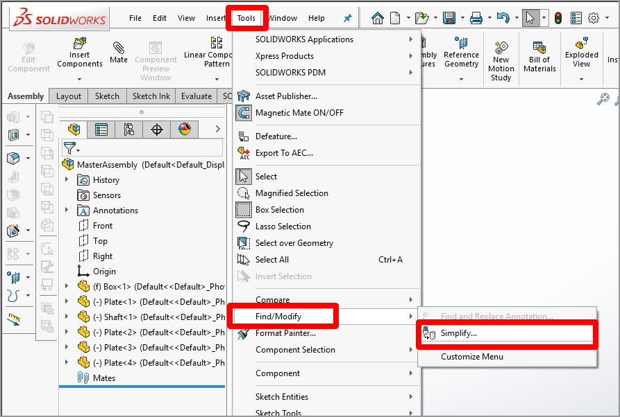

2. Choose from the following options:

   - **Features**. Decide which features you want to search for. Select **Fillets, Chamfers, Holes**, because these features create lots of polygons when transcoded.

   - **Feature Parameter or Volume Based.**  When you select the **Feature Parameter** option, SOLIDWORKS selects objects whose parameters (such as Fillet Radius) are smaller than the value in the **Simplification factor** field. When you select the **Volume Based** option, SOLIDWORKS selects objects if the feature volume is less than the volume of a part times the value in the **Simplification factor** field. Either method works fine. Selecting the **Volume Based** option and entering a value of **0.1** for the **Simplification factor** field provides a great first pass. If you don't find many objects, increase the **Simplification factor** value and try again. Select **Find Now** to see the results.

       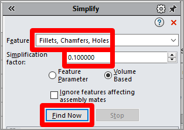

3. Select the **All** check box, and then select **Suppress**.

    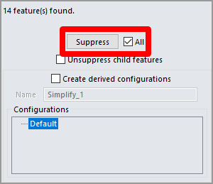

   The features you selected are removed from the model. If you find that features were removed that you wanted to keep, you can undo the process by clearing the **All** check box and selecting just the items you want to remove.

## Remove small parts with the Defeature tool

The **Defeature** tool provides another optimization option. You can use this tool both for removing parts (simplifying the geometry of your model) and for creating a silhouette of your model, which is useful when you just need to understand the basic shape of a complex model.

* Select **Tools** > **Defeature**.

    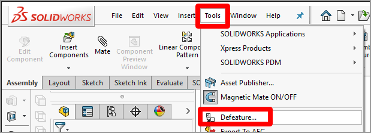

At this point, you can choose whether to [simplify your geometry](#simplify-geometry) or [create a silhouette](#create-silhouette).
<!--note from editor: I changed the wording of the following two procedure headings just to emphasize that they're subsets of the "Remove small parts..." heading. Also added these intra-topic links, which might be overkill but I do want to be sure people understand that they're parallel, and that they both follow the previous step of opening the Defeature tool.-->

### To simplify geometry

1. Select the **Simplify Geometry** button, and then select the **Next** button.  

    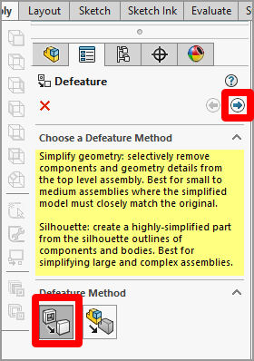

2. Select the **Internal components** check box, select the **Small components** check box, and then enter a percentage to use. We suggest starting with 1&nbsp;percent. This will often remove nuts, bolts, and washers from an assembly while leaving the more visually important components. You can increase this percentage if you need to remove more. Select the **Next** button when you're ready to move forward.

    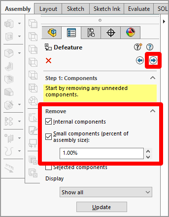

4. Select the **Next** button again to skip adding motion to the assemblies.

    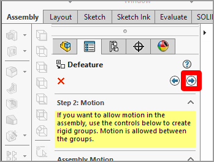

5. If you want to retain the detail for specific geometry areas, select them in the model; otherwise, they'll be optimized. You can also select the check boxes under **Auto-Select** to retain all holes or holes of a specific size. Select the **Next** button when you're done.

    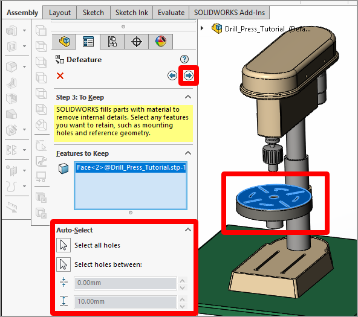

6. The tool "defeatures" the model. If anything remains that you wanted to remove, select it in the model. When you're done, select the **Next** button.

    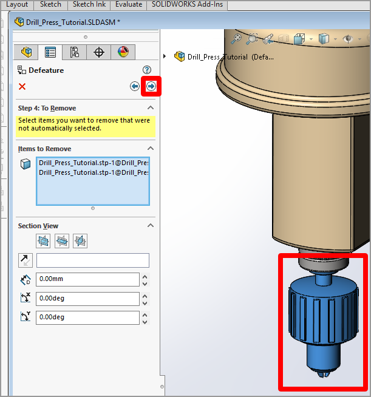

7. If the optimized model meets your needs, select **Save as a new document**, and then select the green check mark.

    

8. Name the model, and then select **Save**. The model is saved as a single SOLIDWORKS part file.

### To create a silhouette

1. Select the **Silhouette** button, and then select the **Next** button.

    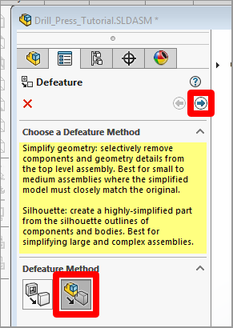

2. Highlight the entire model (or portions of the model, if you only want to modify certain parts), select an option under **Simplification Method**, and then select **Add Group**. For this example, we selected the **Tight Fit Outline** option, but feel free to experiment with other options.

    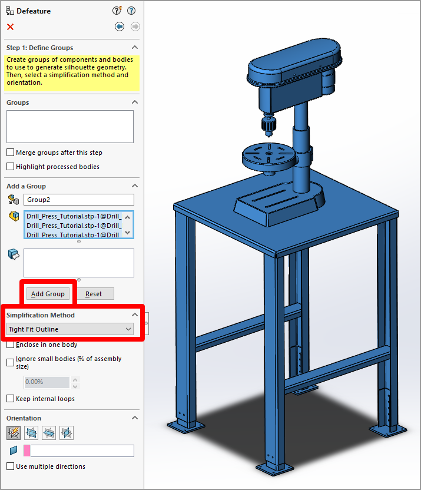

3. You'll see a preview window that shows what your silhouetted model will look like. When the model looks the way you want, select the **Next** button.

    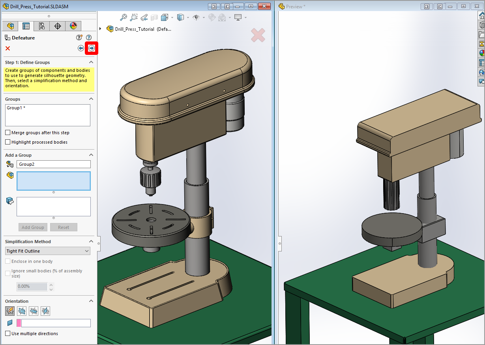

4. Select **Save as a new document**, and then select the green check mark to save the model.  

    

## Save an assembly as a part

Another technique is to save the 3D model assembly as a part file (.asm &rarr; .prt). When you do this, you can choose to hide internal geometry, which increases the performance of your 3D model and also helps maintain confidentiality about the inner workings of your designs.

1. Select the master assembly (or a subassembly), and then select **File** > **Save As**.

2. In the **Save as type** field, select **Part**.

    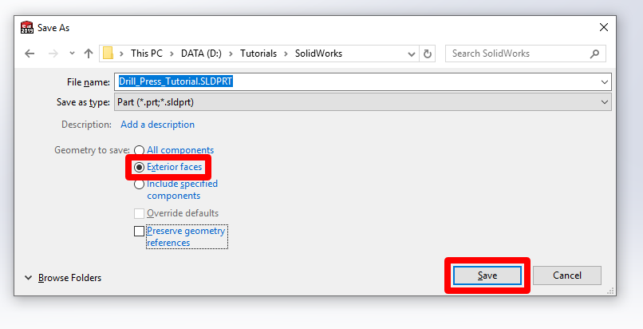

3. Under **Geometry to save**, select **Exterior faces**. This creates a part that only has the exterior faces showing. Any internal parts are filled, and the item becomes solid.

4. Select **Save**.

## Export the 3D model as a GLB file

After you optimize a 3D model, you can easily export it directly from SOLIDWORKS as a GLB file.  

1. Select **File** > **Save As**, and then select **Extended Reality Binary (.glb)** as the file type.

   

2. Select **Save**.

## Other conversion options

If you don't have SOLIDWORKS 2019 and the XR Exporter add-in, you need to do one of the following to convert your 3D model into a format that can be optimized:

- If you don't need to see material color, you can export your model as an STL file and import it directly into Dynamics 365 Import Tool (Preview). If it doesn't perform well, you can import the STL file into a digital content creation (DCC) application and optimize it further. See a [list of tutorials](tutorials-overview.md) on how to optimize your 3D models by using DCC apps.

- If you want to see material colors on your final product, you need to send your 3D model through a transcoder before optimizing it further. [This 3ds Max tutorial](3ds-max.md) walks you through the optimization and conversion process.

## View a 3D model in Dynamics 365 Guides and Power Apps

After you've prepared a 3D model, use the following links to learn more about using the model in Dynamics 365 Guides or Power Apps

[Dynamics 365 Guides](../index.md)  
[Power Apps](https://docs.microsoft.com/powerapps/maker/canvas-apps/mixed-reality-overview)

### More information

You can find more information about these products here:

[Dassault Systèmes SOLIDWORKS 2019](https://www.solidworks.com/)  
[Extended Reality (XR) Exporter](https://www.solidworks.com/beta/exporter.htm)

Several screenshots in this document were taken from the Dassault Systèmes SOLIDWORKS software program to provide clear instructions on how to use Dassault's software.

Microsoft Corporation is not responsible for, and expressly disclaims all liability for damages of any kind arising out of the use of Dassault Systèmes SOLIDWORKS, or reliance on these instructions. This document is created only to provide general information to our customers and does not take into consideration any individualized business plans or specifications.

The use in this document of trademarked names and images is strictly for informative and descriptive purposes, and no commercial claim to their use, or suggestion of sponsorship or endorsement, is made by Microsoft.  
