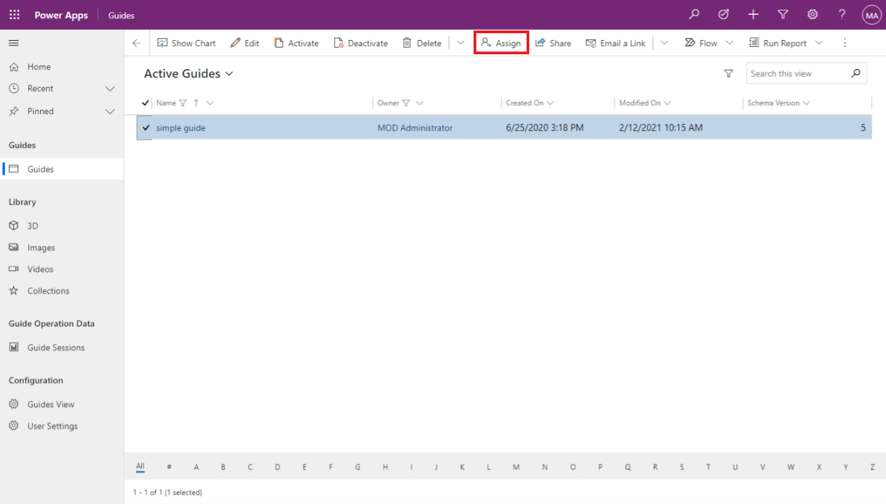
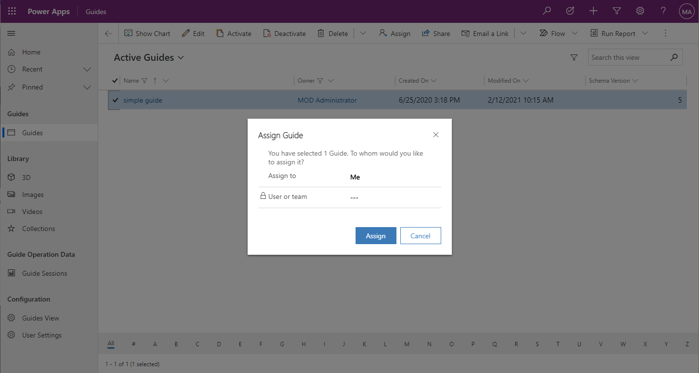
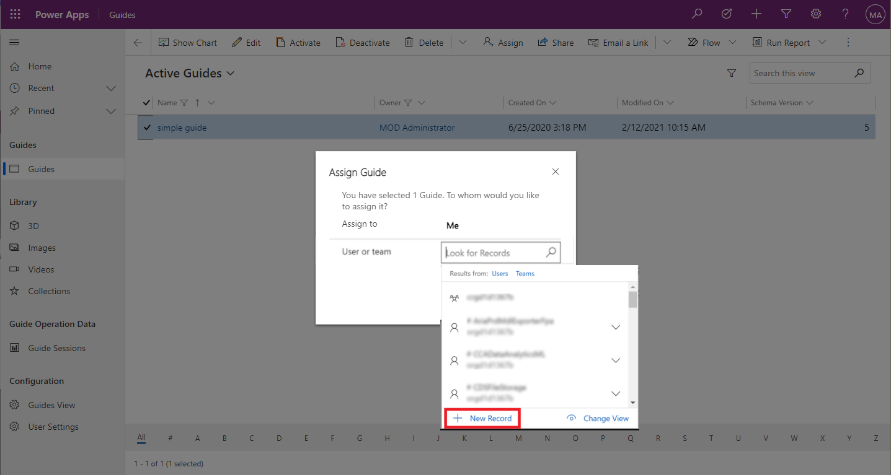

<!-- This article is a copy of the article below with the term "guide" updated to "guide".   A better solution will have to be found to "customize" core power apps support documents to address the specific D365 Guides user experience.  
https://docs.microsoft.com/en-us/powerapps/user/assign-or-share-records -->

# Assign or share guides

When you create a guide, you are the owner of the guide. If you would like another person in your organization to take ownership of the guide, then you can assign the guide to that person. You can assign a Guide to a user or team. You can also assign a guide to yourself that another user owns but you need to have system administrator privilege to do this.

If you want to keep ownership of the guide but let someone else work on it with you, then use the **Share** option to share the guide.

For more information on how privileges and access works, see [How access to a row (or guide) is determined](https://docs.microsoft.com/power-platform/admin/how-record-access-determined).

For more information on the three types of teams; *owner* team, Azure Active Directory (Azure AD) *group* team, or an *access* team , see [Manage Teams in Power Platform Security](https://docs.microsoft.com/en-us/power-platform/admin/manage-teams).

## Assign a guide to a user or an owner team

1. From a list of guide, select the guide that you want to assign to someone else. You can select multiple guides.

   > [!div class="mx-imgBorder"]
   > 

2. On the command bar, select **Assign**. 

   > [!div class="mx-imgBorder"]
   > 

  
3. In the assign dialog box, select the **Assign to** column, and choose one of the following options:
    - Select **Me** to assign the guide to yourself and then select **Assign**. Remember only a system administrator can assign a guide that belongs to someone else to themself.
    
      > [!div class="mx-imgBorder"]
      > 
    
    - Select **User or Team** and then enter the name of the user or team or use the lookup to find them. Or, select **New record** to create a new user or team. When you're done select **Assign**.

      > [!div class="mx-imgBorder"]
      > 

 
 ## Share a guide with someone else
 
 If you want to keep ownership of a guide but let someone else work on the guide with you then use the share option see [Use access teams to limit access to specific guides or guide content in Dynamics 365 Guides](https://docs.microsoft.com/en-us/dynamics365/mixed-reality/guides/admin-access-teams).

[!INCLUDE[footer-include](../includes/footer-banner.md)]