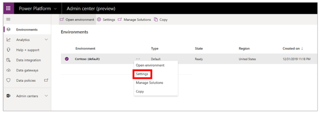
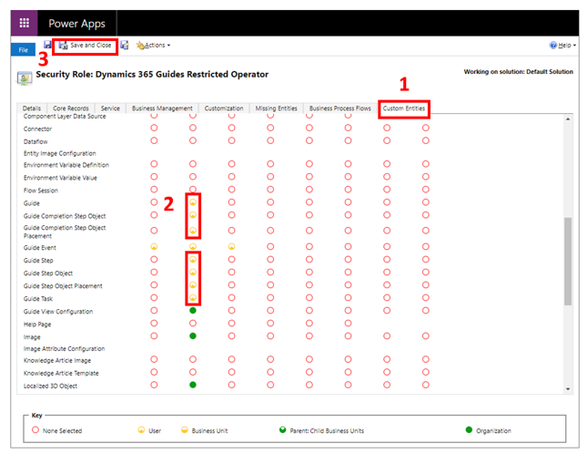
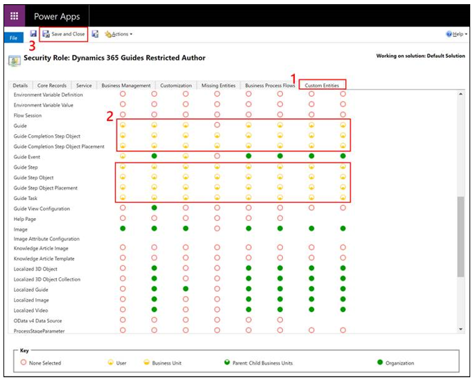
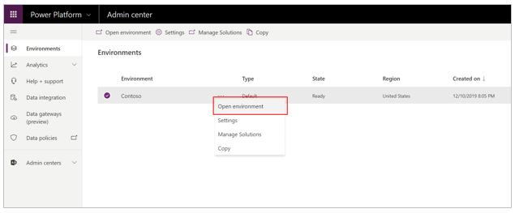
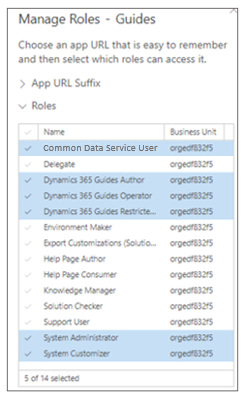
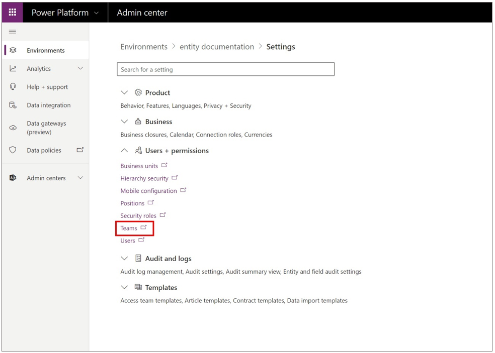
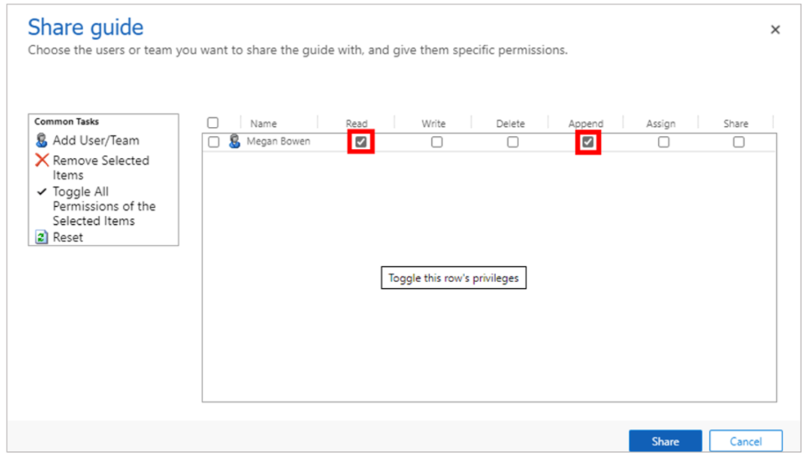

# Use access teams to limit access to specific guides or guide content in Dynamics 365 Guides

A Microsoft Dynamics 365 admin can use [access teams](https://docs.microsoft.com/dynamics365/customerengagement/on-premises/developer/use-access-teams-owner-teams-collaborate-share-information) to easily control who can see specific guides and guide content (3D models, images, or videos) in Dynamics 365 Guides. Access teams are useful when you want to grant different user permissions for specific records in [Common Data Service](https://docs.microsoft.com/powerapps/maker/common-data-service/data-platform-intro). For example, you might want access to some guides to be limited to a specific factory location, or you might want to limit access to guides that are in progress.

> [!NOTE]
> Dynamics 365 offers additional ways to customize and configure access to specific records in Common Data Service. However, this topic doesn't cover advanced configuration, such as the creation of [owner teams](https://docs.microsoft.com/dynamics365/customerengagement/on-premises/developer/use-access-teams-owner-teams-collaborate-share-information).

## How access teams work with the Operator and Author user roles

You can assign an Operator or Author role to a user to specify whether that user can create and edit guides or just use them. When you assign an Operator or Author role, that role automatically grants the user access to all guides in the instance. To limit access to specific guides or guide content (3D models, images, or videos), you must reduce privileges for the Operator or Author role and use access teams.

## Overall process for limiting access to a guide

The process for limiting access includes these basic steps:

1. Create a new security role that has reduced privileges.

2. Grant the new security role access to the Guides model-driven app.

3. Assign the new security role to a user or users.

4. Create an access team, and add users to it.

5. Share the guide with the access team.

This topic describes each of these steps in detail.

## Step 1: Create a new security role that has reduced privileges

To take advantage of access teams, the first step is to create a new Dynamics 365 security role that has reduced privileges for Guides. Users who are assigned this new security role will have access only to guides that have been shared with them either directly or via an access team.

> [!NOTE]
> This topic shows how to restrict access to the **Guide** entity. However, you can use the same basic steps to restrict access to other types of Guides records (3D models, images, or videos). In this way, you can limit visibility into those records to specific users or teams.

1. In the [Power Platform admin center](https://admin.powerplatform.microsoft.com/environments), on the **Environments** page, select an environment where a Guides solution is installed, select the **More environment actions** (**...**) button, and then select **Settings**.

    

2. On the **Settings** page, under **Users + permissions**, select **Security roles**.

    

3. Select the check box for the **Dynamics 365 Guides Operator** role, and then, at the top of the page, select **More Actions \> Copy Role**. By copying the role, you ensure that your changes won't be overwritten the next time that the Guides solution is updated.

    

4. Name the new role **Dynamics 365 Guides Restricted Operator**, and then select **OK**.

    

5. On the **Security Role: Dynamics 365 Guides Restricted Operator** page, on the **Custom Entities** tab, in the rows for the **Guide** entities, select the dots in following dots in the second column to change the Read privileges from the **Organization** level to the **User** level: **Guide**, **Guide Completion Step Object**, **Guide Completion Step Object Placement**, **Guide Step**, **Guide Step Object**, **Guide Step Object Placement**, and **Guide Task** (see the screen shot below). When you've finished, select **Save and Close** at the top of the page.

    > [!NOTE]
    > The **Key** section at the bottom of the page describes the different privilege levels. For more information, see [Security roles and privileges](https://docs.microsoft.com/dynamics365/customerengagement/on-premises/admin/security-roles-privileges).

    
    
6. To limit author access to specific guides:

    a. Clone the **Dynamics 365 Guides Author** role and name it **Dynamics 365 Guides Restricted Author**.

    b. On the **Security Role: Dynamics 365 Guides Restricted Author** page, on the **Custom Entities** tab, in the rows for the **Guides** entities, select the following dots and change the privileges from the **Organization** level to the **User** level. 

      

7. When you're finished, select **Save and Close** at the top of the page.

## Step 2: Grant the new security role access to the Guides model-driven app

The Guides model-driven app provides an interface that lets users share a specific guide or guide record with other users or teams. To enable new security roles, you must grant them access to the Guides model-driven app.

1. In the [Power Platform admin center](https://admin.powerplatform.microsoft.com/environments), on the **Environments** page, select the environment where the Guides solution is installed, select the **More environment actions** (**...**) button, and then select **Open environment**.

    

2. In the **Guides** app tile, select the **More Actions** (**...**) button, and then select **Manage roles**.

    

3. In the **Manage Roles - Guides** pane that appears on the right side of the page, select the check box for the **Dynamics 365 Guides Restricted Operator** role, but don't clear the selections for the other roles. Then select **Save**.

    

## Step 3: Assign the new security role to a user or users

To prevent specific users from having access to all guides by default, change the security role of those users to the new Dynamics 365 Guides Restricted Operator role. After that role is assigned, the users will be able to see only guides that have been shared with them.

> [!NOTE]
> This example shows how to restrict operator privileges. However, the procedure for restricting author privileges is similar.

1. In the [Power Platform admin center](https://admin.powerplatform.microsoft.com/environments), on the **Environments** page, select the same Guides solution, select the **More environment actions** (**...**) button, and then select **Settings**.

    

2. On the **Settings** page, select **Users**.

    

3. Select a specific user by selecting the user's full name.

    

4. Select **Manage Roles** to open the **Manage User Roles** dialog box, and then follow these steps:

    1. Clear the check box for the **Dynamics 365 Guides Operator** role.

    2. Select the check box for the **Dynamics 365 Guides Restricted Operator** role.

    3. Select **OK**.

    

## Step 4: Create an access team and add users to it

A user can be associated with more than one access team.

> [!NOTE]
> If you or someone else has already created an access team that you want to use, skip ahead to the next procedure.

1. In the [Power Platform admin center](https://admin.powerplatform.microsoft.com/environments), on the **Environments** page, select the same Guides solution, select the **More environment actions** (**...**) button, and then select **Settings**.

    

2. On the **Settings** page, select **Teams**.

    

3. Select **New**.

    

4. On the **New Team** page, set the **Team Name** and **Administrator** fields, change the value of the **Team Type** field to **Access**, and then select **Save**.

    

5. To add users to the team, select the plus sign (**+**) next to the **Team members** list.

    

6. Enter the name of the user that you want to add, select the **Search** button, and then select the user's name.

## Step 5: Share the guide with the access team

1. Go to <https://make.powerapps.com/>.

2. Select **Apps**, and then select **Guides**.

    

3. Find the guide that you want to share, select the check box next to the guide name, and then select **Share**.

    

4. On the **Share guide** page, select **Add User/Team**.

    

5. In the **Look Up Records** dialog box, follow these steps:

    1. In the **Look for** field, select **Team**.

    2. In the **Look in** field, select **All User Access Teams**.

    3. Select the check box next to the name of the access team that you want to share the guide with.

    4. Select **Select**, and then select **Add**.

    

### Share a guide with another user

All users who have access to the Guides model-driven app can share the guides and guide records that they have access to with other users.

1. Go to <https://make.powerapps.com/>.

2. Select **Apps**, and then select **Guides**.

    

3. Find the guide that you want to share, select the check box next to the guide name, and then select **Share**.

    

4. On the **Share guide** page, select **Add User/Team**.

    

5. In the **Look Up Records** dialog box, select the check box next to a specific user, select **Select**, and then select **Add**.

    

6. Make sure that the user has the **Read** privilege, and then select **Share**.

    

## See also

[Use access teams and owner teams to collaborate and share information](https://docs.microsoft.com/dynamics365/customerengagement/on-premises/developer/use-access-teams-owner-teams-collaborate-share-information) 
[Assign an Operator or Author role to a user](assign-role.md) 
[Restrict access to an instance in Dynamics 365 Guides by using security groups](admin-security.md) 
[Learn more about Dynamics 365 security roles and privileges](https://docs.microsoft.com/dynamics365/customerengagement/on-premises/admin/security-roles-privileges)
