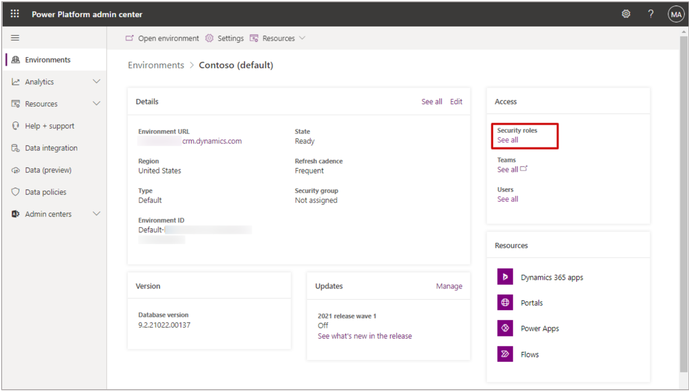
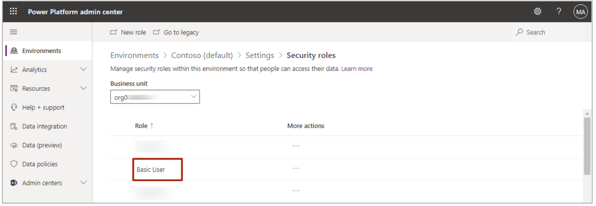
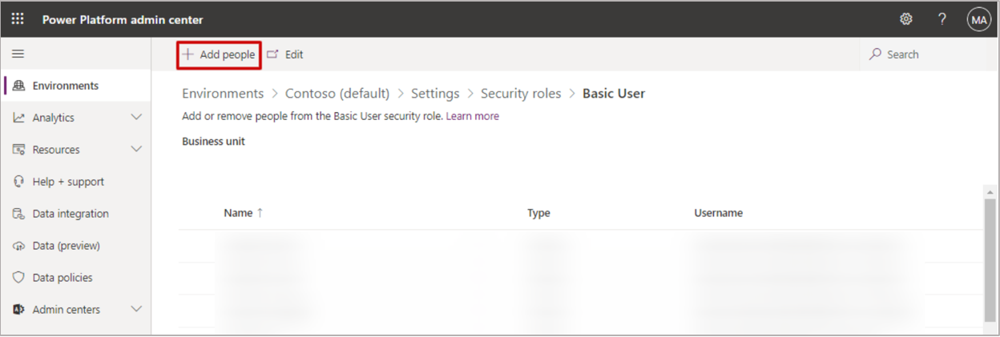
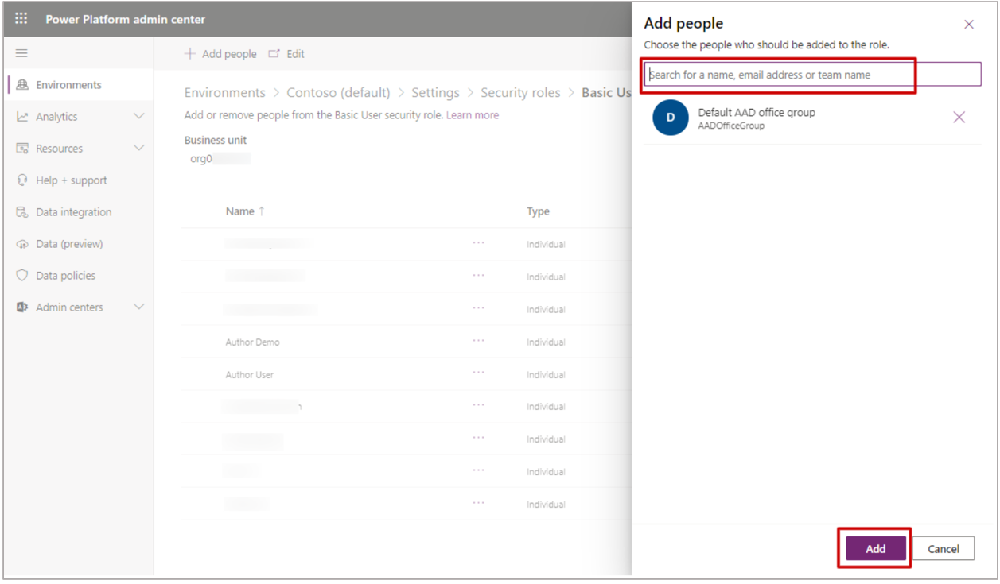
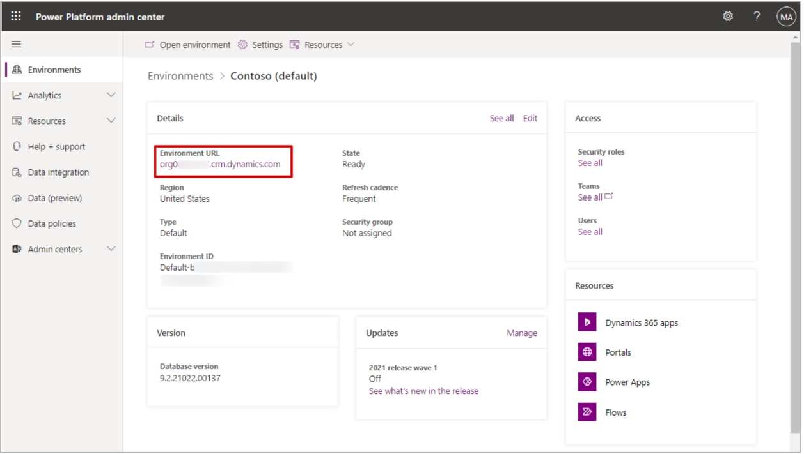
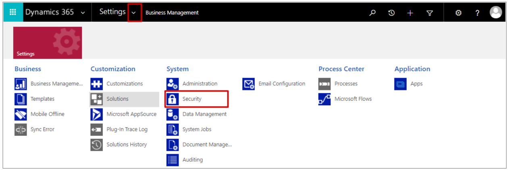
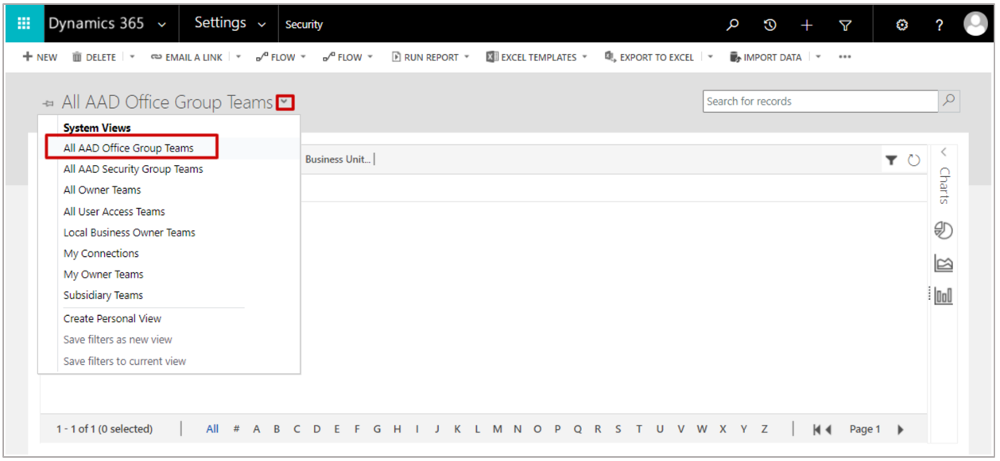
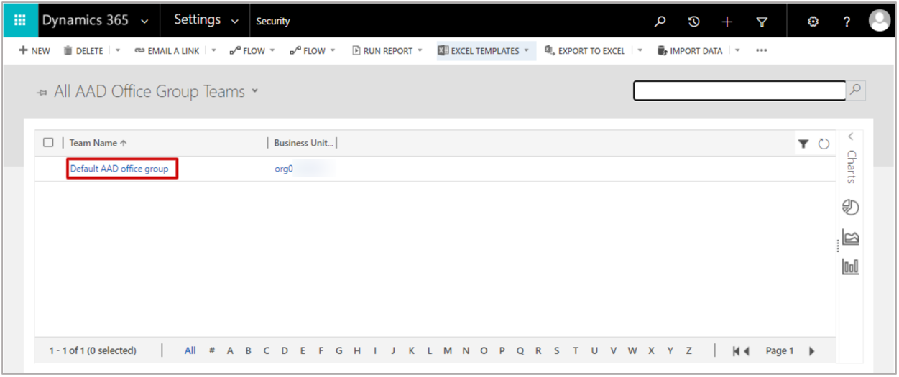

# Assign Author and Operator roles to a Dynamics 365 group team linked to an Azure Active Directory group

You can assign [Dynamics 365 Guides Author and Operator roles](admin-role-types.md) to a Dynamics 365 group team linked to an Azure Active Directory group to make it easier to organize and manage user roles. By linking Azure Active Directory Security groups or Azure Active Directory Office groups to a Dynamics 365 group team, Dynamics 365 Guides roles can be inherited by any user added to the Azure Active Directory group. To get an overview of Azure Active Directory groups and managing group teams, see the following links:

- [Groups in Microsoft 365 and Azure, and Which is Right for You](https://docs.microsoft.com/microsoft-365/community/all-about-groups)

- [Manage group teams](https://docs.microsoft.com/power-platform/admin/manage-group-teams)

> [!NOTE]
> SharePoint groups are not supported by Dynamics 365. Only Azure Active Directory Security groups or Azure Active Directory Office groups are supported by Dynamics 365 group teams.

## Create an Azure Active Directory group

To learn how to create an Azure Active Directory Security group or an Azure Active Directory Office group, see [Create a basic group and add members using Azure Active Directory](https://docs.microsoft.com/azure/active-directory/fundamentals/active-directory-groups-create-azure-portal).

## Create a Dynamics 365 group team

The type of group you create in Dynamics 365 depends on the type of Azure Active Directory group you're starting with (Security or Office). For more information, see [Create a group team](https://docs.microsoft.com/power-platform/admin/manage-group-teams#create-a-group-team).  

For more information on how to link an Azure Active Directory group to a Dynamics 365 group team, see [Manage group teams](https://docs.microsoft.com/power-platform/admin/manage-group-teams). 

> [!NOTE] 
> When setting a value for **membership type** by selecting one of the options (**Members**, **Members & Guests**, **Guests**, or **Owners**), be aware that this value determines which users in the group will flow into the Dynamics 365 group team. Setting the **membership type** is similar to setting a pass-through filter. For example, if **Members** is selected and a guest is added to the group, the guest will not flow down into the team and will not inherit the role from the Dynamics 365 group team.  

## Two ways to assign roles to a team

You can assign roles to a team in two ways: 

- Option 1: Assign a group team to a Dynamics 365 Guides role. In this case, the additions must be made to the Basic User role and any additional roles that you want to modify. This is the best option if you need to assign a role to many Dynamics 365 group teams.

- Option 2: Assign a Dynamics 365 Guides role to a group team. This is the best option if you need to modify a small number of Dynamics 365 group teams. For example, if you add the Author role to an Azure Active Directory Office group, anyone in the group will have a role that will allow them to create and edit a guide. The guide will be owned by the group.

### Option 1: Assign a group team to a Dynamics 365 Guides role

For this option, you'll update a role to include the Dynamics 365 group team that was created using the [Power Platform admin center](https://admin.powerplatform.microsoft.com/environments).

1. In the Power Platform admin center, select the environment that you want to update.

2. In the **Access** section, under **Security roles**, select **See all**.

    
 
3. Under **Role**, select **Basic User**. 

    
    
    > [!NOTE]
    > The **Basic User** role must be added to the group to enable Dynamics 365 Guides for the users in this group team. 

4. At the top of the screen, select **Add people**.

    
    
5. Search for the Dynamics 365 group team created above, select it in the search results, and then select **Add**.

    
 
6. Repeat the steps above for the [Dynamics 365 Guides role](https://docs.microsoft.com/dynamics365/mixed-reality/guides/assign-role) that you want to apply to this team. Dynamics 365 Guides roles include:

    - Dynamics 365 Guides Author
    
    - Dynamics 365 Guides Operator
    
    - Dynamics 365 Guides Restricted Author
    
    - Dynamics 365 Guides Restricted Operator

    [Learn more about the different Author and Operator roles](admin-role-types.md).

7. Repeat the above steps for any additional roles that you want to apply to the group team.

### Option 2: Assign a Dynamics 365 Guides role to a group team

For this option, you'll update the Dynamics 365 Guides role to include the Dynamics 365 group team created using the [Power Platform admin center](https://admin.powerplatform.microsoft.com/environments). For more information, see [Add roles to group teams](https://docs.microsoft.com/power-platform/admin/manage-teams).

1. In the Power Platform admin center, select the environment that you want to update.

2. In the **Details** section, select the **Environment URL** link to access the details for the environment.  

    

3. In the title bar, select the **Settings** button, and then select **Advanced Settings**.

      

4. In the Dynamics 365 screen, select the down arrow next to **Settings**, and then under **System**, select **Security**.

    

5. In the **Security** screen, select **Teams**.

    

6. At the top of the page, select the team type (**All AAD Office Group Teams** or **All AAD Security Group Teams**).

    
 
7. Select the team name to modify the team.

    

8. At the top of the page, select **MANAGE ROLES**.

    

9. Confirm that the **Basic User** role is selected, and then select any additional roles that you want to apply to the group.

    
    
    [Learn more about the different Author and Operator roles](admin-role-types.md).

> [!NOTE]
> The **MANAGE ROLES** command is not available on the group teams page if the check box to the left of a group team is selected.  **MANAGE ROLES** is available only in the context of a group team details page.  

## See also

[Learn about the different Author and Operator roles](admin-role-types.md) 
[Assign an Author or Operator role to an individual user](assign-role.md)

