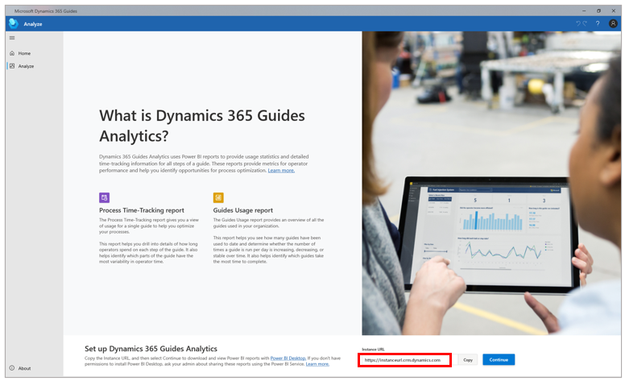
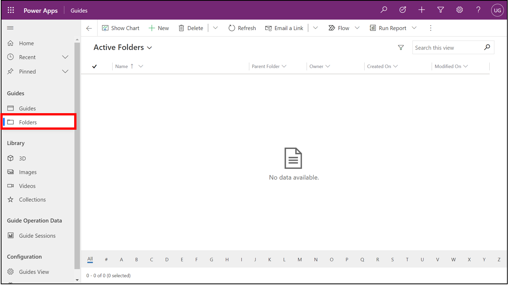
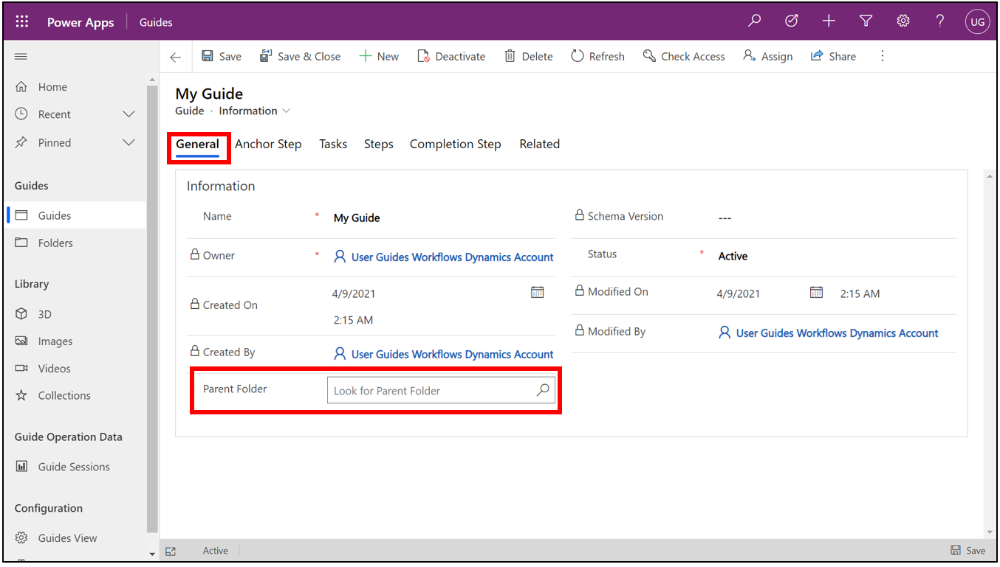
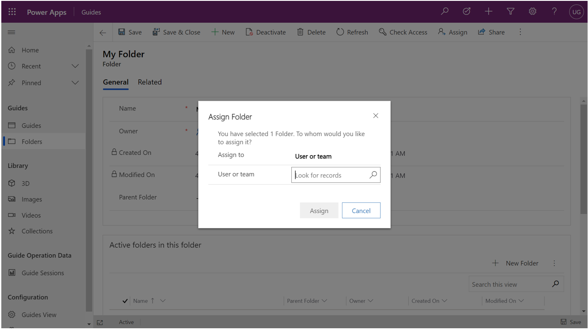

# Organize guides into folders in Dynamics 365 Guides (for admins)

If you're an admin or an author for Microsoft Dynamics 365 Guides, you can organize guides into folders. A folder can contain guides and subfolders, and each folder can be assigned an owner that is inherited by guides or subfolders in that folder. When you delete a folder, all items in that folder are also deleted. Folders are useful for managing groups of guides with the same permissions, such as guides for a specific team or product. Permissions assigned to folders do not give permissions to guides within those folders, however. 

## Create a folder

1. Sign in to the instance by using your admin or author credentials.

    > [!TIP]
    > To find the URL for the instance, select the **Analyze** tab in the PC app. The URL is shown in the **Instance URL** field at the bottom of the page. Copy this URL, and paste it into the address bar of your web browser.
    >
    > 

2. In Power Apps, select the **Guides** app tile.

    
    
3.	In the left pane, select **Folders** to view all folders created in the instance.

    

4.	At the top of the screen, select **New** to create a new folder.

     

5.	Enter the name and owner of the folder. You can select an existing folder in the **Parent Folder** field, or leave the **Parent Folder** field blank to create a folder at the root level.

6.	At the top of the screen, select **Save & Close** to save the folder and return to the folder list. After saving, you can add guides and subfolders to the folder.

## Add a guide to a folder

1.	In the left pane, select **Guides**, and then locate the guide you want to add to the folder.    

2.	On the **General** tab, in the **Parent Folder** field, enter the parent folder name or search for it.

    

3.	At the top of the screen, select **Save** or **Save & Close**.

> [!TIP]
> To move a guide back to the root folder, return to the guide details and delete the contents of the **Parent Folder** field.

## Change the owner of a folder

When you change the owner of a folder, any guides or subfolders within that folder will be assigned to that owner. This allows you to easily manage access for a group of related guides.

To change the owner of a folder:

1.	In the left pane, select **Folders** to view the list of folders in the instance.

2.	Go to the desired folder, and then at the top of the screen, select **Assign** to display the folder information.

    

3.	In the **Assign Folder** dialog box, select the box to the right of the **Assign to** label to toggle between **Me** and **User or team**. If **Me** is selected, the folder is assigned to you. If **User or team** is selected, you can enter the owner in the **User or team** field or search for an owner.

    

4.	Select **Assign** to save the new owner. 

## See also

[Create a guide](create-guide.md)

[!INCLUDE[footer-include](../includes/footer-banner.md)]
