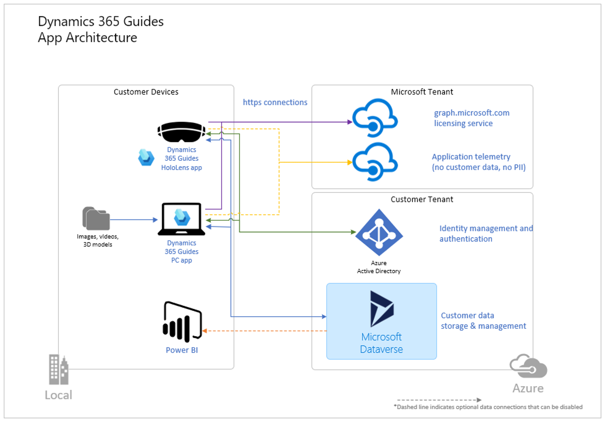
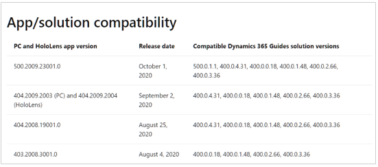
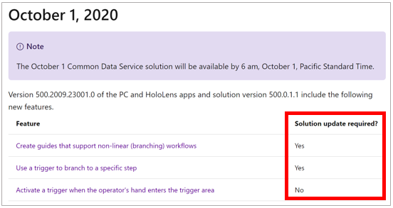
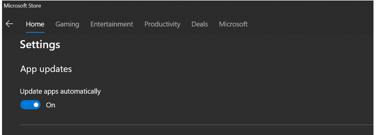
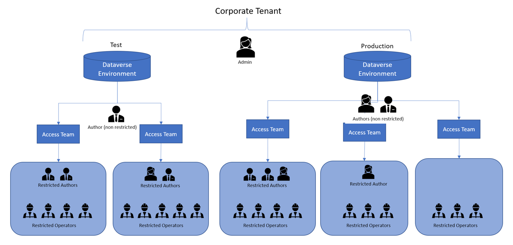

# Deployment Playbook for Dynamics 365 Guides

## Architecture
Dynamics 365 Guides is built on the Microsoft [Dataverse infrastructure](https://docs.microsoft.com/powerapps/maker/common-data-service/data-platform-intro), 
which provides end-to-end control over your deployment from server-side to client-side. A clear understanding of the Dynamics 365 Guides architecture will help you plan your deployment and manage updates. 

The following diagram shows the overall architecture:

Dynamics 365 Guides includes two client-side applications: the PC app (a Universal Windows Platform app), and the HoloLens app. Server-side data is stored in  
Dataverse within your customer tenant.

- A **tenant** is a representation of an organization. It’s a dedicated Azure Active Directory environment that an organization or app developer receives when the organization or app developer creates a relationship with Microsoft (like signing up for Azure, Microsoft Intune, or Microsoft 365).

- A **Dataverse environment** is a segmented database that securely stores and manages data that’s used by business applications like Dynamics 365 Guides. 
Data in Dataverse is stored in a set of tables similar to how a table stores data in a database. Dynamics 365 Guides uses a [custom set of Dataverse tables to store data](https://docs.microsoft.com/dynamics365/mixed-reality/guides/developer-entity-reference). 

    > [!NOTE]
    > You’ll often see the terms “environment”, “instance”, and “organization” used interchangeably to refer to a Dataverse environment. They all mean the same thing.

- The **Dataverse solution** refers to the database tables installed in your Dataverse environment where your Dynamics 365 Guides data is stored. 
When the Dynamics 365 Guides team updates the PC and HoloLens apps, they also update the solution. It’s important to [make sure that the PC and HoloLens apps that 
you’re using are compatible with the solution]().

## Test vs. production environments

A basic Dynamics 365 Guides deployment should consist of at least two Dataverse environments within your tenant: a test environment and a production environment.

You can use the test environment to validate any major updates before pushing them to your production environment, where Dynamics 365 Guides is being used by your end users.

> [!NOTE]
> "Production environment” in this case refers generally to the environment that your users access to do their daily work. This is not the same as the Dataverse “Production environment” that you select [when installing the Dynamics 365 Guides Dataverse solution](setup-step-two.md#compatibility-between-solution-and-apps).
  
Your Dynamics 365 Guides license allows you to access as many Dataverse environments as needed within your tenant.  

## Storage capacity 

You need at least 1 GB of database capacity to install the Guides Dataverse solution. [Learn how to check available capacity](https://docs.microsoft.com/power-platform/admin/capacity-storage#verifying-your-new-storage-model). As you add more content to your guides, you’ll need to monitor your database capacity.    

## Updating the Dynamics 365 Guides apps and the Dataverse solution

The Dynamics 365 Guides team updates the product on a monthly basis. Ensuring that you have a good workflow for getting the updates is key to preventing downtime while continuing 
to get the most advanced and stable releases.

There are three components included in every update:

- PC authoring app

- HoloLens app

- Dynamics 365 Guides Dataverse solution

    > [!IMPORTANT]
    > You should always update the PC and HoloLens apps first, and then the Dataverse solution. If you update the  solution before updating the apps, older apps 
    will not work with the newer solution version and will cause downtime.   
    
When updating the solution, schedule downtime with your team and make sure they’re not using the apps. An update can take over one hour if you have a large amount of 
content in your solution.

### Compatibility between solution and apps

Every release of Dynamics 365 Guides includes an update to the solution. The PC and HoloLens apps will always be backwards compatible with their ‘major’ version numbers. 
For example, version 4.0 of the PC app will always work with version 4.0 of the solution. When in doubt, [check the app/solution compatibility table](https://docs.microsoft.com/dynamics365/mixed-reality/guides/admin-apps-solution-compatibility).

### Major and minor updates — when you need to update the solution

The Dynamics 365 Guides team updates the apps and solution version numbers twice per year  for major updates: on April 1 and October 1. These major updates are mandatory 
if you want to use the latest versions of the apps and take advantage of new features and enhancements. You’re notified of these updates through admin communications. 

Minor updates are listed in [What's new](https://docs.microsoft.com/dynamics365/mixed-reality/guides/new), through in-app notifications, and through our [Dynamics 365 Guides forum](https://community.dynamics.com/365/guides). Some features in minor updates might require an update to 
the solution. The PC and HoloLens apps will continue to function if you don’t update the solution, but you won’t be able to use the new features in this case. Features 
that require a solution update are listed in [What's new](https://docs.microsoft.com/dynamics365/mixed-reality/guides/new).

 
To [update the solution](https://docs.microsoft.com/en-us/dynamics365/mixed-reality/guides/upgrade), you must have a Dataverse **System Admin** security role and a valid Dynamics 365 Guides or Power Apps license assigned. 

### PC and HoloLens app updates

The PC and HoloLens apps are managed through the Microsoft Store, which is pre-installed on HoloLens and most PCs. As a best practice, keep the **Update apps automatically** option turned on to ensure that you’re using the latest and most stable versions of the apps.

If the Microsoft Store is not available to you, you can request that your IT department add Dynamics 365 Guides to the Microsoft Store for Business. If this isn’t feasible, 
contact your Dynamics 365 Guides team or sales representative and request engineering support to facilitate direct installation of the applications. 

### Update management through Mobile Device Management (MDM)

As you plan your deployment with your IT department, also consider mobile device management solutions like [InTune to manage app updates](https://docs.microsoft.com/mem/intune/fundamentals/windows-holographic-for-business#deploy-and-manage-apps).

## Security and privacy

Dynamics 365 Guides is part of the Dynamics 365 application ecosystem, which is covered by the Microsoft cloud security framework. See [the Data Protection Resources site](https://servicetrust.microsoft.com/ViewPage/TrustDocumentsV3?command=Download&downloadType=Document&downloadId=a67eb07f-a1cb-4c54-afd6-f93c1fd67ef1&tab=7f51cb60-3d6c-11e9-b2af-7bb9f5d2d913&docTab=7f51cb60-3d6c-11e9-b2af-7bb9f5d2d913_FAQ_and_White_Papers) that covers compliance, privacy, security, and transparency topics. This document provides in-depth details on the overall security and compliance posture given the move of Dynamics 365 to be a first class SaaS built on top of Microsoft Azure platform. 

The [Microsoft Security Development Lifecycle (SDL)](https://www.microsoft.com/en-us/securityengineering/sdl/) consists of a set of practices that support security 
assurance and compliance requirements. The SDL helps developers build more secure software by reducing the number and severity of vulnerabilities in software, while reducing development cost.

### Network access 

Dynamics 365 Guides is a cloud-based application and may require that your network admin whitelist the IP addresses and/or endpoints required to connect to the Dynamics 365 servers. [Learn more about whitelisting IP addresses and URLs](https://docs.microsoft.com/power-platform/admin/online-requirements#ip-addresses-and-urls). 

## Access management and user roles

There are three levels of access management:

- Access to the Dataverse environment

- Access/permissions to content within the Dataverse environment

- Functional user roles that limit read/write/update activities to only designated authors and operators

### Control access to the Dataverse environment

You can use [security groups](https://docs.microsoft.com/dynamics365/mixed-reality/guides/admin-security#associate-a-security-group-with-an-instance) to control which users can access specific Dataverse environments. Security groups provide the highest level of access control and are intended for organizations with multiple business units (product divisions, for example) that don’t collaborate with each other or share content. You can also [use bulk processes to assign security groups](https://docs.microsoft.com/power-platform/admin/manage-teams#using-azure-active-directory-groups-to-manage-a-users-app-and-data-access).

### Control access to specific guides or content 

You can use [access teams](https://docs.microsoft.com/dynamics365/customerengagement/on-premises/developer/use-access-teams-owner-teams-collaborate-share-information) to control who can see specific guides and guide content (3D models, images, or videos). Access teams are useful when you want to grant different 
user permissions for specific records in Dataverse. For example, you might want access to some guides to be limited to a specific factory location, or you might 
want to limit access to guides that are in progress.

The following table describes the different roles and when to use each.

|Role	|Permissions	|When to use|
|----------------------------|----------------------------------------------------|--------------------------------------------------------|
|Admin|- Can install and update Dataverse solutions - Can create new Dataverse environments - Can assign security roles - Has access to all teams and environments |Required for administration of the Dynamics 365 Guides Dataverse solution  **Note:** A best practice is to have at least two admins to ensure coverage.|
|Author	|- Read/write access - Can access all guides in an environment|For top-level Dynamics 365 Guides authors|
|Operator	|- Read only - Can access all guides in an environment|For users that do not need to create or edit a guide|
|Restricted Author|- Read/write - Can only access guides that they create, are shared directly with them, or are shared through an access team|When an author only needs access to specific guides in the environment|
|Restricted Operator|- Read only - Can only access guides that are shared directly with them or are shared through an access team|When an operator only needs access to specific guides in the environment|

The following diagram shows an example of using Dataverse environments, access teams, and user roles to manage access to environments and guides.

> [!TIP]
> You can use Azure Active Directory security groups to [assign Dynamics 365 Guides security roles to batches of users](https://powerusers.microsoft.com/t5/Common-Data-Service-for-Apps/How-to-assign-security-roles-to-Microsoft-365-Groups-Security/m-p/648584). This is useful when you’re deploying Dynamics 
365 Guides to many operators and allows for a bulk operation rather than having to assign roles individually.
