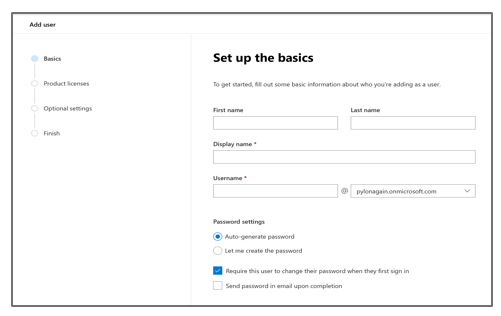
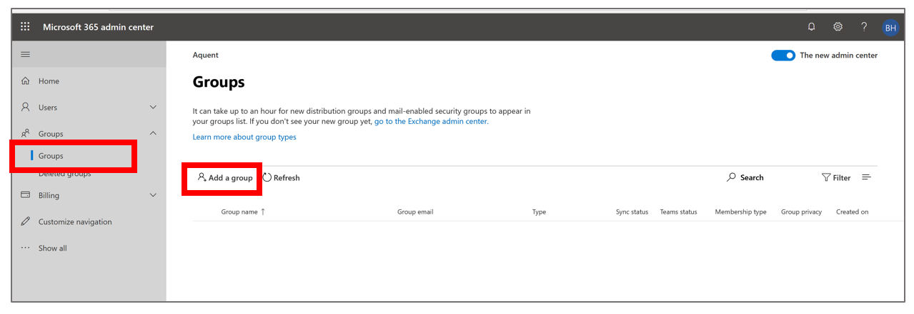
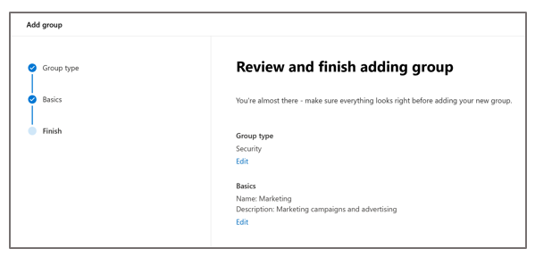
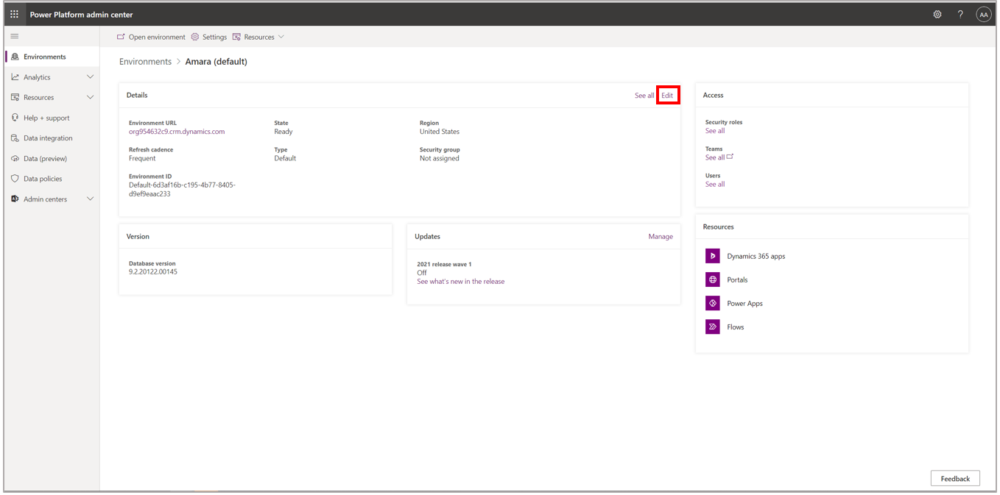
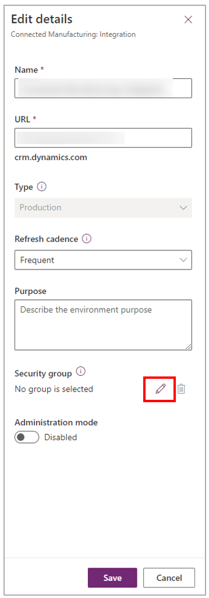

# Restrict access to an instance in Dynamics 365 Guides by using security groups

If your company has multiple instances of Microsoft Dynamics 365 Guides, you can use security groups to control which users can access each instance.

For example, you might want to create three security groups to control access to the following instances.

| Instance                       | Security group  | Purpose |
|--------------------------------|-----------------|---------|
| Coho Manufacturing Sales       | Sales\_SG       | Provide access to the organization that creates sales opportunities, handles quotations, and closes deals. |
| Coho Manufacturing Maintenance | Maintenance\_SG | Provide access to the organization that does service and machinery maintenance. |
| Coho Manufacturing Dev         | Developer\_SG   | Provide access to the sandbox instance that is used for development and testing. |

## Create a user and assign a license

Use this procedure if you haven't already created users and assigned licenses. If you've already completed those tasks, you can skip ahead to the next procedure.

1. Sign in to the [Microsoft 365 admin center](https://admin.microsoft.com/Adminportal/Home#/homepage).

2. In the left pane, select **Users** \> **Active users**, and then select **Add a user** to open the **Add user** wizard.

    

3. On the **Set up the basics** page, enter the user's first name, last name, display name, and user name.

    

4. Under **Password settings**, follow these steps:

    1. Select whether the password should be automatically generated, or whether you want to create it yourself.

    2. Select whether the user will be required to change the password the first time that he or she signs in.

    3. Select whether you want to send the password by email.

    When you've finished, select **Next**.

5. On the **Assign product licenses** page, select a location, select the **Dynamics 365 Guides** check box if it isn't already selected, and then select **Next**.

    

6. On the **Optional settings** page, add any roles or profile information that you want to add, and then select **Next**.

7. On the last page, review the settings, select **Finish adding**, and then select **Close** to close the wizard.

    > [!TIP]
    > You can also [add several users at the same time](/office365/enterprise/add-several-users-at-the-same-time).

## Create a security group and add members (users) to it

1. In the [Microsoft 365 admin center](https://admin.microsoft.com/Adminportal/Home#/homepage), in the left pane, select **Groups** \> **Groups**, and then select **Add a group** to open the **Add group** wizard.

    

2. On the **Choose a group type** page, select **Security**, and then select **Next**.

    

3. On the **Set up the basics** page, enter a name and description for the group, and then select **Next**.

    

4. On the **Review and finish adding group** page, review your changes, select **Create group**, and then, on the next page, select **Close** to close the wizard.

    

5. On the **Groups** page, select **Refresh** if you don't see your new group.

6. Select the group that you created, and then, in the pane that appears on the right, select the **Members** tab.

    

7. On the **Members** tab, select **View all and manage owners**.

    

8. In the dialog box that appears, select **Add members**.

    

9. Select the users to add to the security group, select **Save**, and then select **Close** two times to return to the **Groups** page.

> [!NOTE]
> To remove users from a security group, repeat this procedure, but select the **X** next to any member that you want to remove.
>
> 

## Associate a security group with an instance

1. In the [Microsoft 365 admin center](https://admin.microsoft.com/Adminportal/Home#/homepage), in the left pane, select **All admin centers**, and then select **Power Apps**.

    

2. In the Power Platform admin center, in the **Details** section, select **Edit**.

    

3. On the **Edit Details** tab, select the pencil button, select the security group, and then select **Save**.

    

## Additional information about security groups

Note the following points about security groups:

- When users are added to a security group, they are added to the instance.

- When users are removed from a security group, they are disabled in the instance.

- When a security group is associated with an existing instance that has users, any users in that instance who aren't members of the security group will be disabled.

- If no security group is associated with an instance, all users who have a license will be created as users and enabled in that instance.

- If a security group is associated with an instance, only users who have a license and who are members of the security group will be created as users in that instance.

- When you remove a security group that is associated with an instance, either by editing the instance and removing the security group, or by deleting the security group, licensed users who were members of that security group will have the same access to model-driven apps in Dynamics 365.

- When you assign a security group to an instance, the instance appears on the **Instances** tab in the Dynamics 365 admin center only for users who are members of the group.

- If you don't assign a security group to an instance, the instance appears on the **Instances** tab in the Dynamics 365 admin center even for users who haven't been assigned a security role in that instance.

- Nested security groups aren't supported.

> [!NOTE]
> All licensed users, regardless of whether they are members of security groups, must be assigned security roles to access model-driven apps in Dynamics 365. You assign security roles in the web application. Users can't access instances until they are assigned at least one security role for that instance. For more information, see [Grant users access](/power-platform/admin/grant-users-access).

## See also

[Add several users at the same time](/office365/enterprise/add-several-users-at-the-same-time)

[!INCLUDE[footer-include](../includes/footer-banner.md)]
