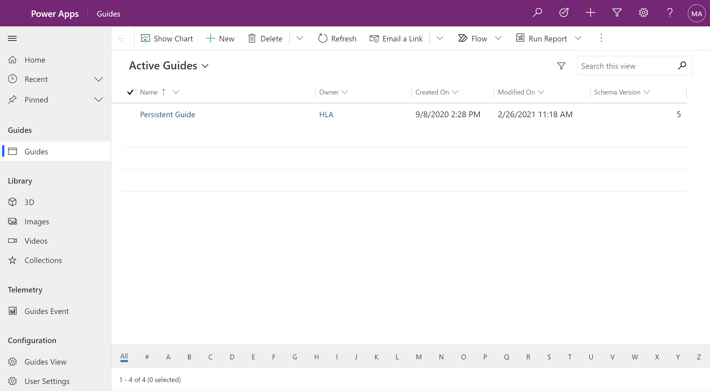

<!-- This article could be a redirect to the article below with the term "App" updated to "Guides model-driven app".   A better solution will have to be found to "customize" core power apps support documents to address the specific D365 Guides user experience.  
https://docs.microsoft.com/powerapps/user/assign-or-share-records -->

# Share the Guides model-driven app to provide access

> [!CAUTION] 
> The Guides model-driven app isn't intended as a replacement for authoring in the PC and HoloLens apps. If you use the model-driven app to create, update, or delete records, you might make Guides nonfunctional or prevent users from using the PC or HoloLens apps in the intended way. Currently, modification through the model-driven app isn't fully supported and should be reserved for experienced Dynamics 365 developers who are familiar with Microsoft Dataverse.

## Access the Guides model-driven app

Type [home.dynamics.com](https://home.dynamics.com) into the address bar of a web browser, login and then search for the **Guides model-driven app** in the **My Apps** section.

1. In the PC authoring app, sign in to the Dynamics 365 instance that includes the guide.

2. On the **Analyze** tab, select **Copy** to copy the **Instance URL** value, and then paste the value into the address bar of a web browser.

    

3. Sign in, and select the **Guides** model-driven app from the "Guides" menu on the left.

4. The interface for the Guides model-driven app will be available as  shown below:

## Limiting Access to the Guides model-driven app

When you create a guide in the PC authoring app, the content is stored inside the Dataverse. The Guides Model Driven Power App enables users to access and view guide content from the Dataverse quickly. Users can also make some modifications through the Guides Model Driven app including [deactivating a guide](admin-deactivate-guide.md) , [sharing content](admin-access-teams.md), or  [Creating a 3D object-collection](workflow-example-2.md).

It is common for organizations to limit the users who can access the Guides model-driven App. The Guides model-driven App is a type of Power App.    You can limit who in your organization can access the Guides model-driven App using the tools provided to manage access for Power Apps.  

Access to a Power App, like the Guides model-driven app, can be limited by sharing it with individual users, or access can be limited by sharing it with one or more Azure Active Directory Groups.  The detailed steps for either option is in the article [Share a model-driven app using Power Apps](https://docs.microsoft.com/powerapps/maker/model-driven-apps/share-model-driven-app)
