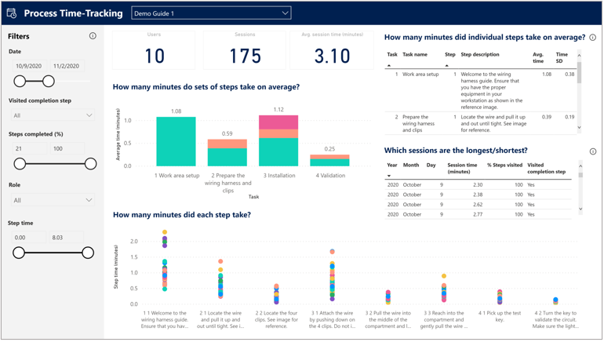
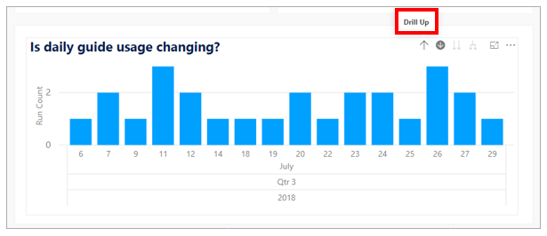
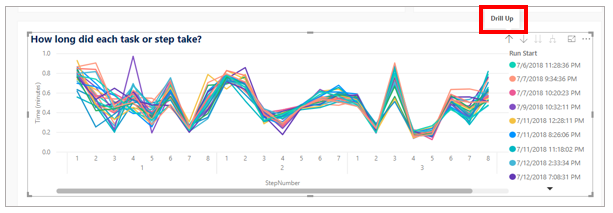

# What is Guides Analytics? 

Guides Analytics is part of the Guides application suite that also includes the Guides PC authoring app and the Guides HoloLens app. 
Use Guides Analytics to analyze the usage of guides across your organization. Guides Analytics consists of Power BI visual reports 
which are populated with Guides telemetry data stored securely in your Dynamics 365 environment. 

### What data is collected and used in Guides Analytics? 

When an operator uses the Guides HoloLens app in Operate mode, each gaze-and-commit interaction on the **Next step** and 
**Go back** buttons is recorded, together with the date and time of the interaction. Each operation of a guide in HoloLens 
Operate mode, whether completed from beginning to end of the guide or involving just a few steps, is called *a run*. The 
operator’s user ID and information about the guide, such as step number, task number, and guide name are also recorded. This 
data is stored in your private and secure Dynamics 365 environment.  

### What can you do with the data? 

The Guides Analytics reports are designed to help you answer high-level questions about guides usage. For example: 

- How many guides have been used to date? 
 
- Is the number of times a guide is run per day increasing, decreasing, or remaining stable over time? 

- Which guides take the most time to complete? 

You can also use Guides Analytics to drill into detailed time-tracking information at the task and step levels. For example, answer questions such as: 

- Which step of a guide takes the most time? 

- Which step of a guide has the most variability in operator time? 

These reports provide information about operator adoption and usage and give guide authors a data-driven way to improve their 
guides. For example, an author could focus their editing efforts on steps that take a long time to execute or show a high 
degree of variability among operators. These reports are also valuable in training scenarios for both trainers and trainees 
to better understand performance and improvement over time.  

## Open Guides Analytics 

### Set up your reports for the first time 

You can set up Guide Analytics for the first time through the Guides PC authoring app.

> [!NOTE]
> Guides Analytics requires the freely available Power BI Desktop application. If you don’t have permission to install Power BI Desktop on your computer, ask your admin about Sharing the reports through the Power BI Service. 

To set up your reports:
 
1.	In the Guides PC authoring app, select the **Analyze** tab.
   
      
 
2.	On the **Analyze** tab, copy the highlighted Instance URI text, and then select **Continue** to go to the [Microsoft Download Center](https://www.microsoft.com/en-us/download/details.aspx?id=57767). 

     
 
3.	In the Microsoft Download Center, select the **Download** button. You’ll be prompted to choose which files to download: 

   - **Guides Analytics Template.** You can configure this Power BI template file to display Guides time-tracking data from within your organization. This is the main component of Guides Analytics. 
   
   - **Guides Analytics Demo.** You can use this Power BI file to view an example data set. It does not require any configuration and lets you get an overview of Guides Analytics before you even create your first guide.  

     We recommend downloading both files. 

        
  
4.	Open the downloaded Guides Analytics Template.pbit file with Power BI Desktop. Use your Guides username and password if you’re prompted to sign in to Power BI.  
 
5.	When prompted, paste the Instance URI into the text box as shown below. This is the same Instance URI you copied from the **Analyze** tab in the PC authoring app in Step 2. 

    
 
     You may see the following error message saying you aren’t signed in: 
  
    

    In that case, select the **Sign in** button and enter your Guides username and password to connect the template to your organization’s secure Dynamics 365 environment. 

6.	You should now see the template populated with data from your own guides. If you have not operated any guides yet, your reports may appear blank. The reports are described in detail in **Take a tour of reports** later in this topic.
 
    
 
7.	Save the configured reports to a convenient place on your computer for later use. 

8.	Select the **Refresh** SCREEN SHOT GOES HERE button on the Home ribbon to update your reports with the most recent Guides data. 
  
 
### Open your reports 

Once you have set up and saved the Guides Analytics Template on your computer, simply launch Power BI Desktop and open your saved report. Power BI Desktop has a **File – Open – Recent** items list that is convenient for finding your previously opened reports.  

## Take a tour of reports 

Both the Guides Analytics and Guides Analytics Demo apps contain two reports: Guides Usage and Process Time-Tracking.

### Guides Usage report

The Guides Usage report provides an overview of all the guides used in your organization. The following graphic illustrates the parts of the report.

 
 
1.	Which guides are included in the report.

   Use the drop-down menu to select which guides are used to generate the visuals and statistics in the report. Changing the selection in this drop-down changes the values in all parts of the report. By default, the **All** option is selected to give you an overview of all your organization’s guides.
   
2.	Use the summary statistics to quickly answer the following questions:

   - **Guides.** How many guides have been used by at least one operator to date? 
   
   - **Users.** How many users have operated at least one guide to date? 
   
   - **Devices.** How many devices have been used to operate at least one guide to date? 
   
   - **Runs.** How many total runs have been completed to date? 
   
3.	Is daily guide usage changing? 

   The bar chart of run counts (y-axis) per day (x-axis) allows you to see trends such as increasing, decreasing, or stable daily guides usage.  

   **Drill up/Expand to the next level.** In Power BI, dates have a hierarchy of year, quarter, month, day. By default, this bar chart displays run counts per day. To see total run counts per month, first select the chart and then select the **Drill Up** button in the upper right-hand corner of the chart.
   
   
  
   To return to the per day view, select the **Drill Mode** button, and then select the month bar you want to drill into.  

   

Alternatively, select the **Expand to the next level** button to drill back down.  
  
   
 
   **Filter by Date.** Change the date range by using the Filter by Date slicer. Select the start or end date to set them manually, or move the slider.
   
> [!NOTE]
> The date filter is applied to all visuals and statistics in the report. 

4.	What is the most frequently used guide? 

   The bar chart of run counts (x-axis) per guide (y-axis) allows you to quickly identify which guides are used most and least in your organization (top and bottom of the chart respectively). If you have many guides, you may need to scroll within this chart. 
   
5.	What is the average run time per guide? 

   The bar chart of average run time in minutes (x-axis) per guide (y-axis) allows you to quickly identify the guides that take the most or least amount of time to operate (top and bottom of chart respectively). If you have many guides, you may need to scroll within this chart. 

### Process Time-Tracking report

Use the Process Time-Tracking report to drill into usage and step-level run time data for a single guide. 

 
1.	Which guides are included in the report?

   Use the drop-down menu to select a single guide. Changing the selection in the drop-down changes the values in all parts of the report to correspond to data for that single guide. 
   
2.	Use the summary statistics to quickly answer the following questions: 

   - **Users.** How many users have run this guide at least once? 
   
   - **Devices.** How many devices have been used to operate this guide at least once to date? 
   
   - **Runs.** How many total runs of this guide have been completed to date? 
   
3.	Is daily guide usage changing? 

   This is the same chart that’s shown in the Guides Usage report described above. 
   
4.	How long is a guide run in minutes? 

   You can see the average run time of this guide, in addition to the longest run time (max) and shortest run time (min) in minutes to get an overview of how long this guide takes to operate.  
   
5.	How long did each task or step take? 

   This line chart shows the time in minutes (y-axis) for each step of a guide (x-axis) to give you a sense for which steps take the most time and which steps have the most variability in run time. Each run of the guide is shown as a separate colored line. The chart legend provides a list of all runs sorted by run start time. 
   
   **Drill up/Drill down/Expand to the next level.** By default, this chart shows the run time in minutes per step. The x-axis indicates both the step numbers (upper labels) and parent task labels (lower labels). Guide tasks and steps are organized into a hierarchy. 

   To change the view from the step level to the task level, first select the chart and then select the **Drill Up** button in the upper right-hand corner of the chart.  

   
   
   To return to the step view, select the **Drill Mode** button, and then select the task you want to drill in to.
  
   
 
   Alternatively, select the **Expand to the next level** button to drill back down. This option will expand all tasks to the step level, whereas the **Drill Mode** only drills into the data item you selected. 
   
   
  
6.	Select a recent run 

   To view data for a single recent run, select it from the run table. By default, this table is sorted by the **Run Start** time with the most recent run on the top. You can also select the column headers to sort by **Run Time** or **User Name**. If you select a single row in this table, all visuals and statistics will be filtered to just that single run. 
   
7.	Filter by Date or Step Time (minutes) 

   There are situations in which you might want to filter the report to show just runs generated in a particular date range or runs that are within some step time range. For example: 
   
   - **Compare versions of a guide.** The date filter is particularly useful if you made a revision to your guide (for example, added or removed a step) and you want to show data for a given version of the guide that can be identified based on the date the guide was created or edited. 

   - **Filter outliers.** Unusually long step times can stretch the y-axis of the time per step line chart, which can make the majority of data difficult to see. Use this slider to set the range of step times you want to visualize across the report so you can ignore the outliers.  

## Share the Guides Analytics reports 

You can share your Guides Analytics Power BI reports within your organization by publishing them to the Power BI Service. This allows anyone in your organization with a Power BI Pro license to access the report through the Power BI Service web interface accessible at [https://powerbi.microsoft.com](https://powerbi.microsoft.com).  

Power BI provides several mechanisms for sharing reports with others in your organization. We recommend reading [Ways to share your work in Power BI](https://docs.microsoft.com/en-us/power-bi/service-how-to-collaborate-distribute-dashboards-reports) for an overview. A great way to share your reports within your organization in a read-only fashion is to publish them as a Power BI app. This involves the following well-documented steps: 

1.	[Create a workspace in the Power BI Service](https://docs.microsoft.com/en-us/power-bi/service-create-workspaces) 

2.	[Publish your Guides Analytics reports to this workspace using Power BI Desktop](https://docs.microsoft.com/en-us/power-bi/desktop-upload-desktop-files) 

3.	[Publish the contents of your workspace as an app in the Power BI Service](https://docs.microsoft.com/en-us/power-bi/service-create-distribute-apps)  
 
### See also

[Authoring a guide (overview)](authoring-overview.md)
[Operating a guide](operator-guide.md)
[FAQ](faq.md)

