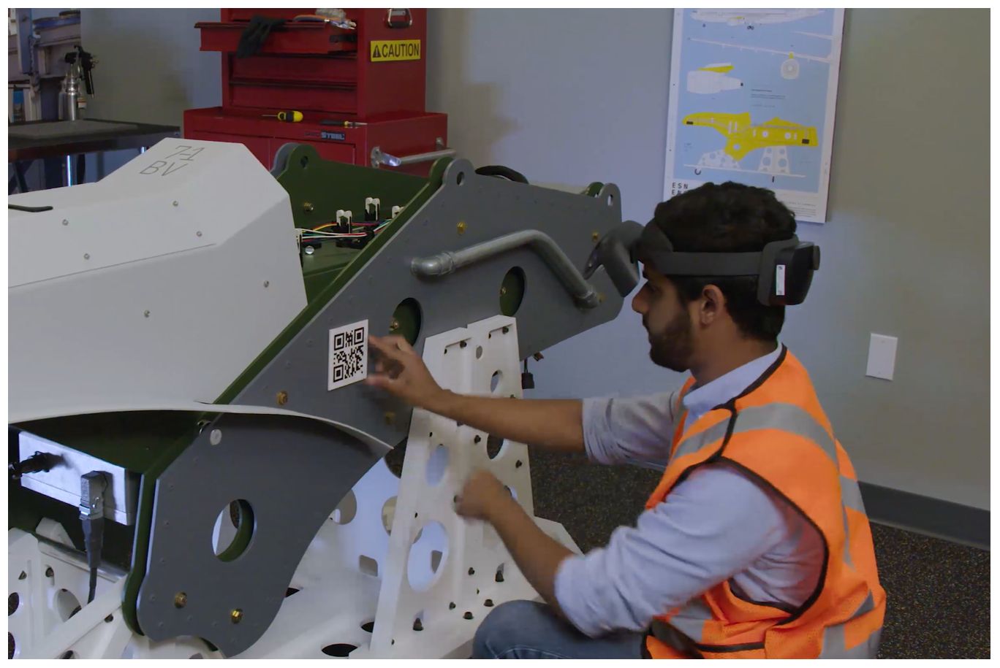
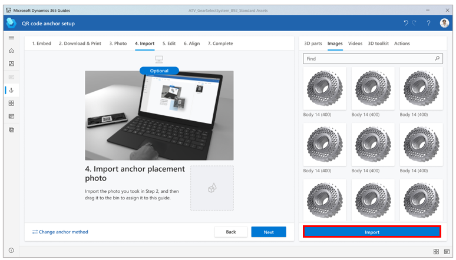
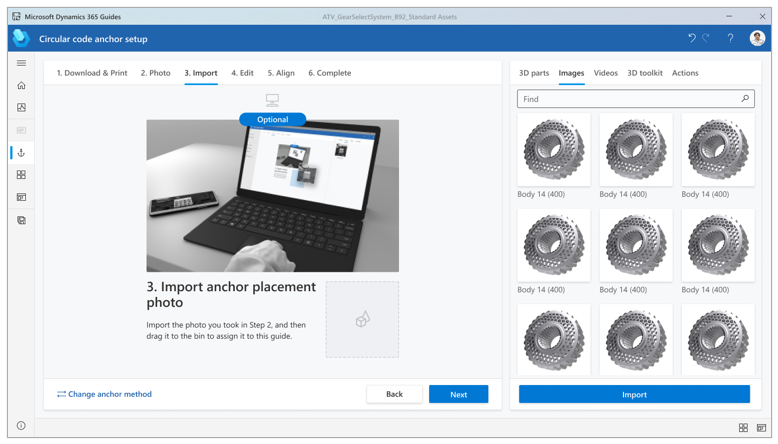
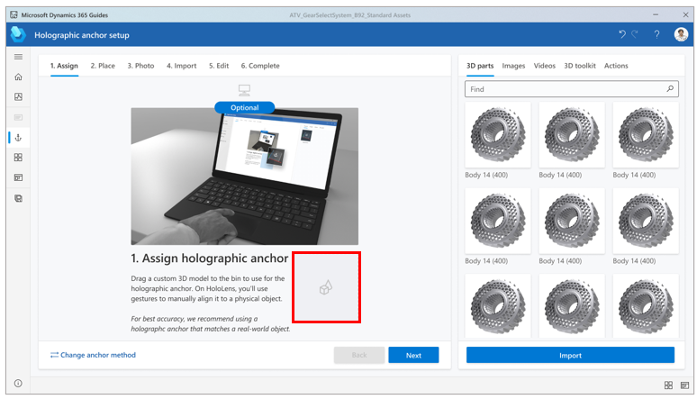
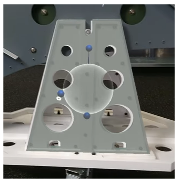
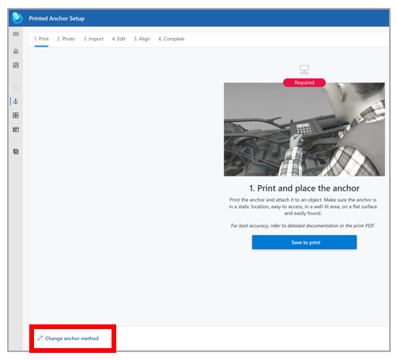

# Anchor your guide to the real world in the Dynamics 365 Guides PC app

When you create a guide with the [!include[pn-dyn-365-guides](../includes/pn-dyn-365-guides.md)] PC app, one of the first steps is to choose an anchoring method. When you anchor a guide, you synchronize it spatially with your real-world environment (for example, a factory floor). Anchoring is how holograms know where they are in the real world. You must create an anchor for your guide for it to work on [!include[pn-hololens](../includes/pn-hololens.md)].

It's crucial to ensure that your guide alignment is correct and as precise as possible. If the guide is misaligned, your instructions may show actions at incorrect locations, which can result in operator confusion or damage to parts.

## Three ways to anchor a guide

There are three ways to anchor a guide:

- **QR code anchor (recommended)**. With a QR code anchor (new in the February release of Dynamics 365 Guides), you align a guide by gazing at (scanning) a printed QR code anchor attached to a physical object in the real world. A QR code anchor is recommended because it's the most accurate and you can print the anchor at different sizes.

   >[!NOTE]
   >QR code anchoring is not available on HoloLens 1 devices.

- **Circular code anchor**. With a circular code anchor (referred to as a "printed anchor" in earlier versions of Dynamics 365 Guides), you align a guide by gazing at (scanning) a printed circular code anchor attached to a physical object in the real world.

- **Holographic anchor**. With a holographic anchor (referred to as a "digital anchor" in earlier versions of Dynamics 365 Guides), you align a guide to a digital 3D hologram overlaid on a physical object in the real world. You might need to use a holographic for any of the following reasons:

   - It might not be feasible to attach a QR code anchor or circular code anchor because the authoring is done in a location different than where the parts are located.

   - It might not be feasible to attach a QR code anchor or circular code anchor due to moving parts.

   - You can't guarantee that the placement of the QR code anchor or circular code anchor will be the same every time.

   - A part is too small to attach a QR code anchor or circular code anchor.

[!include[pn-dyn-365-guides](../includes/pn-dyn-365-guides.md)] includes an **Anchor** wizard that makes it easy to select and set up the most appropriate anchor type for your situation.

## Anchor your guide by using a QR code anchor

Creating a QR code anchor involves four basic steps:

1. Use the **Anchor** wizard to select the QR code anchor method.

2. Print the anchor from the PDF file that the **Anchor** wizard creates.

3. Attach the anchor to a physical object in the real world.

4. Gaze at the anchor on [!include[pn-hololens](../includes/pn-hololens.md)] to anchor the guide.

### Set up a QR code anchor

You can access the **Anchor** wizard from the **Outline** page. The **Outline** page automatically appears after you create or open a guide.

1. On the **Outline** page, select **Set your anchor now**.

    

2. On the **Choose an anchor method** page, select the button for the QR code anchor.

    

3. In step 1 of the wizard, select **Download QR code** to create a PDF file named **Guides-QRCodeAnchor**. This file includes the anchor that you'll print in step 5.

    

4. On your computer, in Adobe Acrobat Reader, open the **Guides-QRCodeAnchor** file.

5. Print the last page of the document on matte stock (glossy materials can affect scanning). Bubblejet printers produce a better matte finish.

6. After printing, make sure the anchor measures between 97 to 400 mm wide (based on [Version 1 QR code recommendations](https://www.qrcode.com/en/about/version.html)).

6. Attach the QR code anchor to a physical object in the real world, and then take a picture to help the operator find it.

7. Go back to the **Anchor** wizard in the PC app, and then select **Next** two times (you can skip step 2 of the wizard if you already took a picture of the anchor placement). 

8. In step 3 of the wizard, select **Import** to import the picture that you took in step 6. Then drag it to the **Import anchor placement photo** box. When you're finished, select **Next** to move to the next step.

    

9. In step 4 of the wizard, if you want to change the default instructions for the operator, select **Edit step card text**, and then enter your instructions. When you're finished, select **Next** to move to the next step.

    

10. Put on your [!include[pn-hololens](../includes/pn-hololens.md)], open your guide, and then gaze at the QR code anchor to anchor the guide.

    

### Best practices for QR codes

Keep the following in mind when working with QR code anchors:

- **Position**. Make sure the anchor is always positioned flat. DO NOT distort or place on a curved surface as this will negatively affect alignment and detection.

- **Location**. Place the QR code anchor in a location that’s easy to access so it doesn’t interfere with work and is easy to identify (for placement).

   - Anchor placement should ideally be central to the steps being done.

   - Content placed further away from the anchor will incur more position variability than content placed closer.

   - Place the anchor where operators can quickly re-scan to realign at any time, if required.

   - If operators need to place/remove anchors before run-throughs, content position variability will increase.

   - Ideally, the anchor should not be moved after it’s placed by the author. If a permanent placement isn’t possible, consider creating a mount so that it can be placed consistently in the same location/orientation each time.

   - Take a photo or video to document the anchor placement and add it to the guide instructions to increase operator confidence.

- **Orientation**. How you orient the anchor can have a big impact on scanning performance.

   - Position the anchor on a vertical surface to minimize light reflections, if possible.

   - Do not use reflective materials for the support surface.

   - Very reflective surfaces located behind the anchor and direct exposure to sun or artificial light can negatively impact scanning performance.

- **Scanning angle**. Ensure you’re facing the anchor straight on at the correct distance when gazing at it.

   - Scanning from glancing angles can result in detection failure or misalignment.

   - Ideal scanning range is 50cm to 150cm.

- **Contrast**. The brightness for the provided anchor is set to a 30% gray background, which provides the best adaptability for a wide variety of environments.

   - If you have issues detecting an anchor that you provide, try adjusting the anchor’s image brightness to match the average environmental brightness around the anchor.

## Anchor your guide by using a circular code anchor

 [Watch a video about creating a circular code anchor](https://aka.ms/guidesprintedanchor)

Creating a circular code anchor involves four basic steps:

1. Use the **Anchor** wizard to select the circular code anchor method.

2. Print the anchor from the PDF file that the **Anchor** wizard creates.

3. Attach the anchor to a physical object in the real world.

4. Gaze at the anchor on [!include[pn-hololens](../includes/pn-hololens.md)] to anchor the guide.

### Set up a circular code anchor

You can access the **Anchor** wizard from the **Outline** page. The **Outline** page automatically appears after you create or open a guide.

1. On the **Outline** page, select **Set your anchor now**.

    

2. On the **Choose an anchor method** page, select the button for the circular code anchor.

    

3. In step 1 of the wizard, select **Download circular code** to create a PDF file named **Guides-CircularCodeAnchor**. This file includes the anchor that you'll print in step 6.

    

4. On your computer, in Adobe Acrobat Reader, open the **Guides-CircularCodeAnchor** file.

5. Select **File** > **Print**, and then, under **Page Sizing & Handling**, select the **Actual size** option.

    

6. Print the last page of the document on matte stock (glossy materials can affect scanning). Bubblejet printers produce a better matte finish.

7. After printing, make sure that the marker spacing matches the measurements shown in the following illustration.

    

    > [!NOTE]
    > If the anchor spacing isn't within +/– 0.1 mm, in the **Print** dialog box, select the **Custom Scale** option, and then change the percentage to compensate for the size discrepancy. For example, if the result is 49 mm when you print the anchor, change the scale to 100.4 percent to get 49.196 mm, which is within tolerance.

8. Attach the circular code anchor to a physical object in the real world, and then take a picture to help the operator find it.

9. Go back to the **Anchor** wizard in the PC app, and then select **Next** two times (you can skip step 2 of the wizard if you took a picture of the location in the previous step). 

10. In step 3 of the wizard, select **Import** to import the picture that you took in step 8. Then drag it to the **Import anchor placement photo** box. When you're finished, select **Next** to move to the next step.

    

11. In step 4 of the wizard, if you want to change the default instructions for the operator, select **Edit Step card text**, and then enter your instructions. When you're finished, select **Next** to move to the next step.

    

12. Put on your [!include[pn-hololens](../includes/pn-hololens.md)], open your guide, and then gaze at the circular code anchor to anchor the guide.

        

### Best practices for circular code anchors

Keep the following in mind when working with circular code anchors:

- **Material surface.** Be sure to print the anchor on matte stock, and don't laminate it. Glossy materials can negatively affect scanning because of reflected light. Also, make sure that the anchor is flat. An anchor that is curved or distorted can affect alignment and detection.

- **Same anchor for authoring and printing.** For the best accuracy, use the **same** circular code anchor for authoring and operating.

- **Size.** Make sure that your circular code anchor is the exact size that is indicated in this topic. Incorrect anchor size causes misalignment of the guide.

    - Some applications and printers might change the size of the image.

    - If the anchor is larger than indicated, [!include[pn-hololens](../includes/pn-hololens.md)] interprets the scale difference in distance. Therefore, the anchor is identified as closer than it really is.

    - The best way to make sure that the anchor isn't resized is to print it from the PDF file, as described earlier in this topic.

- **Location.** Place the anchor in a location on the physical object that is easy to access and out of the way.

    - Ideally, the anchor placement should be central to the steps that are being performed.

    - Content placed farther away from the anchor will be less accurate.

    - Place the anchor where operators can quickly rescan to realign at any time.

    - Ideally, the anchor should not be moved after the author places it. If a permanent placement isn't possible, consider creating a mount so that the anchor can be consistently placed in the same location/orientation every time.

    - Take a photo or video to document the circular code anchor placement, and add it to the guide instructions to increase operator confidence. To capture a photo or video from [!include[pn-hololens](../includes/pn-hololens.md)], see [Mixed reality capture](https://docs.microsoft.com/windows/mixed-reality/mixed-reality-capture).

- **Scanning angle.** Make sure you're facing the anchor straight on at the correct distance when gazing at it. 

    - Scanning from glancing angles can cause detection failure or misalignment.

    - Ideal scanning range is from 60 to 80 cm.

### How HoloLens establishes anchor position, scale, and orientation

During scanning, the forward-facing camera on [!include[pn-hololens](../includes/pn-hololens.md)] is used to measure the horizontal and vertical distances on the anchor. This information is combined with the actual anchor values that are stored internally in the application (49.2 mm and 32.8 mm) to establish the anchor's precise position, scale, and orientation in space.

[!include[pn-dyn-365-guides](../includes/pn-dyn-365-guides.md)] includes an additional correction method that lets users improve the alignment by manually overriding any offset that is generated by the variability of the acquired image and anchor size. For more information, see [Ensuring accurate placement of holograms for circular code anchors](known-issues.md#how-do-i-address-hardware-offset-in-hololens-1-devices-to-ensure-accurate-placement-of-holograms-for-circular-code-anchor-alignment).

## Anchor your guide by using a holographic anchor

 [Watch a video about creating a holographic anchor](https://aka.ms/guidesdigitalanchor)

Creating a holographic anchor involves three basic steps:

1. Use the **Anchor** wizard to select the holographic anchor method.

2. Use the wizard to import a custom 3D model to use as the anchor, and to assign the 3D model as the anchor for the guide. The 3D model can be a representation of a physical object or a generic 3D object. If you don't select a custom 3D model, a default holographic anchor will be used. 

3. In the [!include[pn-hololens](../includes/pn-hololens.md)] app, in **Author** mode, use gestures to align the holographic anchor to a physical object in the real world.

### Set up a holographic anchor

You can access the **Anchor** wizard from the **Outline** page. The **Outline** page automatically appears after you create or open a guide.

1. On the **Outline** page, select **Set your anchor now**.

   

2. On the **Choose an anchor method** page, select the button for the holographic anchor.

   

3. In step 1 of the wizard, select **Import**, find your custom 3D model, and then select **Open** to import it. The model is added to the **3D parts** tab in the gallery.

   

4. Drag the 3D model from the **3D parts** tab to the **Assign holographic anchor** box. The 3D model is assigned as the holographic anchor for the guide. When you're finished, select **Next** to move to the next step.

   

5. Put on your [!include[pn-hololens](../includes/pn-hololens.md)], open the guide, and then use air tap and hold to move the holographic anchor directly over a physical object in your work environment. If you need to rotate the object, use air tap and hold to move the blue spheres.

   

   > [!TIP]
   > On [!include[pn-hololens](../includes/pn-hololens.md)] 2, you can use your hand to directly select and place a holographic anchor when you author a guide. For more information, see [HoloLens 2 gestures for authoring and navigating](authoring-gestures-HL2.md).

6. Take a picture of the place where you put the holographic anchor to help the operator find it.

7. Go back to the PC app, and then select **Next** in the wizard two times (you can skip step 2 of the wizard if you took a photo of the location in the previous step).

8. In step 4 of the wizard, select the **Import** button to import the photo that you took in step 6. Then drag it to the **Import photo of anchor location** box. When you're finished, select **Next** to move to the next step.

    

9. In step 5 of the wizard, if you want to change the default instructions for the operator, select **Edit Step card text**, and then enter your instructions. When you're finished, select **Next** to move to the next step, and then select **Confirm**.

    

### Best practices for holographic anchors

- **Size.** Select a holographic anchor that's not too small or too big. 

  - Medium-size digital objects are best. Very small or very large holograms are difficult to manipulate. 
  
  - Shoebox size or slightly larger is ideal.
  
- **Placement.** Choose a holographic anchor that's as close to the center of the work being done as possible. The farther you place digital content away from the holographic anchor, the less accurate it becomes.

- **Shape.** Select a holographic anchor that has a non-uniform or uncommon shape. Unusual shapes are easiest to align to.

  - Avoid objects that are mirrored. This can cause 180-degree misalignment.
  
  - Pick shapes that have clear edges and corners to help orient your content properly.
  
- **Recognizable.** Select a holographic anchor that's obvious, easily recognizable, and easy for the operator to find. Make sure that they can access the object without any obstructions.

- **Alignment direction.** Always align the holographic anchor to your physical object from the same direction. This maximizes repeatability for operators.

    - Placement from different perspectives can cause misalignment.

    - Always look at the holographic anchor from multiple angles to make sure that it's aligned to the physical object.

## Change from one anchor type to another

1. On the **Outline** page, select the anchor at the top of the page, or select the **Anchor** button in the left navigation pane. The **Anchor** wizard is opened.

    

2. In the lower-left corner of the wizard window, select **Change anchor method**.

   

3. Select the anchor type that you want to change to.

4. In the warning message that appears, select **Switch anchor method**.

## Other factors that affect anchoring accuracy

The following factors can also affect the accuracy of the anchor and/or user perception of the alignment:

- **Interpupillary distance (IPD) setting.** IPD is the distance between the center of the user's pupils. Because different users might have different IPDs, it's crucial that the appropriate IPD be set, so that [!include[pn-hololens](../includes/pn-hololens.md)] can adapt its display. An incorrect IPD setting can cause inaccurate perception. It can also cause instability of holograms in space. To calibrate your IPD on [!include[pn-hololens](../includes/pn-hololens.md)] 1, [use the HoloLens Calibration app](https://docs.microsoft.com/windows/mixed-reality/calibration).

- **Pre-scanning the environment.** [!include[pn-hololens](../includes/pn-hololens.md)] actively scans its environment for visible features to map its surroundings. This scan occurs whenever the device is turned on and a user is signed in. It occurs regardless of whether you're in the [!include[pn-hololens](../includes/pn-hololens.md)] shell or running apps. [!include[pn-hololens](../includes/pn-hololens.md)] constantly improves the accuracy of these maps as it scans the environment from different viewpoints and stores the maps on the device. Holograms are placed in relation to these maps. The more accurate the map, the more accurate the hologram placement.

    Before [!include[pn-dyn-365-guides](../includes/pn-dyn-365-guides.md)] is used on a [!include[pn-hololens](../includes/pn-hololens.md)] that hasn't been used in a particular environment, have the user put on the [!include[pn-hololens](../includes/pn-hololens.md)], sign in to the device, and walk around the space where hologram instructions have been placed or will be placed. Although the user can perform this step from the [!include[pn-hololens](../includes/pn-hololens.md)] shell, we recommend that the **Start** menu be hidden, so that the user can see the space as he or she walks around. By walking at a leisurely pace while slowly looking up and down, the user will give the device an opportunity to find features and construct accurate maps. This process is called "pre-scanning" because it's done before you run [!include[pn-dyn-365-guides](../includes/pn-dyn-365-guides.md)]. You only have to do this once for each environment, because [!include[pn-hololens](../includes/pn-hololens.md)] stores the maps that it creates on the device and remembers the spaces that it has scanned.

    Very dark or very bright environments, or environments that include very reflective surfaces (mirrors), dark surfaces, or featureless surfaces, negatively affect the ability of [!include[pn-hololens](../includes/pn-hololens.md)] to recognize the space, which affects hologram position and stability.

- **Impact of device positioning on [!include[pn-hololens](../includes/pn-hololens.md)] 1.** [!include[pn-hololens](../includes/pn-hololens.md)] uses a novel display technology to project images in the user's field of vision, creating holograms. On [!include[pn-hololens](../includes/pn-hololens.md)] 1, the way that users wear a device on their head has a huge impact on the perceived position of the holograms. The best way to understand this is to adjust the device positioning while you align holograms to their physical counterparts in [!include[pn-dyn-365-guides](../includes/pn-dyn-365-guides.md)]. Notice how the alignment of holograms is affected when you shift the device left and right, up and down, or forward and backward. Users should wear the device in a consistent way, and they should understand that subtle shifts in device positioning might not feel different but can cause significant changes in perceived hologram locations. On [!include[pn-hololens](../includes/pn-hololens.md)] 2, issues with device positioning are addressed through eye tracking.

## What's next?

[Structure your guide in the Outline page](structure-guide.md) 
[Create steps and add 3D content or 2D media](create-steps-assign-media.md) 
[Add a website or Power Apps link to a step](pc-app-website-powerapps-link.md) 
[Learn about keyboard shortcuts](keyboard-shortcuts-pc-app.md)
