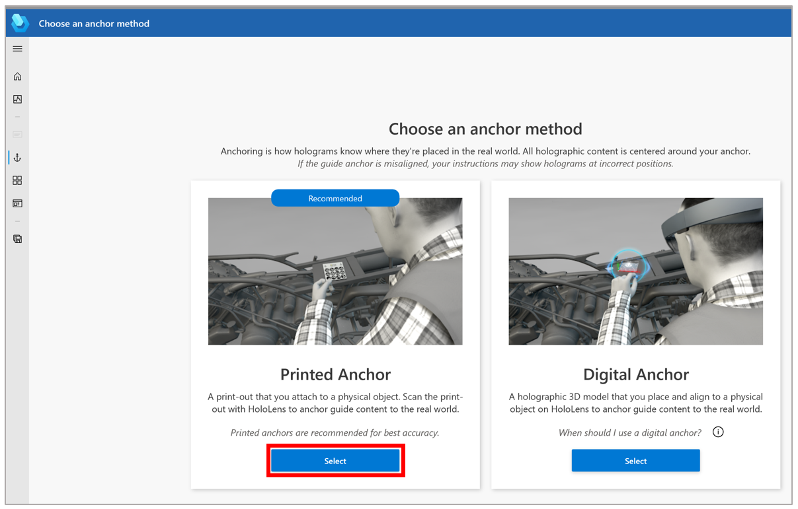
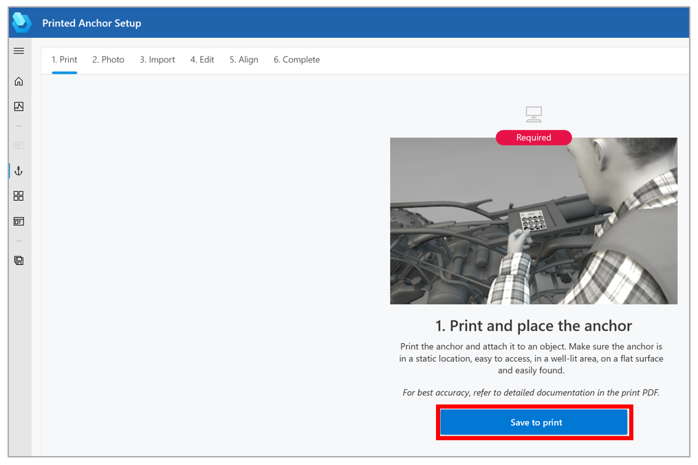
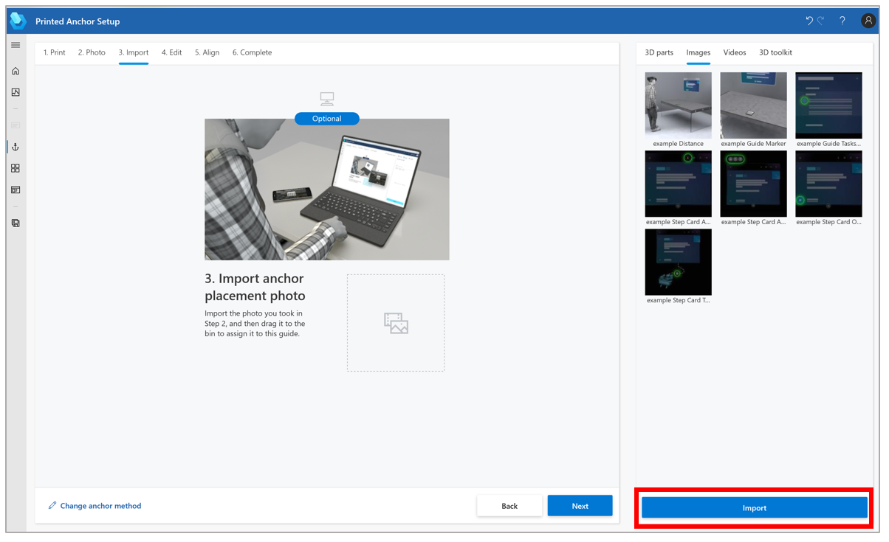
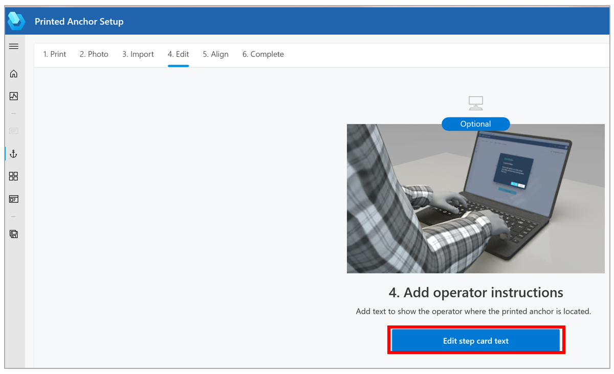

# Anchor your guide to the real world in the Dynamics 365 Guides PC app

When you create a guide with the [!include[pn-dyn-365-guides](../includes/pn-dyn-365-guides.md)] PC app, one of the first steps is to choose an anchoring method. When you anchor a guide, you synchronize it spatially with a real-world environment. Anchoring is how holograms know where they are in the real world. You must create an anchor for your guide for it to work on HoloLens.

It’s crucial to ensure that your guide alignment is correct and as precise as possible. If the guide is misaligned, your instructions may show actions at incorrect locations, which can result in operator confusion or damage to parts.

## Two ways to anchor a guide

There are two ways to anchor a guide:

- With a **printed anchor** (recommended), you align a guide by gazing at (scanning) a printed anchor attached to a physical object in the real world.

- With a **digital anchor**, you align a guide to a digital 3D hologram that's overlaid on a physical object in the real world. 

A printed anchor is recommended because it's more accurate. You might want or need to use a digital anchor, however, for any of the 
following reasons:

- It might not be feasible to attach a printed anchor because the authoring is done in a location different than where the parts are located.

- It might not be feasible to attach a printed anchor due to moving parts.

- You can’t guarantee that the placement of the printed anchor will be the same every time.

- A part is too small to attach a printed anchor to.

Dynamics 365 Guides includes an anchor wizard that makes it easy to choose and set up the most appropriate anchoring method for your situation.

## Anchor your guide by using a printed anchor

 [Watch a video on creating a printed anchor](https://aka.ms/guidesprintedanchor)

Creating a printed anchor involves four basic steps:

1. Use the Anchor wizard to choose an anchor method.

2.	Print out the anchor from a PDF file created by the anchor wizard.

3.	Attach the printed anchor to a physical object in the real world.

4.	Gaze at the anchor on HoloLens to anchor the guide.

### Set up a printed anchor

You can access the Anchor wizard from the **Outline** page. The **Outline** page automatically appears after you create a guide.

1. On the **Outline** page, select **Set your anchor now**.

    
   
2. In the **Choose an anchor method** screen, select **Printed Anchor**.  

    

3. In step 1 of the wizard, select the **Save to print** button. This creates a PDF file called **Guides-PrintedAnchor** that includes the anchor that you'll print in step 6. 

    

4. On your PC, in Adobe Acrobat Reader, open the **Guides-PrintedAnchor** file. 

5. Select **File** > **Print**, and then under **Page Sizing & Handling**, select the **Actual size** option.

  

6.	Print the last page of the document on matte stock (glossy materials can affect scanning). 

7.	After printing, make sure the marker spacing matches the measurements shown in the following illustration:

    
 
    > [!NOTE]
    > If the anchor spacing is not within +/- 0.1 mm, in the **Print** dialog box, select the **Custom Scale** option, and then change the percentage to compensate for the size discrepancy. For example, if you print the anchor and the result is 49 mm, you need to change the scale to 100.4% to get 49.196 mm, which would be within tolerance.
    
8. Attach the printed anchor to a physical object in the real world, and then take a picture of where you placed it to help the operator locate it.

9. Go back to the Anchor wizard in the PC app, and then select **Next** two times. 

10. In step 3 of the wizard, select **Import** to import the picture you took in step 8, and then drag it to the **Import anchor placement photo** bix. Select **Next** to move to the next step.

     

11. In step 4 of the wizard, if you want to change the default instructions for the operator, select **Edit step card text**, and then enter your instructions. Select **Next** to move to the next step.

     

12. Put on your HoloLens, open your guide, and then gaze at the printed anchor to anchor it. 

### Best practices for printed anchors

Keep the following in mind when working with printed anchors:

- **Same anchor for authoring and printing.** For best accuracy, use the **same** printer anchor for authoring and operating. 

- **Size.** Make sure that your printed anchor is the exact size indicated in this document. Incorrect anchor size causes guide misalignment. 

  - Some applications and printers might change the size of the image.
  
  - If the printed anchor is larger than indicated, [!include[pn-hololens](../includes/pn-hololens.md)] interprets the scale difference in distance. This causes the anchor to be identified as closer than it really is. 
  
  - Printing from the .pdf file (as described earlier in this topic) is the best way to ensure that the anchor is not resized. 
  
- **Location.** Place the anchor in a location on the physical object in a location that’s easy to access and out of the way.

  - Printed anchor placement should ideally be central to the steps being done.
  
  - Content placed farther away from the anchor will be less accurate.
  
  - Place the anchor where operators can quickly rescan to realign at any time.
  
  - Take a photo or video to document the printed anchor placement, and add it to the guide instructions to increase operator confidence. To capture a photo or video from [!include[pn-hololens](../includes/pn-hololens.md)], see [Mixed reality capture](https://docs.microsoft.com/windows/mixed-reality/mixed-reality-capture).
  
- **Scanning angle.** Make sure you’re facing the anchor straight on at the correct distance when gazing at it. 

  - Scanning from an angle can cause misalignment.
  
  - Ideal scanning range is from 60 to 80 cm.

### How HoloLens establishes anchor position, scale, and orientation

When scanning, the forward-facing camera on [!include[pn-hololens](../includes/pn-hololens.md)] is used to measure the horizontal and vertical distances on the anchor. 
This information is combined with the actual anchor values stored internally in the application (49.2 mm and 32.8 mm, as indicated 
in the preceding illustration) to establish the anchor's precise position, scale, and orientation in space.

## Anchor your guide by using a digital anchor

 [Watch a video on creating a digital anchor](https://aka.ms/guidesdigitalanchor)

Digital anchoring involves three basic steps:

1.	Use the PC app to import a custom 3D model to use as the anchor. This can be a representation of a physical object or a generic 3D object. A default digital anchor will be used if you don't select a custom 3D model.

2. Use the Anchor wizard in the PC app to assign the digital anchor.

3.	Using [!include[pn-hololens](../includes/pn-hololens.md)] Author mode, align the digital anchor to a physical object in the real world.

### Use the PC app to import a custom 3D model

1.	Open the PC app.

2.	On the right side of the screen, select the **Import** command. 

3.	In the **Open** dialog box, select the 3D model that you want to use, and then select **Open**.

    This adds the 3D model to the **3D parts** section of the library.
    
### Use the anchor wizard to assign the digital anchor

You can access the Anchor wizard from the **Outline** page. The **Outline** page automatically appears after you create a guide.

1. On the **Outline** page, select **Set your anchor now**.

   
   
2. In the **Choose an anchor method** screen, select **Digital Anchor**.  
 
3. In step 1 of the wizard, drag the 3D model from the **3D parts** section to **Assign digital anchor** box. This assigns the 3D model as your digital anchor. Select **Next** when you're ready to move to the next step.

4. Put on your HoloLens, and then use air tap and hold to move the digital anchor directly over a physical object in your work environment. If you need to rotate the object, use air tap and hold to move the blue spheres.

   >[!TIP]
   >On HoloLens 2, you can use your hand to directly select and place a digital anchor when authoring a guide. See [Manipulating holograms](https://docs.microsoft.com/dynamics365/mixed-reality/guides/hololens-authoring#place-your-holograms) for more information.

5. Take a picture of where you placed the digital anchor to help the operator find the anchor.

6. Go back to the PC app, and then select **Next** two times to move to the next step in the wizard.

7. In step 4 of the wizard, import the photo you took in step 5, and then drag i to the **Import photo anchor location** bin. Select **Next** when you're ready to move to the next step.

8. In step 5 of the wizard, if you want to change the default instructions for the operator, select **Edit step card text**, and then enter your instructions. Select **Next** to move to the next step, and then select **Confirm**.

### Best practices for digital anchors

- **Size.** Select a digital anchor that’s not too small or too big. 

  - Medium-size digital objects are best. Very small or very large holograms are difficult to manipulate. 
  
  - Shoebox size or slightly larger is ideal.
  
- **Placement.** Choose a digital anchor that’s as close to the center of the work being done as possible. The farther you place digital content away from the digital twin, the less accurate it becomes.

- **Shape.** Select a digital anchor that has a non-uniform or uncommon shape. Unusual shapes are easiest to align to.

  - Avoid objects that are mirrored. This can cause 180-degree misalignment.
  
  - Pick shapes that have clear edges and corners to help orient your content properly.
  
- **Recognizable.** Select a digital anchor that’s obvious, easily recognizable, and easy for the operator to find. Make sure that they can access the object without any obstructions.

- **Alignment direction.** Always align the digital anchor to your physical object from the same direction. This maximizes repeatability for operators.

  - Placement from different perspectives can cause misalignment.
  
  - Always look at it from multiple angles to ensure the digital anchor is aligned to the physical object.

## Ensure accuracy of anchors (alignment)
Independent from the method used for anchoring, these additional factors can impact the accuracy of the alignment and/or user perception of the alignment:

- **Interpupillary distance (IPD) setting.** The IPD is the distance between the center of the user’s pupils. It’s crucial to set the appropriate IPD to enable [!include[pn-hololens](../includes/pn-hololens.md)] to adapt its display because different users might have different IPDs. An incorrect IPD setting can result in a wrong perception of holograms in space as well as instability of holograms. [Use the HoloLens Calibration app to calibrate your IPD](https://docs.microsoft.com/windows/mixed-reality/calibration). 

- **Pre-scanning the environment.** [!include[pn-hololens](../includes/pn-hololens.md)] actively scans its environment for visible features to create maps of its surroundings. This happens whenever the device is turned on and a user is signed in. It’s independent of whether you’re in the [!include[pn-hololens](../includes/pn-hololens.md)] shell or running apps. [!include[pn-hololens](../includes/pn-hololens.md)] constantly improves the accuracy of these maps as it scans the environment from different viewpoints and stores them on the device. Holograms are placed in relation to these maps. The more accurate the map, the more accurate the hologram placement.

Before using [!include[pn-dyn-365-guides](../includes/pn-dyn-365-guides.md)] on a [!include[pn-hololens](../includes/pn-hololens.md)] that’s unfamiliar with its environment, the user should put on the [!include[pn-hololens](../includes/pn-hololens.md)], sign into the device, and walk around the space where hologram instructions are placed or will be placed. This can be done while the user is in the [!include[pn-hololens](../includes/pn-hololens.md)] shell, but we recommend the user hide the **Start** menu to see the space as they walk around. Walking at a leisurely pace while slowly looking up and down will give the device the opportunity to find features and construct accurate maps. This is called "pre-scanning" because it’s done before you run [!include[pn-dyn-365-guides](../includes/pn-dyn-365-guides.md)]. You only need to do this once for each environment because [!include[pn-hololens](../includes/pn-hololens.md)] stores the maps it created on the device and remembers the spaces it has scanned.

   Very dark or very bright environments, or environments that include very reflective surfaces (mirrors), dark surfaces, or featureless surfaces, cause a negative impact on [!include[pn-hololens](../includes/pn-hololens.md)]’s capability to recognize the space, which will impact hologram position and stability.

- **Impact of device positioning.** [!include[pn-hololens](../includes/pn-hololens.md)] uses a novel display technology to project images in the user’s field of view, which creates holograms. The way a user wears a device on their head has a huge impact on the perceived position of the holograms. The best way to understand this is to adjust the device positioning while aligning holograms to their physical counterparts in [!include[pn-dyn-365-guides](../includes/pn-dyn-365-guides.md)]. Observe how the alignment of holograms is affected when you shift the device left and right, up and down, and when you slide the display forward and backward. Users should wear the device in a consistent way and understand that subtle shifts in device positioning might not feel different but can lead to significant changes to perceived hologram locations.
   
- **Using the same anchor for authoring and operating.** For best accuracy, use the same anchor for authoring and operating. 

## What's next?

[Structure your guide in the Outline page](structure-guide.md) 
[Create steps and add 3D content or 2D media](create-steps-assign-media.md) 
[Learn about keyboard shortcuts](keyboard-shortcuts-pc-app.md) 

