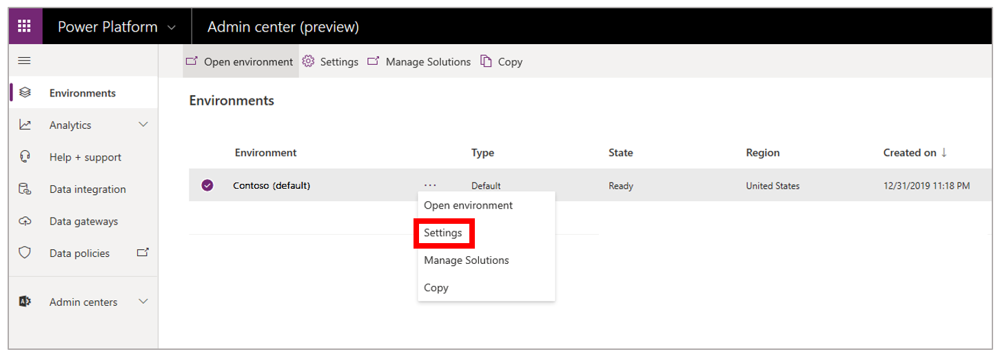
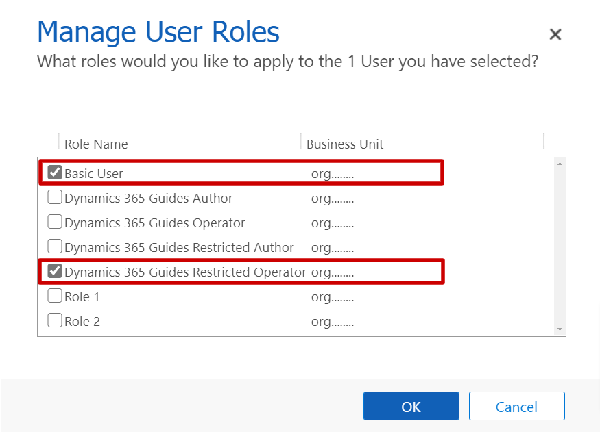
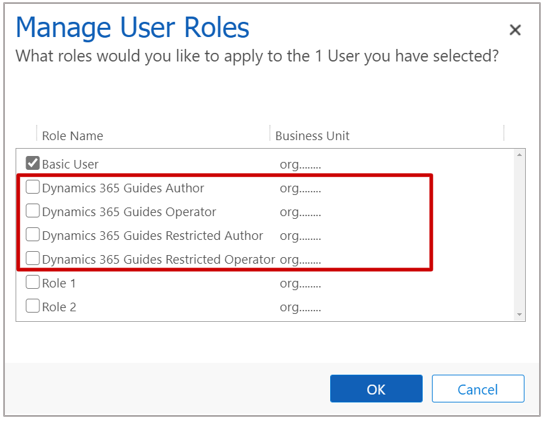

# Assign an Author or Operator role to a user in Dynamics 365 Guides

If you're a Microsoft Dynamics 365 Guides admin, you can assign an **Author** or **Operator** role to users to limit what they can do in the apps. The following table describes the privileges that each role grants.

| Role | Description |
|---|---|
| Author | Use the PC app and HoloLens app to create, edit, and operate guides. Users who have the **Author** role can also rename and deactivate existing guides. |
| Operator | Use the HoloLens app to view and operate a guide. Users who have the **Operator** role can also save time by skipping the **Select Mode** dialog box when they open a guide. |

> [!IMPORTANT]
> If you followed the instructions in the [Try or buy, and deploy Dynamics 365 Guides](setup.md) topic when you set up Dynamics 365 Guides, any users that you added were automatically assigned the **Author** role. You must explicitly assign the **Operator** role to specific users if you don't want them to have **Author** role privileges.

## Prerequisites

Before you can modify user roles, the following prerequisites must be in place:

- You have an active Dynamics 365 Guides license. For more information, see [Try or buy, and deploy Dynamics 365 Guides](setup.md).

- The latest Dynamics 365 Guides solution is installed. For more information, see [Upgrade to the latest solution](upgrade.md).

- You have access to the Power Platform admin center and have full admin privileges.

## Assign user roles

> [!NOTE]
> Users can take up to one hour to appear in the Dynamics 365 admin center after the licenses are added in the Microsoft 365 admin center.

1. Open the [Power Platform admin center](https://admin.powerplatform.microsoft.com/environments), and sign in by using your admin credentials.

2. If the **Environments** page doesn't appear, select **Environments** in the left pane to open it.

3. Select the environment that you want to work with, select the **More environment actions** (**...**) button, and then select **Settings**.

    

4. Select **Users + permissions** to expand the list of options, and then select **Users**. If you're prompted to sign in to Dynamics 365, be sure to use your admin credentials.

    
    
    > [!IMPORTANT]
    > You can access Dynamics 365 Guides data through the **Guides Hub** tile. However, we recommend that you not make changes in the Guides Hub. Any changes that you make there can have unintended consequences for the Dynamics 365 Guides apps. 
    
5. Follow one of these steps:

    - If the users are already in the list, skip ahead to step 6 to assign user roles.
    
    - If you must add one or more users, select **Add user** at the top of the page, enter the account details in the **Add user** dialog box, and then select **Add**. For more information, see the "Troubleshooting" section later in this topic.

        > [!NOTE]
        > When you add a user in this way, you trigger synchronization. Therefore, the user is added to the instance within a few minutes.  
    
6. Select **Manage users in Dynamics 365** at the top of the page. 

   

7. Select one or more users, and then select **Manage Roles** at the top of the page.

    

8. In the **Manage User Roles** dialog box, make sure that the **Basic User** check box is selected.

    
    
    > [!NOTE]
    > You may see a **Common Data Service** check box instead of a **Basic User** check box. If so, select that check box. 

9. Select the check box for the appropriate role for the selected users, and then select **OK**.

    
    
10. If you want the user to have admin privileges, select the **System Administrator**check box. 
    
## Troubleshooting

If users don't appear on the **Security** page (**Dynamics 365** \> **Settings** \> **Security**), in the [Power Platform admin center](https://admin.powerplatform.microsoft.com/environments), select **Add user**. In the **Add user** dialog box, enter the account details, and then select **Add**. This operation triggers synchronization. Therefore, the user is added to the instance within a few minutes.

## See also

[Add additional user accounts to Dynamics 365 Guides](add-users.md) 
[Overview of authoring a guide](authoring-overview.md) 
[Overview of operating a guide](operator-overview.md)

[!INCLUDE[footer-include](../includes/footer-banner.md)]
