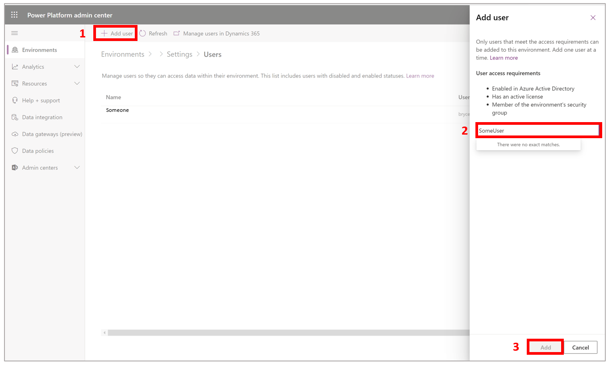

# Assign an Author or Operator role to an individual user in Dynamics 365 Guides

If you're a Microsoft Dynamics 365 Guides admin, you can assign an Author or Operator role to users to limit what they can do in the apps. The Restricted Author and 
Restricted Operator roles provide an extra layer of control. [Learn about the privileges provided by each role](admin-role-types.md).

> [!NOTE]
> You can also assign user roles in bulk by using [Azure AD groups](admin-assign-role-groups.md).

## Prerequisites

To assign user roles:

- You must have an active Dynamics 365 Guides license. For more information, see [Overview of setting up Dynamics 365 Guides](setup.md).

- The latest Dynamics 365 Guides solution must be installed. For more information, see [Update to the latest solution](upgrade.md).

- You must have access to the Power Platform admin center and have full admin privileges.

## Assign user roles

> [!NOTE]
> Users can take up to one hour to appear in the Dynamics 365 admin center after the licenses are added in the Microsoft 365 admin center.

1. Open the [Power Platform admin center](https://admin.powerplatform.microsoft.com/environments), and sign in with your admin credentials.

2. If the **Environments** page doesn't appear, select **Environments** in the left pane to open it.

3. Select the environment that you want to work with, select the **More environment actions** (**...**) button, and then select **Settings**.

    

4. Select **Users + permissions** to expand the list of options, and then select **Users**. If you're prompted to sign in to Dynamics 365, be sure to use your admin credentials.

    

    > [!IMPORTANT]
    > You can access Dynamics 365 Guides data through the **Guides Hub** tile.  The Guides model-driven app isn't intended as a replacement for authoring in the PC and HoloLens apps. If you use the model-driven app to create, update, or delete records, you might make Guides nonfunctional or prevent users from using the PC or HoloLens apps in the intended way. Currently, Guide modification through the model-driven app isn't fully supported and should be reserved for experienced Dynamics 365 developers who are familiar with Microsoft Dataverse.

5. Follow one of these steps:

    - If the users are already in the list, skip ahead to step 6 to assign user roles.

    - If you want to add one or more users, select **Add user** at the top of the page, enter the account details in the **Add user** dialog box, and then select **Add**. For more information, see the "Troubleshooting" section later in this article.

        > [!NOTE]
        > Users added to the instance will be added to the user list within a few minutes.

6. Select **Manage users in Dynamics 365** at the top of the page.

   

7. Select one or more users, and then select **Manage Roles** at the top of the page.

    

8. In the **Manage User Roles** dialog box, make sure that the **Basic User** check box is selected.

    

    > [!NOTE]
    > You may see a **Common Data Service** check box instead of a **Basic User** check box. If so, select that check box.

9. Select the check box for the appropriate role for the selected users, and then select **OK**.

    
    
    [Learn about the different Author and Operator roles](admin-role-types.md).

10. If you want the user to have admin privileges, select the **System Administrator** check box.

## Troubleshooting

If users don't appear on the **Security** page (**Dynamics 365** > **Settings** > **Security**), in the [Power Platform admin center](https://admin.powerplatform.microsoft.com/environments), select **Add user**. In the **Add user** dialog box, enter the account details, and then select **Add**. Users added to the instance should appear in the user list within a few minutes.

## See also

[Add additional user accounts to Dynamics 365 Guides](add-users.md) 
[Learn about the Author and Operator roles](admin-role-types.md) 
[Assign roles in bulk through Azure AD groups](admin-assign-role-groups.md)

[!INCLUDE[footer-include](../includes/footer-banner.md)]
