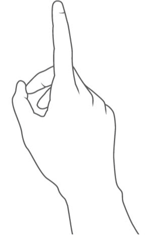
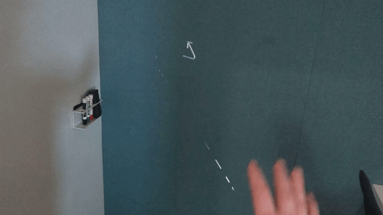

# HoloLens 2 gestures for authoring and navigating in Dynamics 365 Guides 

Hand-tracking in Microsoft [!include[pn-hololens](../includes/pn-hololens.md)] 2 provides instinctual interactions for authors. You can select and position holograms with direct 
touch, just like real objects, and use hand rays to interact with holograms when they're out of reach. 

>[!NOTE]
>If you’re using HoloLens 1, see [Authoring and navigating gestures for HoloLens 1](authoring-gestures.md).

## Basic actions and gestures to know

To author or navigate in [!include[pn-hololens](../includes/pn-hololens.md)] 2, you need to know how to do these actions and gestures:

- **Touch**. With [!include[pn-hololens](../includes/pn-hololens.md)] 2 and [!include[pn-dyn-365-guides](../includes/pn-dyn-365-guides.md)], you can reach out and touch or grab holograms. This is the easiest and most intuitive way to author your guides. 

    

    >[!IMPORTANT]
    >Use touch interaction to work with parts you have placed in the world. In [!include[pn-dyn-365-guides](../includes/pn-dyn-365-guides.md)], instruction cards (Step cards) are meant to be kept out of the way so they're out of reach for touch interaction. 

- **Hand ray**. To use a hand ray, hold your hand in front of you with your palm facing away. This causes a laser pointer (hand ray) to appear. After targeting an item with your hand ray, you can act on that target in different ways as described later in this topic.

     

- **Gaze**. If the item has a selection box or circle (gaze/dwell button), you can select the item by gazing at it. The item is selected when the box or circle is filled. You will often use gaze and air tap together. When you gaze, turn your whole head—not just your eyes. The cursor will follow.
 
     

- **Air tap**. Hold your hand straight out in front of you in a loose fist, point your index finger straight up toward the ceiling, tap your finger down, and then quickly raise it back up again.
 
    

- **Air tap and hold**. Start by air tapping, but keep your finger down instead of raising it back up.

### Gesture frame

It’s also important to know about the gesture frame. [!include[pn-hololens](../includes/pn-hololens.md)] 2 has sensors that can see a few feet to either side of you. When you use gestures, you need to keep them inside that frame, or [!include[pn-hololens](../includes/pn-hololens.md)] won't see them. As you move around, the frame moves with you. When your hand is inside the frame, a hand ray will appear from your palm. When [!include[pn-hololens](../includes/pn-hololens.md)] can't see your hands and you’re looking at a UI element, you’ll see the gaze cursor in the center of your display.

## Work with close-up UI elements and holograms

For close-up UI elements and holograms, you can just reach out and touch or grab them with your hands. When your hand gets close enough to touch or grab a hologram, a visual appears around the control to let you know what that control does.

### To select a button

- Push it with your index finger. The button’s collision area lights up as you approach the button.

### To select a hologram
- Touch the hologram with your index finger. The controls will appear.

    

### To move a hologram

- Grab the large white sphere in the center of the controls with your hands and move it where you want. The sphere will light up based on where your index finger is in relation to the sphere.

    

### To rotate a hologram

- Grab one of the blue spheres (rotation controls) and rotate it the way you want. Arrows appear around the rotation controls to show which direction they rotate.

    
    
    
    
    

### To change the size of a hologram

- Pinch the blue dial (**Scale** control) on the right side of the part. A slider track appears above and below the **Scale** control to show scaling up or down.

    
    
### To edit a hologram

- Touch the **Edit hologram** button with your finger, and then touch the command you want.

    

## Work with far-away UI elements and holograms - using hand rays and gaze

You can use hand rays to work with UI elements and holograms from a distance. You can use gaze to work with the instruction card from a distance, but you can’t manipulate holograms.

>[!TIP]
>When you author a guide, if your hand is visible, hand rays are enabled and gaze is disabled. To use gaze, place your hands at your side so the [!include[pn-hololens](../includes/pn-hololens.md)] 2 device can’t see your hands.

### To select a button or UI element with a hand ray

1.	Point your hand ray at the object to target it. 

2.	Do one of the following:

    - Air tap to select it.
    
    - If there’s a selection box or circle, hold your hand ray on it until it’s selected.
 
      

### To manipulate a hologram with a hand ray

1.	Point your hand ray at the object to target it. Controls will appear around the hologram.

    
    
2.	Do one of the following:

    - To move the hologram, air tap and hold on the hand ray, move the hologram where you want it, and then release.
    
        
       
    - To rotate the hologram, air tap and hold on one of the blue spheres, rotate the hologram, and then release.
    
                  
                
         
      
    - To change the size of a hologram, air tap and hold the **Scale** control. While holding, move the control along the track up or down.
    
         
      
    - To edit the hologram, air tap the **Edit** button, and then air tap the selections you want.
    
          
      
### To select an item on the instruction card with gaze

1.	Gaze at the button or UI element with your hands at your side.

2.	Continue gazing until the button is filled up.
 
    
   
## Open the Start menu

You can open the **Start** menu on HoloLens 2 with one hand or two hands. If you're not sure what to do at any time, opening the **Start** menu is a good way to get reoriented.

### To open the Start menu with one hand

1.	Hold out one of your hands, palm facing up, and look at your wrist. You’ll see a holographic Windows logo.

2.	On the hand you’re holding out, touch your index finger to your thumb in a pinching motion.
 
    

### To open the Start menu with two hands

1.	Hold out one of your hands, palm facing up, and look at your wrist. You’ll see a holographic Windows logo.

2.	With your other hand, touch the Windows logo with your index finger.

      [Watch a video on opening the Start menu with two hands](https://www.microsoft.com/en-us/videoplayer/embed/RE3Wxng).

## Need a tutorial on gestures?
For a tutorial on some basic gestures, open the **Start** menu, and then select **Tips**. This closes the [!include[pn-dyn-365-guides](../includes/pn-dyn-365-guides.md)] app.

### See also

[Operator gestures on HoloLens 2]() 
[Calibrate HoloLens]() 
[Authoring and navigating gestures on HoloLens 1](authoring-gestures.md) 
[Operator gestures on HoloLens 1]()
