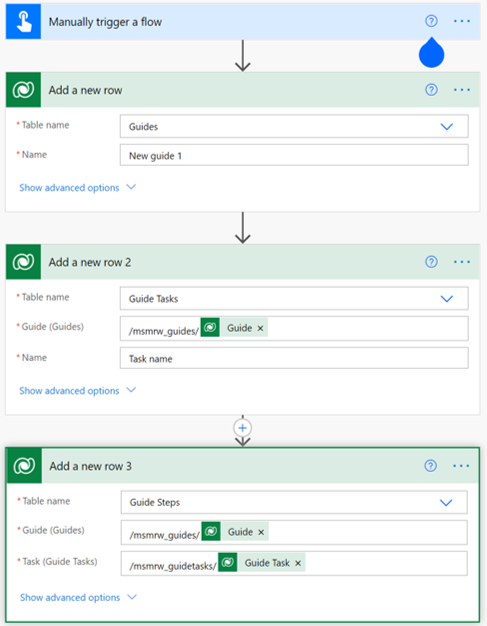
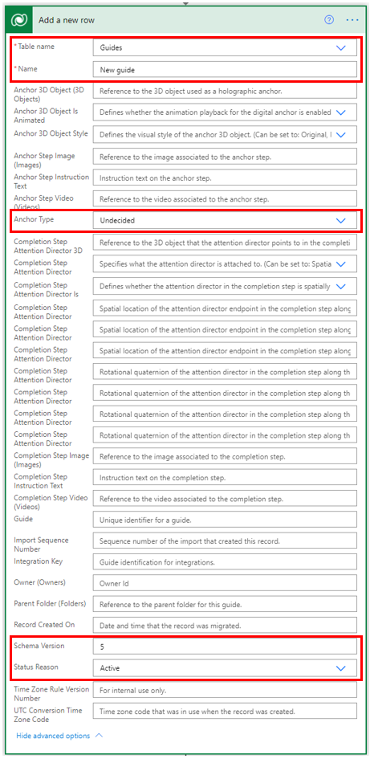
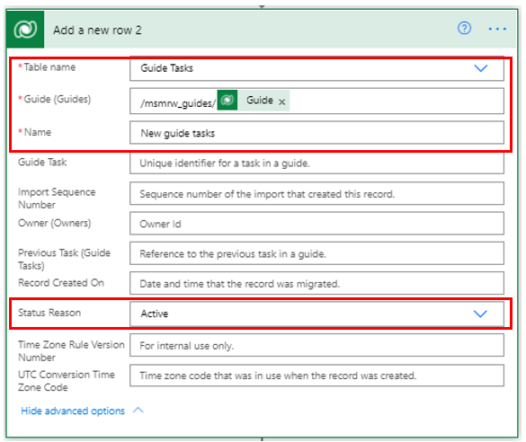

# Tables and fields required to create a guide in Power Automate

When a guide is created in the Microsoft Dynamics 365 Guides PC app, all of the guide's content (instruction text, 3D models, 3D parts, and media) is stored in the Microsoft Dataverse. Using the out-of-the-box PC app makes it easy to get started with authoring, but you can also create a guide programmatically with the Dataverse web API or a Power Automate flow by adding your own content to the right places in the Dataverse. This method is useful if you have existing text instructions in other systems or documents. You can just map the information to the appropriate Dataverse tables/fields to automatically generate a guide.

At minimum, the rows and fields listed in this article are required to create a guide that opens successfully in the PC app.

## Three tables required for any guide

Any basic guide requires the following three Dataverse tables:

- Guide
- Task
- Step

These tables must be created in order since each subsequent table refers to the other tables. In Power Automate, you add a new row to create each table. You can trigger the flow manually or automatically, depending on your scenario. The following screen shot shows a manual flow that creates the three minimum required tables.

## Fields required to create a Guide table

The following fields are required to create a Guide table:

|Field name|Description|
|-------------------------------|-------------------------------------------------|
|Table name|Select **Guides** from the list.|
|Name|You can name the guide anything you want.|
|Anchor Type|Select a specific anchor type from the list or select **Undecided** if you intend to choose the anchor type in the PC app.|
|Schema Version|Used to track the data schema version (currently 5). You'll need to be update this field whenever Microsoft releases a new schema version.
|Status Reason|Must be set to **Active**.|

The following screen shot shows the required fields in the Power Automate UI.

## Fields required to create a Task table

The following fields are required to create a Task table:

|Field name|Description|
|-------------------------------|-------------------------------------------------|
|Table name|Select **Guide Tasks** from the list.|
|Guide (Guides)|Select **Guide** from the dynamic list.|
|Name|Enter any task name.|
|Status Reason|Must be set to **Active**|

The following screen shot shows the required fields in the Power Automate UI.

## Fields required to create a Step table

The following fields are required to create a Step table:

|Field name|Description|
|-------------------------------|-------------------------------------------------|
|Table name|Select the table to create|
|Guide (Guides)|Select **Guide** from the dynamic lookup|
|Task (Guide Tasks)|Select **Guide Task** from the dynamics lookup|

## Test your flow

When you run the flow/manually test it, a new guide will be created and visible in the Guides PC app. 
