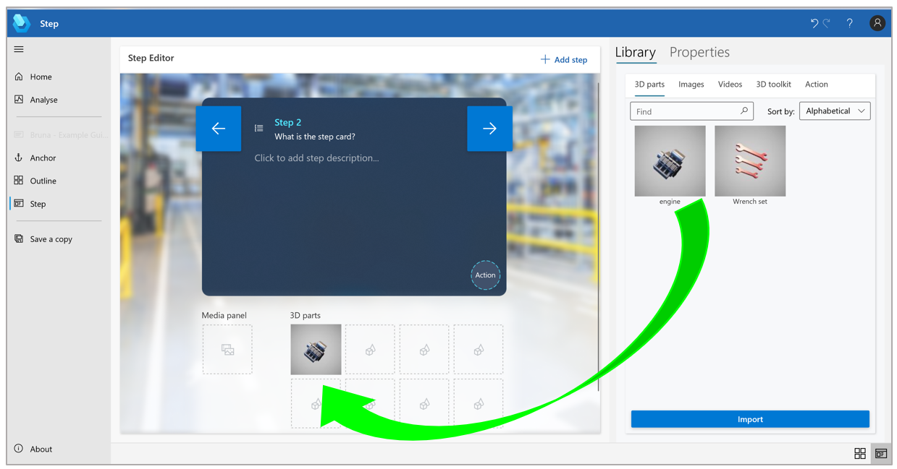
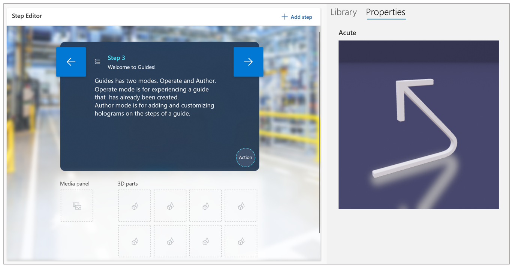

# Create steps and add 3D models or 2D media in the Dynamics 365 Guides PC app

## Add a 3D part

1. On the right side of the page, select the **3D parts** tab.

    

2. Drag the 3D part that you want to one of the **3D parts** boxes.

    
    
> [!TIP]
> To find items that were recently added to the gallery, you can sort by name or by the date when the item was added.

## Import a custom 3D model to use as a 3D part

You can import your own custom 3D models and add them to the **3D parts** library. To import files, you can drag them from a local file folder or use the **Import** command.

### Import a file by using a drag-and-drop operation

1. Open Windows File Explorer, and go to the folder that contains the 3D models that you want to import.

2. Drag the files to the gallery.

    

### Import a file by using the Import command

1. Select **Import** in the lower-right corner of the page.

    

2. Find the files that you want to import, and then select **Open**.

    

> [!NOTE]
> You can use a combination of third-party tools to prepare your 3D (computer-aided design \[CAD\]) models. For more information, see these topics:
>
> - [Optimize your 3D models](3d-content-guidelines/optimize-models.md)
>
> - [Best practices for 3D models](3d-content-guidelines/best-practices.md)
>
> - [Tutorials overview](3d-content-guidelines/tutorials-overview.md)

## Add media (images or videos)

1. On the right side of the page, select the **Images** or **Videos** tab.

    

2. Drag the image or video to the **Media panel** box.

    
    
> [!NOTE]
> You can preview the image or video on the right side of the screen by selecting it (click or double-click) in the **Library**. 

## What file formats are supported for 3D models, images, and videos?

[!include[pn-dyn-365-guides](../includes/pn-dyn-365-guides.md)] supports the following file formats.

| Media | Supported formats | Best practice |
|-------|-------------------|---------------|
| 3D models | FBX, GLB, glTF, STL, PLY | Optimize your 3D models as much as possible, to help maintain optimal performance on [!include[pn-hololens](../includes/pn-hololens.md)]. For more information, see [Convert CAD drawings to use as holograms](author-convert-3D-models.md). |
| Images | PNG, JPG, JPEG, BMP, GIF, TIF | |
| Video/audio | MP4, MOV, WMV, ASF, AVI M2TS, MKV, WAV | Keep your videos less than two minutes long and focused on one step at a time. |

> [!IMPORTANT]
> - **The file size limit is 128 MB. Transcoding may occur when uploading. This may change the size of the file that needs to be stored, which can cause the upload to fail if the file is too big.**
> - The supported video format and resolution is 854 x 480 H.264 MP4 (commonly called Advanced Video Recording or "AVC"). Any other formats are transcoded when imported and may result in a larger file size than the original.
> - Dynamics 365 Guides uses meters as the default scale unit. If your 3D model scale is set to millimeters when you export from your CAD solution, the model will be converted to meters in Dynamics 365 Guides. For example, if your model is 50 millimeters, it will be converted to 50 meters. To ensure size consistency between your CAD solution and Dynamics 365 Guides, make sure to set your model scale unit to meters when you  export. 

## Preview an image, video, or 3D model and view its properties

You can preview an image, video, or 3D model on the right side of the PC app and access the **Step Editor** at the same time. 

- Select (click or double-click) the image, video, or 3D model in the **Library**.

    
    
    The image and its properties are displayed on the right side of the screen.   
    
## Deactivate a guide or specific guide content

You can deactivate a guide or specific guide content (video, image, or 3D part) if you no longer need it. For more information, see [Deactivate a guide or specific guide content](pc-app-deactivate-guide.md). 

If you're an admin, you can reactivate content, if needed. As an admin, you can also deactivate or permanently delete a guide or guide content. For more information on deactivating, deleting, or reactivating a guide or guide content as an admin, see [Deactivate, reactivate, or delete a guide or guide content](admin-deactivate-guide.md).

## What's next?

[Anchor your guide to the real world](anchor.md) 
[Structure your guide in the Outline page](structure-guide.md) 
[Add a website or Power Apps link to a step](pc-app-website-powerapps-link.md) 
[Create and copy a link to a guide or step](pc-app-copy-link-guide-step.md) 
[Learn about keyboard shortcuts](keyboard-shortcuts-pc-app.md) 
[Deactivate a guide or guide content (authors)](pc-app-deactivate-guide.md) 
[Deactivate, delete, or reactivate a guide or guide content (admins)](admin-deactivate-guide.md) 
[Learn what makes a great mixed reality guide](great-guide.md)

[!INCLUDE[footer-include](../includes/footer-banner.md)]
