# Show a list of guides on a custom tab for a specific set of Dynamics 365 Guides users

[!include [rename-banner](~/includes/cc-data-platform-banner.md)]

If you want to create a custom list of guides for a specific user or set of users in Microsoft Dynamics 365 Guides, you can create a custom view. Operators access the view through a custom tab on HoloLens. This tab contains only the guides that are defined by the custom view. 

The following illustration shows an example of a custom tab that contains a custom list of guides.

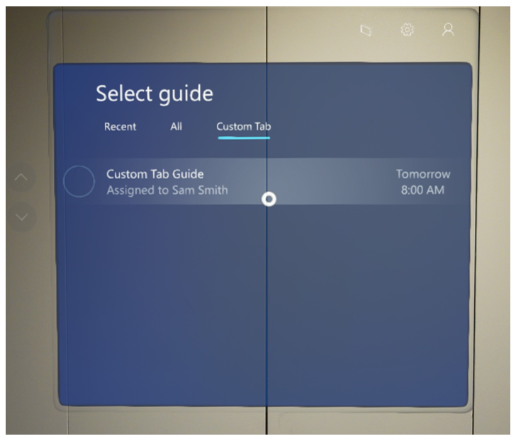

Custom views are useful when you want to show a set of guides that is related to a specific workflow. For example, you might want to show a different set of guides to each team or business unit. Alternatively, you might want to show a list of guides that is targeted at a specific type of operator role.

## Prerequisites

To create a custom view, you must have the following prerequisites:

- Dynamics 365 Guides solution version 104.1907.0.33 or later

- Dynamics 365 Guides PC and HoloLens app versions 104.1907.19001 or later

You must also have the **System Administrator** role for the Dynamics 365 Guides instance that you're working with. Additionally, it's useful to have a general understanding of [Microsoft Dataverse](/powerapps/maker/common-data-service/data-platform-intro), the database that Dynamics 365 Guides is based on.

## Overview of creating a custom view

The process of creating a custom view involves these basic steps:

1. Create a new entity in Microsoft Dataverse. This entity contains the fields that will be included in the view. (It must contain at least two fields.)

2. Create the view.

3. Create a Guides view configuration record.

4. Use the App Designer to add specific guides to the list that is shown in the view.

The remaining sections of this topic describe each step in detail.

## Step 1: Create a new entity in Microsoft Dataverse

> [!NOTE]
> If you want to use an existing entity instead of creating a new entity, skip ahead to the [Step 2: Create the view](#step-2-create-the-view) section.

1. Go to [https://powerapps.microsoft.com](https://powerapps.microsoft.com), and sign in as an admin.

    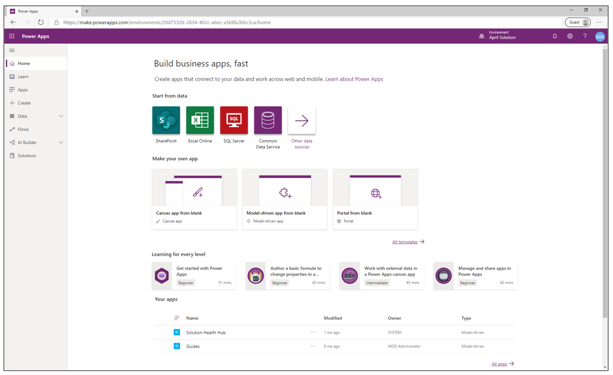
    
2. In the **Environments** pane on the right side of the page, select the instance where the Dynamics 365 Guides solution is installed (the instance that you want to add the custom tab to).

    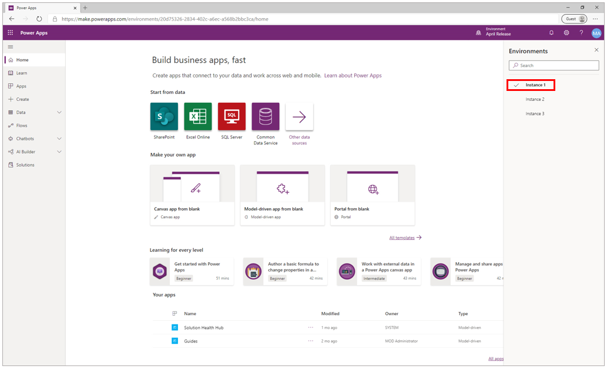

2. In the left pane, select **Data**, and then select **Entities**. Then select **New entity**.

    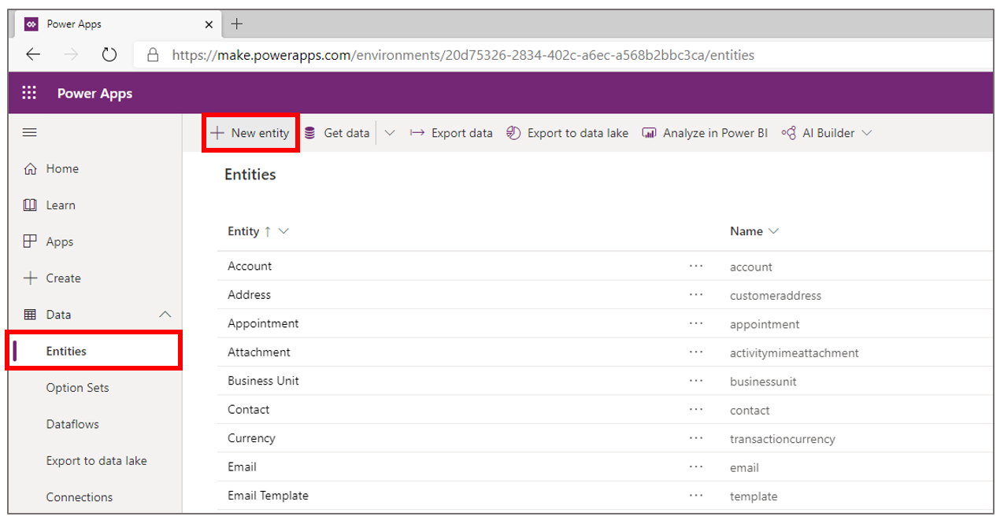

3. In the **New entity** dialog box, enter a display name (for example, **Custom Tab**).

    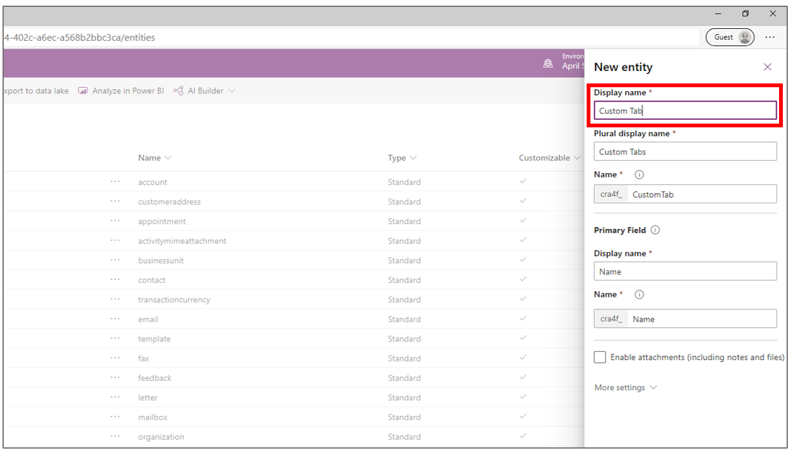

    > [!IMPORTANT]
    > The display name must be singular. If it's plural, the tab won't appear correctly on HoloLens.

4. Select **Create**.

5. While the new entity is open, select **Add field**.

6. In the **Field properties** dialog box, follow these steps:

    1. In the **Display name** field, enter **Date and Time**.

    2. In the **Data type** field, select **Date and Time**.

        

    3. Select **Done**.

7. Select **Add field** again, and then, follow these steps in the **Field properties** dialog box:

    1. In the **Display name** field, enter **Guide**.

    2. In the **Data type** field, select **Lookup**. You will use this field to search the database and assign a guide to the entity through the view.

    3. In the **Related entity** field, enter **Guide**.

        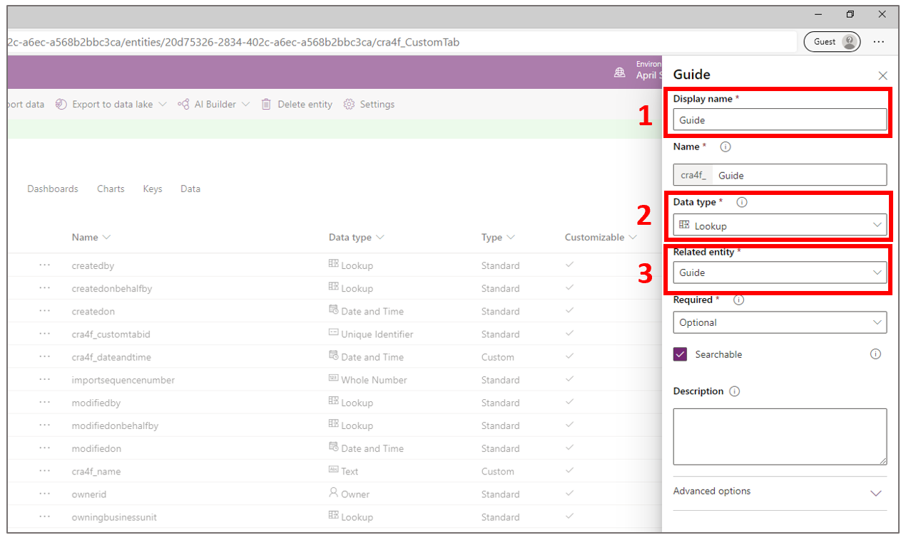

    4. Select **Done**.

8. In the lower-right corner of the page, select **Save Entity**.

## Step 2: Create the view

In this step, you will add a view to the entity that you created in the previous section. This view will include the same fields that you added to the new entity.

The following rules apply to the view:

- It must have at least two columns. Additional columns are optional. The example that follows includes a third column.

- The first column must be a **Date and Time** field (that is, it must have the **Date and Time** data type), and the field can't be empty.

- The second column must be a lookup to the **msmrw\_guide** entity, and the field can't be empty.

- If a formatted value is available, it will be used.

- Nonempty values are concatenated and shown below the guide name.

The following illustration shows an example of a tab that is named **Custom Tab** on HoloLens. It also shows where the values for each part of the tab come from.

1. The name of the view that you create

2. The **Guides** field

3. The **Date and Time** field

4. An additional field (This field can be any field that you want to add.)

### Create the view

1. Make sure that the entity that you created in the previous section is open.

    > [!NOTE]
    > You can't create the view on the **msmrw\_guide** entity.

2. Select **Views**, and then select **Add view**.

    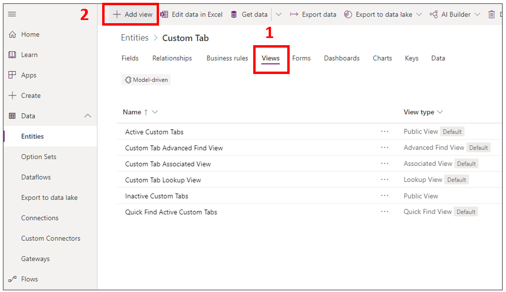

3. In the **Create a view** dialog box, enter a name for the view. This name will be shown on the HoloLens tab.

    

4. Select **Create**.

5. Select **Add column**, and then select **Date and Time**.

    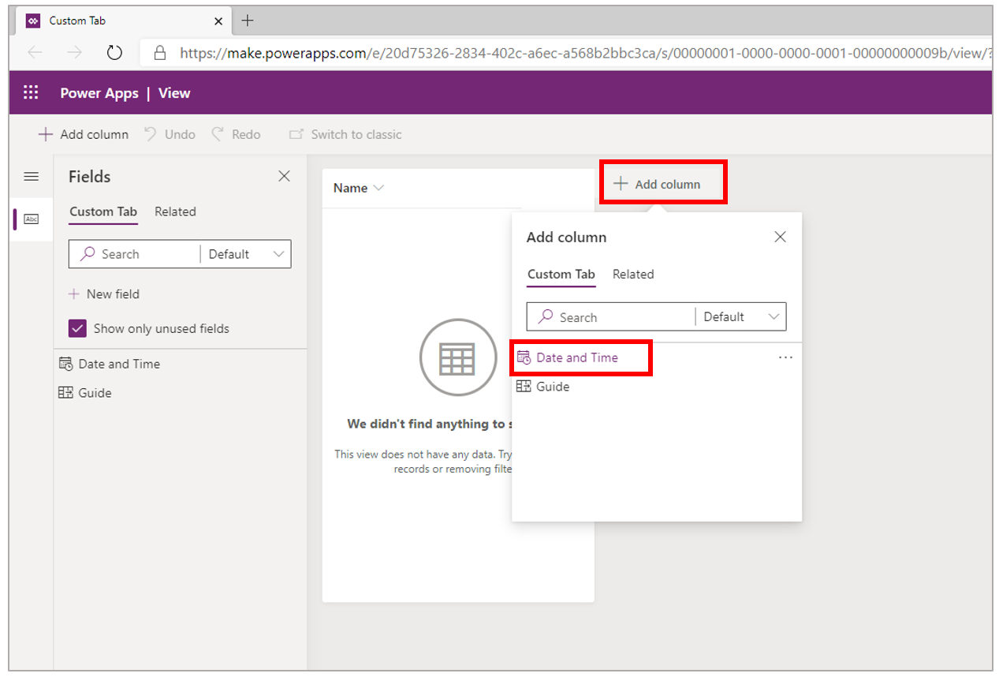

6. Select **Add column** again, and then select **Guide**.

    

    > [!NOTE]
    > You can drag columns to move them after they are created.

7. In the upper-right corner of the page, select **Save**, select **Publish**, and then refresh the page.

8. Copy and save the record ID for the saved query. This record ID appears at the end of the URL for the page.

    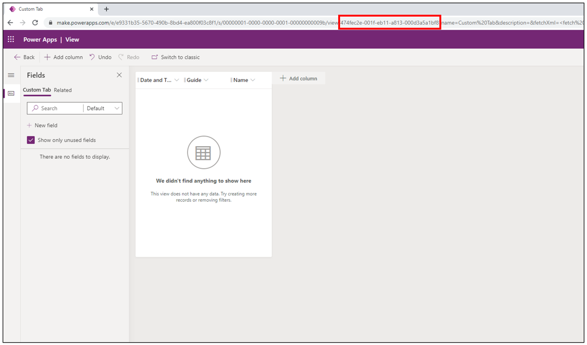
    
    > [!IMPORTANT]
    > When you copy the URL, **do not** include the question mark (?) at the end of it.
    

## Step 3: Create a Guides view configuration record

The purpose of the configuration record is to notify HoloLens about the view that it should use.

1. Go to [https://powerapps.microsoft.com](https://powerapps.microsoft.com), and sign in as an admin for the instance.

2. In the left pane, select **Apps**, and then select **Guides** to open the Guides model-driven app.

    > [!NOTE]
    > The Guides model-driven app isn't intended as a replacement for authoring in the PC and HoloLens apps. If you use the model-driven app to create, update, or delete records, you might make Guides nonfunctional or prevent users from using the PC or HoloLens apps in the intended way. Currently, modification through the model-driven app isn't fully supported and should be reserved for experienced Dynamics 365 developers who are familiar with Microsoft Dataverse.
    
    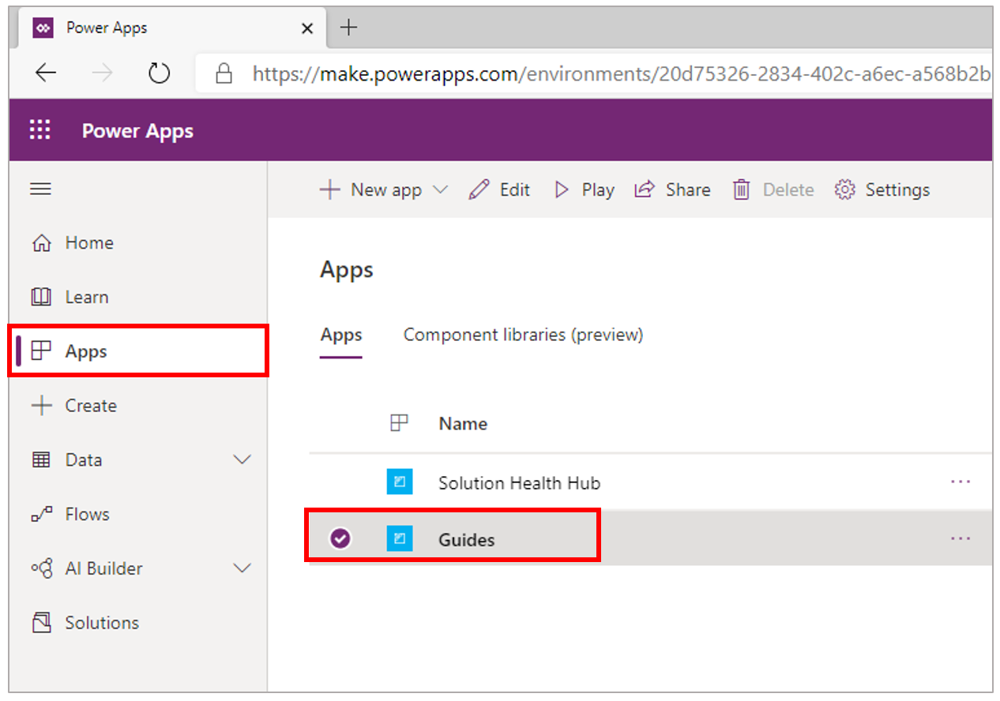

3. In the left pane, under **Configuration**, select **Guides View**, and then select **New**.

    

4. On the **New Guide View Configuration** page, enter a name that will help you remember what this configuration record is for. This name isn't used for the tab name on HoloLens.

    

5. In the **Saved Query ID** field, enter the record ID that you saved in step 8 in the previous section. This value isn't validated. Therefore, copy it carefully to ensure that it's correct.

    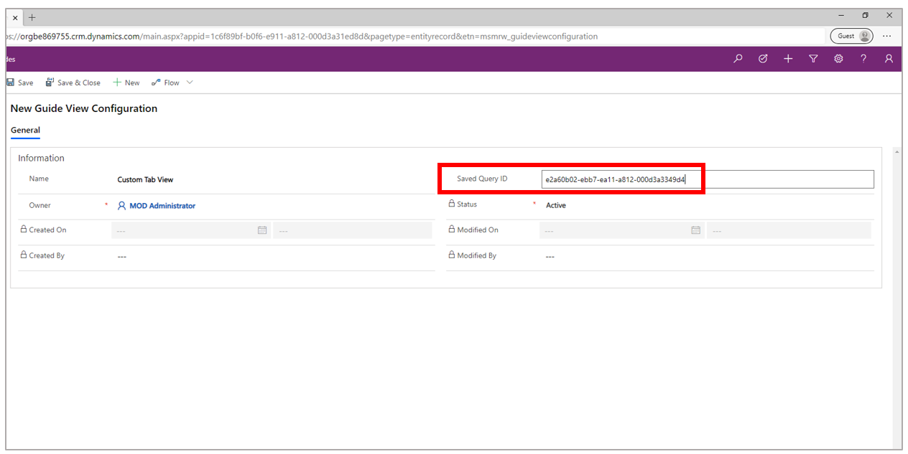

6. Select **Save and Close**.

> [!WARNING]
> There is no relationship between the Guide view configuration record and the saved view. If you delete the target view or entity, a fetch of the data will fail, and data won't be shown on HoloLens.

## Step 4: Use the App Designer to add specific guides to the list that is shown in the view

In this step, you will add the list of guides that will appear on the HoloLens tab.

> [!NOTE]
> The following procedure is an example that shows how to use the App Designer. You can configure the App Designer in different ways, depending on your experience with Dynamics 365.

1. Go to [https://powerapps.microsoft.com](https://powerapps.microsoft.com), and sign in as an admin for the instance.

2. In the left pane, select **Apps**. Then select the **More Commands** (**...**) button next to **Guides**, and select **Edit**.

    

3. In the App Designer, select the **Edit** button (pencil symbol) next to **Site Map**.

    

4. Select the **Configuration** heading, select **Add**, and then select **Group**.

    

5. Enter a name for the new group (for example, **Custom Tab**). This name will appear to the right of the other headings on the **Sitemap Designer** page.

6. Select the heading for the new group, select **Add**, and then select **Subarea**.

    

7. On the **Properties** tab on the right side of the page, in the **Entity** field, select the name of the entity that you created in the [Step 1: Create a new entity in Microsoft Dataverse](#step-1-create-a-new-entity-in-microsoft-dataverse) section. In this way, you link the subarea.

    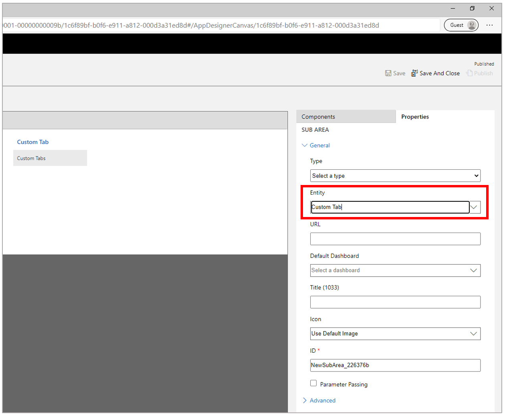

8. In the upper-right corner of the page, select **Save**, and then select **Publish**.

9. In the upper-left corner of the page, select **App Designer** to return to the App Designer.

10. Scroll down to the **Forms** item for your entity, and select it.

    

11. On the **Components** tab on the right side of the page, in the **Main Forms** section, select the **Edit** button (pencil symbol).

    

12. Drag the **Date and Time** and **Guide** fields from the list of fields in the left pane to the center of the page.

    

13. Go to [https://powerapps.microsoft.com](https://powerapps.microsoft.com). You should see your new group and view at the bottom of the left pane.

    

14. Select the view to open it, and then, in the **Guide** field, select a guide to add to the list.

    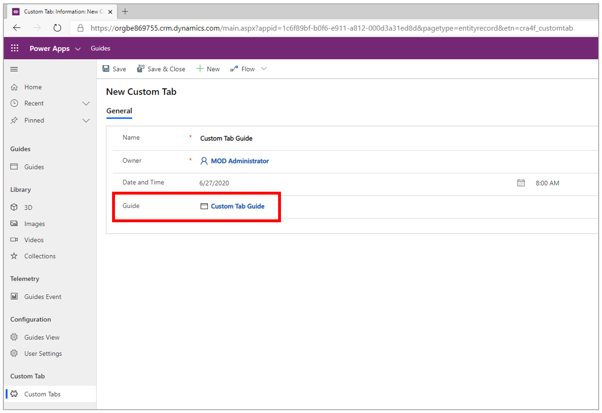

    > [!IMPORTANT]
    > When you add a guide to the list, you must specify a date. This date must be either the current date or a future date. Otherwise, the guide won't appear on the custom tab.

15. In the **Owner** field, assign the user who will have access to the list.

16. To add more guides to the list, select **New**, and then set the **Guide** and **Owner** fields again.

[!INCLUDE[footer-include](../includes/footer-banner.md)]