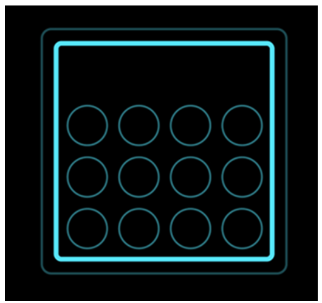

# Anchor a guide by using the Dynamics 365 Guides HoloLens app in Author mode

The first thing that you see when you open a guide in the Microsoft Dynamics 365 Guides HoloLens app is the anchoring instructions that were created in the Dynamics 365 Guides PC app. The method that you use to anchor the guide depends on the type of anchor that was created in the PC app. For more information about how to create an anchor, and the types of anchors, see [Anchor your guide to the real world in Dynamics 365 Guides PC app](anchor.md).

## Anchor a guide by using a printed anchor

1. Put on your HoloLens, and stand about two feet in front of the printed anchor.

2. On the **Scan Printed Anchor** page, select **Initiate Scan**.

    

    On your [!include[pn-hololens](../includes/pn-hololens.md)], you will see a holographic marker image that looks like the following illustration.

    

3. With your [!include[pn-hololens](../includes/pn-hololens.md)], look at the printed anchor until a green outline appears. Use your gaze to align the green box with the marker, and then select **Confirm**.

    

    When the guide is correctly aligned, the **Printed Anchor Found** page appears.

    

## Anchor a guide by using a digital anchor

- Use air tap and hold to move and align the digital anchor to its real-world counterpart. To rotate the anchor, tap and hold the blue spheres.

    

> [!TIP]
> On [!include[pn-hololens](../includes/pn-hololens.md)] 2, you can use your hand to directly select and place a digital anchor when you author a guide.

## Re-anchor a guide

When you anchor your guide, the anchoring information is stored on your [!include[pn-hololens](../includes/pn-hololens.md)]. Therefore, you don't have to re-anchor the guide every time that you open it. However, you can use the **Anchor** button to re-anchor a guide at any time, if you feel that the holograms are out of alignment. For more information, see [Place holograms, add styles, and more](hololens-app-orientation.md)

> [!NOTE]
> You might have to adjust the hardware offset on [!include[pn-hololens](../includes/pn-hololens.md)] 1 devices to help guarantee accurate placement of 3D content. [Learn more about adjusting for hardware offset](https://docs.microsoft.com/dynamics365/mixed-reality/guides/known-issues#uploading-new-3d-models-with-names-matching-any-of-the-pre-packaged-models-in-the-3d-toolkit-will-overwrite-the-files-in-the-3d-toolkit).

## What's next?

[Place holograms, add styles, and more](hololens-app-orientation.md)
