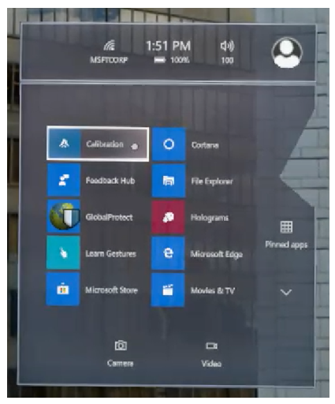

# Calibrate your HoloLens for authoring in the Dynamics 365 Guides HoloLens app

To make sure that holograms appear in the correct locations for guides you author in Dynamics 365 Guides, you must set the interpupillary distance (IPD) for your HoloLens. You can set your IPD by using the Calibration app included with HoloLens. This step must be completed for every HoloLens user, whether you're an author or operator. In an industrial setting where holograms are used to direct operators to perform operational tasks, it's crucial that holograms are correctly aligned. Incorrect alignment can cause operator confusion and costly damage. 

If you don't configure the IPD for each user:

- Holograms will be out of alignment by 1 to 2 cm.

- Holograms will appear as if they're sunk into or floating above surfaces that they're sitting on.

- Holograms won't be stable. As you walk around, you'll notice that they move.

> [!IMPORTANT]
> It's particularly crucial for authors to make sure that their IPD is set correctly. Otherwise, all operators who use the guide will see misaligned holograms.

## Calibrate your HoloLens 2 device

1. When you turn on the device for the first time, the following system prompt automatically appears: "Let's adjust [!include[pn-hololens](../includes/pn-hololens.md)] for your eyes." To begin calibration, select **Adjust**.

    

2. Use the start gesture to open the **Start** menu. For help with gestures, see [Gestures for navigating Dynamics 365 Guides](authoring-gestures-HL2.md).

3. If **Settings** isn't pinned to the **Start** menu, select the plus sign (**+**) button to view all apps.

    > [!NOTE]
    > To select something on the holographic **Start** menu, just touch it with your index finger.

4. Select **Settings**.

5. Select **System**.

6. In the side panel, select **Calibration**.

7. Select **Run Eye Calibration**.

8. Follow the on-screen instructions.

## Calibrate your HoloLens 1 device

> [!IMPORTANT]
> Starting with Dynamics 365 Guides version 502.2011.28001 (December 8, 2020 release), HoloLens operating system version 10.0.17134 (Redstone 4) will no longer be supported. This version of the operating system is used only on HoloLens 1. HoloLens 1 customers must upgrade to HoloLens version 10.0.17763 or later to continue to receive the latest updates. Please work with your IT admin to update your HoloLens operating system. If you choose not to upgrade, you will still be able to use the current version of Dynamics 365 Guides if the application is already installed on the device. For any new or refactored HoloLens 1 devices, version 10.0.17763 or later is required to install Dynamics 365 Guides. 

1. Use the bloom gesture to open the **Start** menu.

2. Air tap **Calibration**.

    

3. Follow the instructions on your [!include[pn-hololens](../includes/pn-hololens.md)].

All users must do this calibration after they sign in to the device. If HoloLens is running Windows Holographic for Business edition, the IPD settings are saved on the device. When you sign in to the same HoloLens, your IPD settings are automatically applied, even after you switch users; you don't have to recalibrate the device. However, if HoloLens is running Windows Holographic edition, user settings aren't saved because this version of the operating system is designed for a single user. So you must recalibrate the device whenever you switch users.

To determine which version of the operating system you're using on [!include[pn-hololens](../includes/pn-hololens.md)], follow these steps.

1. Use the bloom gesture to open the **Start** menu.

2. Air tap **Settings \> System**.

3. Air tap **About**.

## What's next?

[Install the app and sign in](install-sign-in-hololens-app.md) 
[Gestures for navigating the app](authoring-gestures.md) 
