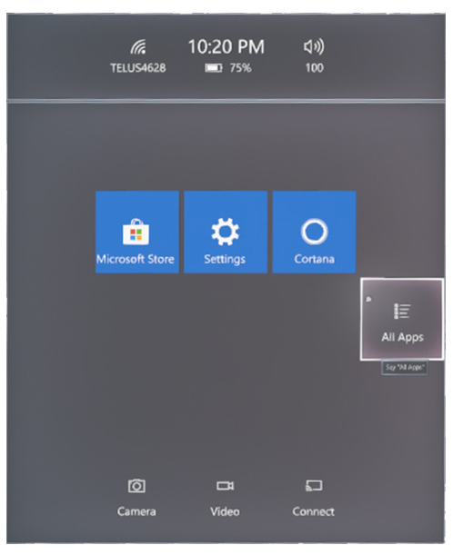
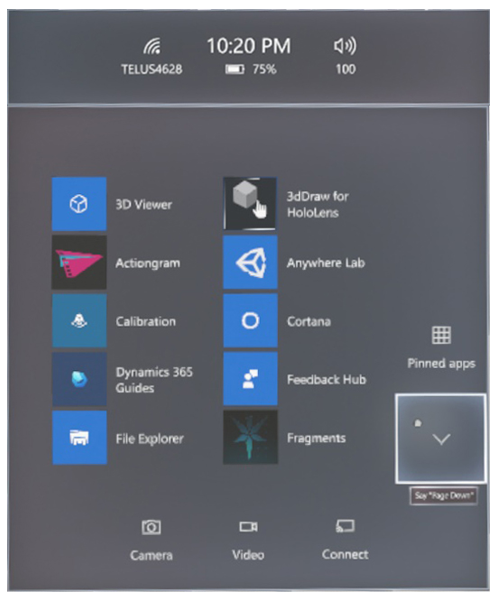
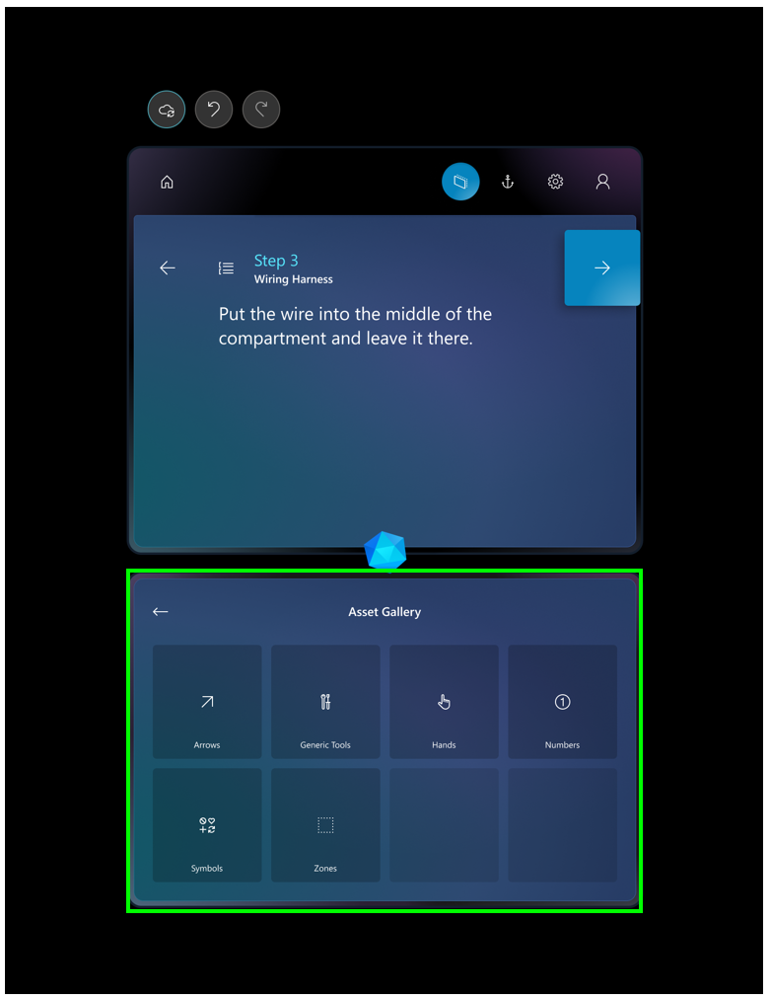
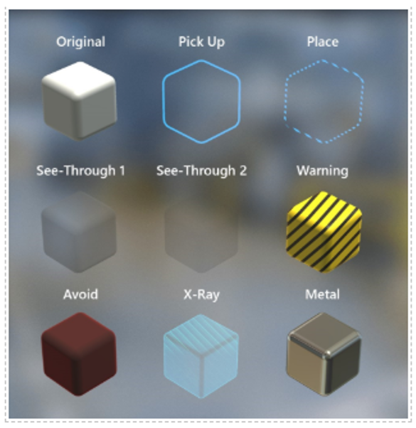
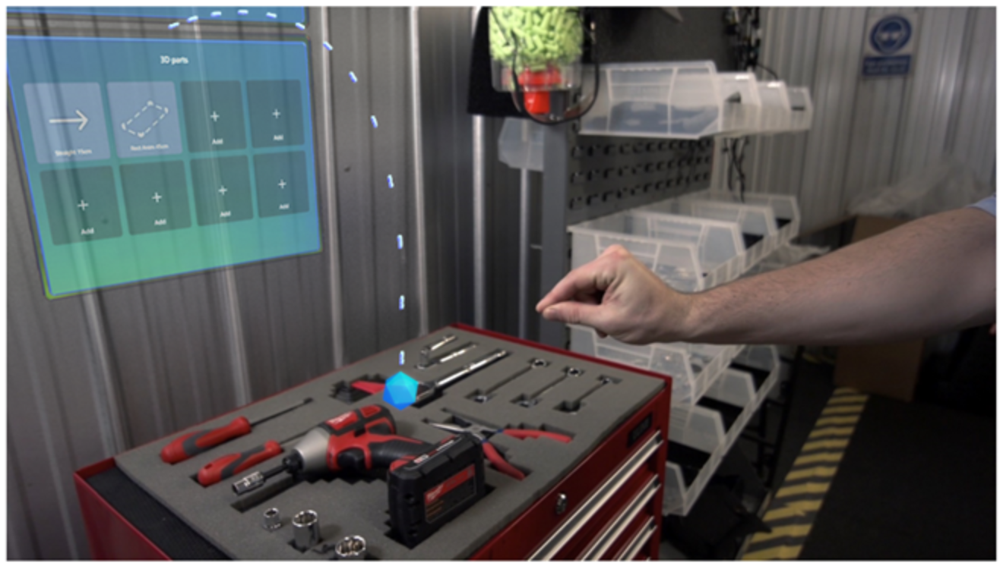

# Test your guide and place holograms using HoloLens Author mode

[!INCLUDE [cc-beta-prerelease-disclaimer](../includes/cc-beta-prerelease-disclaimer.md)]
 
The second major step in authoring a guide in Microsoft Dynamics 365 Guides in preview takes place on the HoloLens application. In HoloLens Author mode, you:

- Align your guide to a printed anchor (marker) or a digital anchor, depending on the type of anchor method you chose in the PC application.

- Test the flow of your guide.

- Place your holographic 3D content in its relevant space in the real world.

- Add holographic tethers to visually tie your steps to physical objects in the real world.

- Add styles (optional) to 3D content to add treatments such as a warning or caution.

  

## Install the HoloLens app

If you haven’t already installed the HoloLens app on your HoloLens device (or it hasn't already been installed for you), install it from the Microsoft Store for Consumers.

To install the HoloLens app:

1.	Make sure you have Microsoft HoloLens build 10.0.14393.0 or later installed on your HoloLens device. We recommend updating to newer versions when available. See [Manage updates to HoloLens](https://docs.microsoft.com/en-us/HoloLens/hololens-updates) for instructions on using Windows Update for Business.

2.	On your HoloLens, use the [bloom gesture](authoring-gestures.md) to open the **Home** menu, and then open Microsoft Store and search for “Dynamics 365 Guides (Preview)”.

3.	Select **Install** to download and install the Dynamics 365 Guides application.

### Sign in to the HoloLens app
If you sign in with a brand new HoloLens device, you’ll be prompted to walk through the Setup wizard. In the Setup wizard, you can sign in with an existing account or create a new one, depending on the version of Windows that you’re running. The Setup wizard will also walk you through steps to calibrate and prepare your HoloLens for use.

#### Calibrate your HoloLens

To have the holograms appear in the correct locations, the interpupillary distance (IPD) must be set. This is true for any HoloLens user, whether you’re an author or an operator. In an industrial setting where a hologram is used to direct the operator to do operational tasks, it’s crucial that holograms be aligned properly. Otherwise it can cause operator confusion and can result in costly damage.

If you don’t configure the IPD for each user: 

- Holograms will be out of alignment by 1–2 cm. 

- Holograms will appear as if they’re sunk into or floating above surfaces they’re sitting on.

- Holograms will not be stable. As you walk around, you’ll notice that they move.

> [!IMPORTANT] 
> It’s particularly crucial for authors to ensure that their IPD is set correctly. Otherwise, all operators using the guide will see misaligned holograms. 

To set your IPD, use the Calibration app included with HoloLens using the following steps: 

1.	Do the bloom gesture to launch the **Start** menu.

2.	Air tap on **Calibration** to begin calibrating your HoloLens.

    
 
3.	Follow the instructions on your HoloLens.

Each user will need to do this calibration after logging into the device. If HoloLens is running Windows Holographic for Business edition, the IPD setting will be saved on the device. When the user logs into the same HoloLens, their IPD setting will be applied automatically even after switching users—they won’t need to recalibrate. If HoloLens is running Windows Holographic edition, however, user settings aren’t saved, because this version of the operating system is designed for a single user. Each time you switch users, you’ll need to recalibrate the device. 

To determine which version of the operating system you’re using on HoloLens: 

1.	Do the bloom gesture to launch the **Start** menu.

2.	Air tap on **Settings > System**.
 
3.	Air tap **About**.
 
### Open and sign in to HoloLens for the first time
After ensuring that your HoloLens is correctly calibrated, you can open the HoloLens application.
1.	Go to **All Apps**.

    

2.	Select the down arrow.

    

3.	Open the Guides application.

    
 
4.	In the **Welcome** screen, select **Sign in**. 

5.	In the **Email and accounts** screen, select **Work or school account**, and then select **Continue**. 

6.	In the **Work or school account** screen, enter the credentials you created during the trial sign-up or the credentials provided to you by the administrator who installed the app. 

    
 
7.	Select an instance to use if you have more than one instance, and then select **Continue**.

8.	In the **Select Mode** dialog box, gaze at the box to the left of **Author** until the box fills, which selects that item. 

    
    
> [!TIP]
> Dynamics 365 Guides comes with an example guide you can use to get ideas for your own guides. Check it out!  

## Align your guide
The first thing you see when you open a guide is the alignment instructions from the PC authoring application. 

### To align a guide by using a printed anchor

1. Stand about two feet in front of the printed anchor.

2. In the **Scan printed anchor** screen, select **Initiate Scan**.

   

   On your HoloLens, you'll see an anchor hologram that looks like this:

   
   
3. Look at the printed anchor with your HoloLens until a green outline appears.

   You'll see the **Printed anchor found** screen. 
   
   
   
4. If the outline aligns with the printed anchor, select **Confirm**. If not, select **Rescan**.
   
> [!NOTE]
> If you chose to use a digital anchor to align the guide, you’d use a gesture to align the hologram that matches the digital 3D representation that you placed in your real-world environment.

When you align your guide, the alignment information is stored on your HoloLens so you don’t have to realign the guide every time you open it. You can realign a guide at any time, though, if you feel the holograms are out of alignment. For more information, read about the **Alignment** button in the next section.

> [!NOTE]
> You might need to adjust the hardware offset in HoloLens 1 devices to ensure accurate placement of 3D content. [Learn more about adjusting for hardware offset](https://docs.microsoft.com/dynamics365/mixed-reality/guides/known-issues#uploading-new-3d-models-with-names-matching-any-of-the-pre-packaged-models-in-the-3d-toolkit-will-overwrite-the-files-in-the-3d-toolkit).

## Get oriented on HoloLens
After you align your guide, you’ll see the Step card. The Step card is the hub of everything you do with your guide and how you navigate in the app. The Step card is also what your operator will see when they use the guide. The Step card tags along with the operator to keep the instructions where they need them as they move around their work space.

Navigate through the guide by gazing at the **Next Step** and **Go Back** arrows. You can also use gestures such as air tap to navigate through a guide. 

At the top of the Step card screen, you’ll see three buttons: **Save**, **Undo**, and **Redo**.

 
The **Undo** and **Redo** buttons work like **Undo** and **Redo** in any Microsoft Office program. There’s no limit to the number of times you can undo or redo. 

> [!NOTE]
> Changes are automatically saved as you author in HoloLens. Just be sure to select **Refresh** when you go back to the PC to ensure that you have the latest version of the guide.

The Step card also includes several other buttons and UI elements:

 
Here’s what each button or UI element is used for:

|Letter|Button/Example|Name|Purpose|
|--|---|------------|----------------------------------------------------------------------------------------------------------------|
|A||Home|Choose a different guide.|
|B||Anchor|Re-anchor (realign) your guide.|HoloLens can sometimes lose tracking. To fix this, you’ll need to realign the guide by gazing at the printed anchor (marker) or digital anchor again.|
|C||Settings|Access the following settings:  - **Fit box**. Use to make sure you’re wearing the HoloLens device correctly.  - **Noise Cancellation**. If the environment is very noisy, this setting adjusts sensitivity to voice commands so the operator doesn't have to shout.  - **Dynamic Volume**. Adjusts the volume dynamically based on noise in the environment. For example, if the environment is very noisy, the volume adjusts upward automatically.  - **Build number**. Shows the build you’re using.|
|D||Profile|Sign in and out.|
|E||Pin|Lock the Step card to a location.|Guides includes a feature called “tag-along.” Wherever you look, the Step card follows your gaze so you never have to worry where your instructions are. When you pin the Step card, you turn off the tag-along feature. When tag-along is off, you can just grab the card and move it wherever you like.|
|F||Step progress|Shows where you are in the step.|
|G||Outline|Go to the Outline page.|Use the Outline page to quickly navigate around your guide.|
|H||Task Progress	|Shows where you are in the open task.|
|I||Task name|The name of the task.|

## Test the flow of your guide
Once you’re oriented on HoloLens, we recommend that you go through your whole guide to see how it flows. As you step through your guide, make note of things you want to change in the PC application. For example, you might need to move some steps around, add tasks or steps, or add more supporting assets. It’s generally best to make these changes in the PC application before you start placing holograms, tethers, and styles. 

## Place your holograms
After you’ve tested the flow of your guide and made changes in the PC application, you’re ready to place your holograms. 

In this stage of the process, you’ll walk through each step in your guide and place any assets that you associated with that step when you authored it in the PC application. For example, if you added a 3D part to support a step, you’ll place that part over its physical counterpart in the real world. If you added a 3D object from the 3D toolkit (an arrow or a number, for example), you’ll place that object in an appropriate place in the real world to draw the user’s focus. You can place the same 3D part or 3D object as many times as you want.

You don’t need to do anything to place images or videos associated with a step. They automatically appear when the operator goes to the step. They can select the **Media** button to close the image or video.

The 3D assets associated with each step appear below the Step card in *the bin*:

 
### Place a 3D part 

1. In the bin, air tap the 3D part that you want to place.

2. Use gaze and gestures to place the 3D part hologram over its counterpart in the physical world. For information on manipulating holograms with gaze and gestures, see the next section.

### Place a 3D model from the 3D toolkit

You can place a 3D model from the 3D toolkit in the same way you place a 3D part if you added that 3D model to the bin in the PC application. If you didn't add the 3D model in the PC application, you can do it directly from the HoloLens app: 

1.	Air tap an empty box in the bin (under **3D parts**).

2.	Air tap a category (an arrow or hand, for example), and then air tap the specific 3D model you want to add.

    

    The item will be added to your bin and you can then place it as you would a 3D part.

### Manipulating holograms

To place a hologram from one of your bins:

1.	Air tap a 3D asset to add it to your real world. It will appear in your world in front of the Step card.

2.	Raise your hand to the ready gesture and gaze at the 3D asset to select it. The way you can tell if it’s selected is that the 3D selection sphere appears around it.

3.	Once the object is selected, air tap + hold anywhere on the selection sphere to pick up the 3D asset.

4.	Do one of the following to move the hologram:

    - To move it larger distances in any direction, move your hand quickly in the direction you want. By default, the hologram moves approximately the same distance your hand moves from the starting point of where you “grabbed” the hologram to where you stop. 
    
    - To make more precise adjustments, move your hand slowly or keep it stationary to enter precision mode. This slows down the movement speed so you can nudge the hologram where you want it.

>[!Tip]  
> You’ll know you’ve entered precision mode when the selection sphere turns blue.

 
#### Rotate a hologram

It’s unlikely an asset will be at the correct orientation when you initially place or move it. Use the rotation adjustment knobs to rotate it the way you want.

To rotate a hologram:

- Air tap and hold on a rotation adjustment, and then do one of the following:

  - Use the up/down knob to rotate vertically.
  
  - Use the left/right knob to rotate horizontally.
  
  - Use the free-hand knob to rotate in any direction.

>[!Tip]
> Gazing at any of the gizmo knobs will let you know which direction the knob will rotate.

When rotating, it helps to think as if you are physically grabbing the knob and rotating around the object, like a wheel.
The following graphic shows how to use the different rotation knobs:

 
> [!Important]
> To manipulate holograms effectively, make sure that your HoloLens is calibrated properly. 

#### Change the size of a hologram after placing it

- Air tap and hold the **Scale** button, and then move your hand up or down.  

   

### Best practices for working with 3D content

- Make sure that the 3D content is not in the way of the operator doing the task. 

- Keep the field of view in mind when placing assets. If you put a hologram behind someone, it will be very hard to find.

- Use 3D content sparingly and with a clear goal. Too much content can clutter the instructions and make it harder to follow.

- Remember that you can attach a tether to 3D content to make it more discoverable. See the next section to learn about tethers.

## Add styles for emphasis
Use styles to provide visual cues for extra emphasis. For example, add the Warning style to show caution or the Avoid style to make sure an operator doesn’t do something that could cause harm. As your operators get used to the visual language provided by styles, it will speed up their learning process.

> [!Note]
> At this time, you can’t add styles from the PC application. They exist only in HoloLens. 

To place a style:

1.	Air tap a hologram you’ve already placed in the real world to select it.

2.	Air tap the **Edit Hologram** (. . .) button.

    

3.	Air tap **Styles**. 

    
 
4.	Select the style you want to use.

    
 
Here’s a list of styles included in Guides and when to use each:

|Style	|Purpose	|How it appears to the operator|
|---------------|-------------------|--------------------------------------------|
|Original|Restore to original appearance.	|Default appearance|
|Pick up	|Tell the operator to pick up something.	|Outline|
|Place	|Show the operator where to place something.	|Dotted line|
|See-through 1	|Show something without obscuring the operator’s view.	|50% transparent|
|See-through 2	|Layer one thing on top of another so the operator can see through two layers.	|75% transparent|
|Warning	|Warn about a safety or quality concern.	|Yellow and black striped|
|Avoid	|Show areas or things to avoid.	|Red flashing|
|X-ray	|Show things that happen inside something.	|Outline with transparent inside|
|Metal	|Provide a realistic metal finish for an object.	|Metallic|

 
### Best practices for styles

- Use styles to reinforce actions.

- Use styles only for the purpose they were intended. When operators learn the visual language of styles, they’ll know that a particular style means a certain thing, which will speed up the learning process. 

## Duplicate a 3D model to use for similar items

Sometimes, you need multiple copies of the same 3D models to point to similar items in the work area. Rather than adding new instances of a 3D model from the asset bin and having to set the position and style each time, you can save time by duplicating the 3D model. The duplicate will have the same rotation and style settings as the original.

To duplicate a model:

1.	Air tap a hologram you’ve already placed in the real world to select it.

2.	Air tap the **Edit Hologram** (. . .) button.

    
    
3. Select **Duplicate**.

    

## Place tethers
You’ll typically place a tether for each Step card when you place your holograms. A tether visually links a Step card to the area where the operator needs to focus. It helps the operator find the content or understand what they’re supposed to be looking at in the real world. 

To place a tether:

1.	Tap and hold the “tether ball” below the Step card.

2.	Place it in the real-world location that you want.

    

### Best practices for tethers

- Tether placement isn’t exact, so if you’re connecting a tether to a 3D object from the 3D toolkit, place the tether in the general area, and then place the 3D object (a number, for example) at the end of the tether. 

## What's next?

To learn more about Guides, here are some helpful links:

- [Use a guide as an operator](operator-guide.md)
- [Analyze your guides to improve efficiency](analytics-guide.md)
- [FAQ](faq.md)

To learn more about Microsoft mixed-reality apps and HoloLens, use the following links: 

- [What is mixed reality](https://docs.microsoft.com/en-us/windows/mixed-reality/mixed-reality)?
- [Microsoft Dynamics 365 Layout](https://dynamics.microsoft.com/en-us/mixed-reality/layout/)
- [Microsoft Dynamics 365 Remote Assist](https://dynamics.microsoft.com/en-us/mixed-reality/remote-assist/)
- [Connect to Wi-Fi on HoloLens](https://docs.microsoft.com/en-us/windows/mixed-reality/connecting-to-wi-fi-on-hololens)
- [Calibrate your HoloLens](https://docs.microsoft.com/en-us/windows/mixed-reality/calibration)
