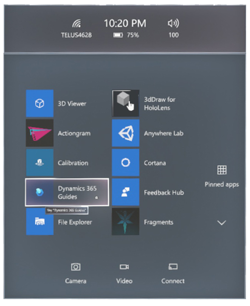

# Install and sign in to the Dynamics 365 Guides HoloLens app

If you haven't already installed the [!include[cc-microsoft](../includes/cc-microsoft.md)] [!include[pn-hololens](../includes/pn-hololens.md)] app on your [!include[pn-hololens](../includes/pn-hololens.md)] device (or if it hasn't already been installed for you), you can install it from the [!include[cc-microsoft](../includes/cc-microsoft.md)] Store for Consumers.

> [!NOTE]
> You must have a license to install the [!include[pn-dyn-365-guides](../includes/pn-dyn-365-guides.md)] [!include[pn-hololens](../includes/pn-hololens.md)] app. You can also sign up for a free trial. For more information, see [Setup overview](setup.md).

## Install the app

1. Make sure that you have [!include[cc-microsoft](../includes/cc-microsoft.md)] [!include[pn-hololens](../includes/pn-hololens.md)] build 10.0.14393.0 or later installed on your [!include[pn-hololens](../includes/pn-hololens.md)] device. We recommend that you update to newer versions when they are available. For information about how to use [!include[pn-ms-windows-short](../includes/pn-ms-windows-short.md)] Update for Business, see [Manage updates to HoloLens](https://docs.microsoft.com/HoloLens/hololens-updates).

2. On your [!include[pn-hololens](../includes/pn-hololens.md)], use the [bloom gesture](authoring-gestures.md) to open the **Home** menu. Then open [!include[cc-microsoft](../includes/cc-microsoft.md)] Store, and search for "[!include[pn-dyn-365-guides](../includes/pn-dyn-365-guides.md)]".

3. Select **Install** to download and install the [!include[pn-dyn-365-guides](../includes/pn-dyn-365-guides.md)] app.

## Sign in

If you sign in to a brand-new [!include[pn-hololens](../includes/pn-hololens.md)] device, you will be prompted to complete the **Setup** wizard. In the **Setup** wizard, you can either sign in by using an existing account or create a new account, depending on the version of [!include[pn-ms-windows-short](../includes/pn-ms-windows-short.md)] that you're running. The **Setup** wizard will also guide you through steps to calibrate and prepare your [!include[pn-hololens](../includes/pn-hololens.md)] for use.

## Calibrate your HoloLens

To help guarantee that the holograms appear in the correct locations, you must set the interpupillary distance (IPD). This step must be completed for every [!include[pn-hololens](../includes/pn-hololens.md)] user, regardless of whether that user is an author or an operator. In an industrial setting where holograms are used to direct operators to perform operational tasks, it's crucial that the holograms be correctly aligned. Incorrect alignment can cause operator confusion and costly damage.

Here are the results if you don't configure the IPD for each user:

- Holograms will be out of alignment by 1 to 2 cm.

- Holograms will appear as if they're sunk into or floating above surfaces that they're sitting on.

- Holograms won't be stable. As you walk around, you will notice that they move.

> [!IMPORTANT]
> It's particularly crucial for authors to make sure that their IPD is set correctly. Otherwise, all operators who use the guide will see misaligned holograms.

To set your IPD, use the Calibration app that is included with [!include[pn-hololens](../includes/pn-hololens.md)], and follow these steps.

1. Use the bloom gesture to open the **Start** menu.

2. Air tap **Calibration** to begin to calibrate your [!include[pn-hololens](../includes/pn-hololens.md)].

    

3. Follow the instructions on your [!include[pn-hololens](../includes/pn-hololens.md)].

All users must do this calibration after they sign in to the device. If [!include[pn-hololens](../includes/pn-hololens.md)] is running [!include[pn-ms-windows-short](../includes/pn-ms-windows-short.md)] Holographic for Business edition, the IPD setting are saved on the device. Therefore, when you sign in to the same [!include[pn-hololens](../includes/pn-hololens.md)], your IPD setting are automatically applied, even after you switch users. You don't have to recalibrate the device. However, if [!include[pn-hololens](../includes/pn-hololens.md)] is running [!include[pn-ms-windows-short](../includes/pn-ms-windows-short.md)] Holographic edition, user settings aren't saved, because this version of the operating system is designed for a single user. Therefore, you must recalibrate the device every time that you switch users.

To determine which version of the operating system you're using on [!include[pn-hololens](../includes/pn-hololens.md)], follow these steps.

1. Use the bloom gesture to open the **Start** menu.

2. Air tap **Settings \> System**.

3. Air tap **About**.

## Open and sign in for the first time

After you've made sure that your [!include[pn-hololens](../includes/pn-hololens.md)] is correctly calibrated, you can open the [!include[pn-hololens](../includes/pn-hololens.md)] app.

> [!NOTE]
> If you're a [!include[pn-dyn-365-guides](../includes/pn-dyn-365-guides.md)] admin, you can assign **Author** and **Operator** roles to limit the features that are available to users. For more information, see [Assign an Author or Operator role to a user](assign-role.md).

1. Select **All Apps**.

    

2. Select the down arrow button.

    

3. Open the [!include[pn-dyn-365-guides](../includes/pn-dyn-365-guides.md)] app.

    

4. On the **Welcome** page, select **Sign in**.

5. On the **Email and accounts** page, select **Work or school account**, and then select **Continue**.

6. On the **Work or school account** page, enter the credentials that you created during sign-up for the trial, or the credentials that the admin who installed the app provided to you.

    

7. Select an instance to use, if you have more than one instance. Then select **Continue**.

8. On the **Select Guide** page, gaze at the guide that you want to open until the circle is filled. When the circle is filled, the guide is selected.

    

9. In the **Select Mode** dialog box, gaze at the circle to the left of **Author** to select it.

    

## What's next?

[Anchor your guide](hololens-app-anchor.md) 
[Place holograms, add styles, and more](hololens-app-orientation.md)
