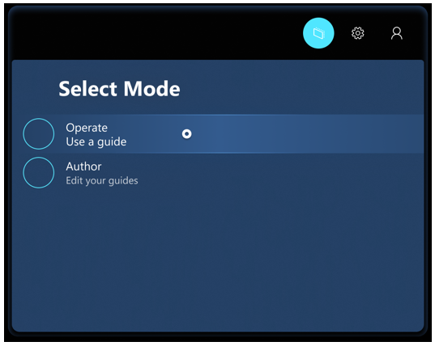

# Install and sign in to the Dynamics 365 Guides HoloLens app (operators)

1. Make sure that you have [!include[cc-microsoft](../includes/cc-microsoft.md)] [!include[pn-hololens](../includes/pn-hololens.md)] build 10.0.14393.0 or later installed on your [!include[pn-hololens](../includes/pn-hololens.md)] device. We recommend that you update to newer versions when they are available. For information about how to use [!include[pn-ms-windows-short](../includes/pn-ms-windows-short.md)] Update for Business, see [Manage updates to HoloLens](https://docs.microsoft.com/HoloLens/hololens-updates).

2. On your [!include[pn-hololens](../includes/pn-hololens.md)] device, use the [bloom gesture](authoring-gestures.md) to open the **Home** menu. Then open the [!include[cc-microsoft](../includes/cc-microsoft.md)] Store app, and search for "[!include[pn-dyn-365-guides](../includes/pn-dyn-365-guides.md)]".

3. Select **Install** to download and install the [!include[pn-dyn-365-guides](../includes/pn-dyn-365-guides.md)] application.

## Sign in to the HoloLens app

If you sign in to a brand-new [!include[pn-hololens](../includes/pn-hololens.md)] device, you will be prompted to complete the **Setup** wizard. In the **Setup** wizard, you can either sign in by using an existing account or create a new account, depending on the version of [!include[pn-ms-windows-short](../includes/pn-ms-windows-short.md)] that you're running. The **Setup** wizard also guides you through steps to calibrate and prepare [!include[pn-hololens](../includes/pn-hololens.md)] for use. For more information about calibration, see the "First things first" section of this topic.
 
## Open and sign in to HoloLens for the first time

1. Select **All Apps**.

    

2. Select the down arrow button.

    

3. Open the [!include[pn-dyn-365-guides](../includes/pn-dyn-365-guides.md)] app.

    

4. On the **Welcome** page, select **Sign in**. 

5. On the **Email and accounts** page, select **Work or school account**, and then select **Continue**.

6. On the **Work or school account** page, enter the credentials that your admin provided. For the credentials, the user name will resemble `username@domain.com`. For example, if your user name is LauraO, and you work for the Contoso company, the user name will be `laurao@contoso.com`.

    

7. Select an instance to use, if you have more than one instance. Then select **Continue**.

8. In the **Guides** dialog box, gaze at the selection box for the guide that you want to open.

9. In the **Select Mode** dialog box, gaze at the circle to the left of **Operate** until it's filled. When the circle is filled, the option is selected.

    

> [!NOTE]
> If you're a Dynamics 365 Guides admin, you can assign the **Operator** role to operators so that they can view guides but can't edit them. If you assign the **Operator** role to a user, the user can also skip the step in the **Select Mode** dialog box and open a guide directly. For more information, see [Assign an Author or Operator role to a user](assign-role.md).

## What's next?

[Calibrate your HoloLens](operator-calibrate.md) 
[Gestures for navigating the app](operator-gestures.md) 
[Anchor your guide](operator-anchor.md) 
[Operate a guide](operator-orientation.md)
