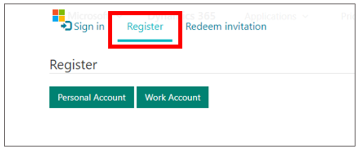
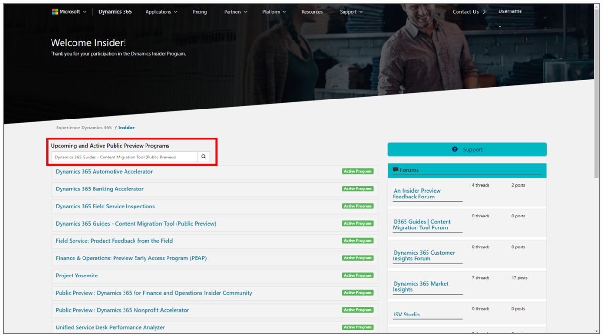
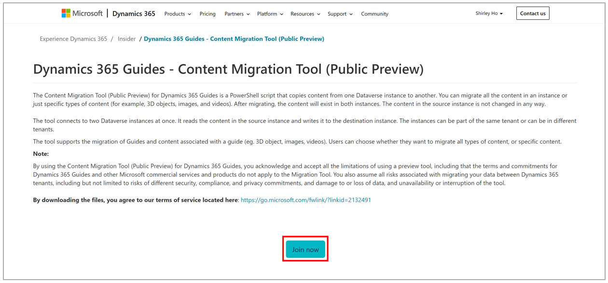
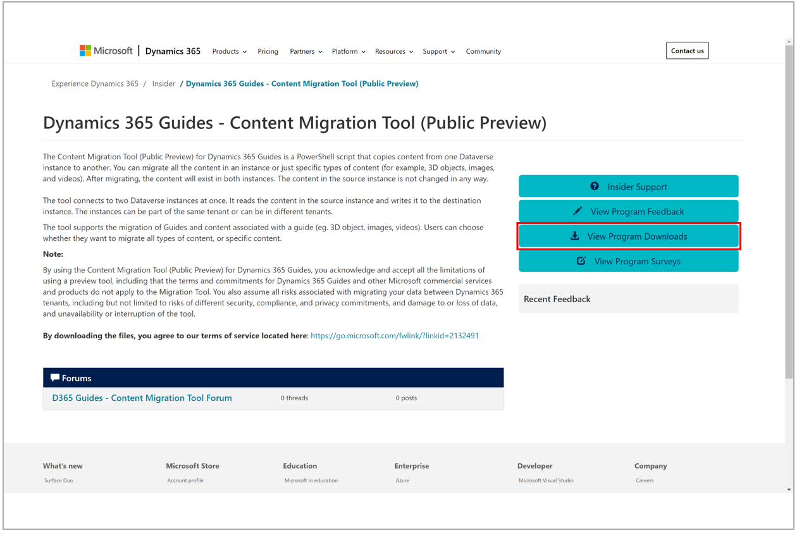
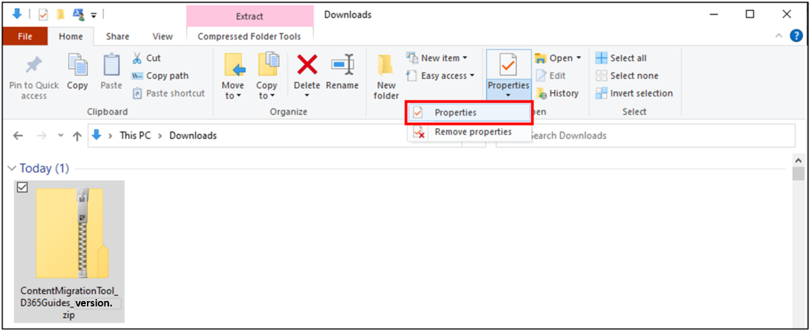
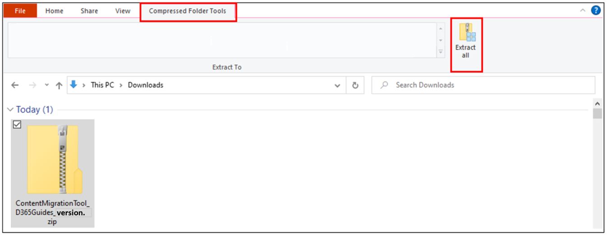
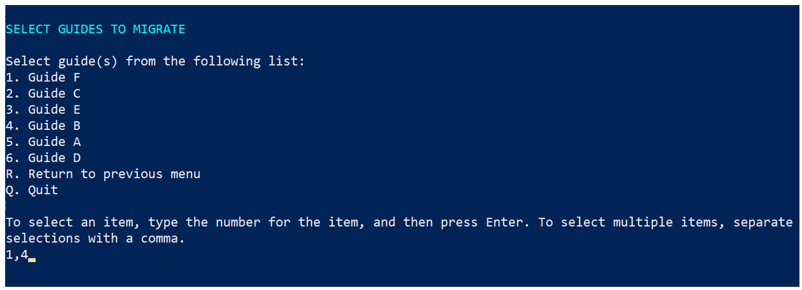

# Migrate Dynamics 365 Guides content from one Common Data Service instance to another using the Content Migration Tool (public preview)

The Content Migration Tool (Public Preview) for Microsoft Dynamics 365 Guides is a [PowerShell](https://docs.microsoft.com/windows-server/administration/windows-commands/powershell) script that copies content from one Common Data Service instance to another. You can migrate all the content in an instance or just specific types of content (for example, 3D objects, images, and videos). After migrating, the content will exist in both instances. The content in the source instance is not changed in any way.

The tool connects to two Common Data Service instances at once. It reads the content in the source instance and writes it to the destination instance. The instances can be part of the same tenant or can be in different tenants. 

> [!NOTE]
> By using the Content Migration Tool (Public Preview) for Dynamics 365 Guides, you acknowledge and accept all the limitations of using a preview tool, including that the terms and commitments for Dynamics 365 Guides and other Microsoft commercial services and products do not apply to the Migration Tool. You also assume all risks associated with migrating your data between Dynamics 365 tenants, including but not limited to risks of different security, compliance, and privacy commitments, and damage to or loss of data, and unavailability or interruption of the tool.

The tool supports the following types of migrations. 

|Type of migration|What's migrated?|
|------------------------------------------------------|------------------------------------------------------------------|
|All content|	Everything stored in the instance that’s active (excludes telemetry events associated with a guide).|
|Guides and associated content|	Active guides and any 3D objects, images, or videos related to those guides. Inactive content associated with a guide is also migrated. You can choose to migrate all existing guides at once or select specific guides. |
|All 3D objects, images, and videos|	All active 3D objects, images, and videos stored in the instance.|
|Only 3D objects|Active 3D objects only. You can choose to migrate all existing 3D objects at once, migrate all 3D objects that belong to a 3D object collection, or select specific 3D objects. |
|Only images|Active images only. You can choose to migrate all existing images at once or select specific images.|
|Only videos|Active videos only. You can choose to migrate all existing videos at once or select specific videos.|

>[!NOTE]
>-[Website and Power Apps links](pc-app-website-powerapps-link.md) are migrated when you migrate the guides. However, for Power Apps, you’ll also need to manually import the apps into the new instance and update the links in the steps.  - Migration of guides based on schema v3 is not supported by this tool. If you have updated your Dynamics 365 Guides solution to the latest version and still have a guide based on schema v3, you can [do a manual upgrade](https://docs.microsoft.com/dynamics365/mixed-reality/guides/upgrade#troubleshooting-you-receive-a-guide-cannot-be-opened-error-message).  - For 3D objects that belong to a 3D object collection, the parent 3D object will not be migrated unless you have the **System Admin** role.

## Prerequisites

- You must have a Dynamics Insider Program account to have access to the download files. 

- You must be a system administrator for the PC you use to run the PowerShell script. 

- You must use [PowerShell](https://docs.microsoft.com/powershell/scripting/install/installing-windows-powershell?view=powershell-7#how-to-check-the-version-of-powershell) version 5.1.18362.752 or later. 

- Both the source instance and destination instance must use Dynamics 365 Guides solution version 400.0.0 or later. 

- You must have credentials to sign in to the source instance with the **System Admin** role (preferable) or **Operator/Author** role (required).  

- You must have credentials to sign in to the destination instance with the **System Admin** role (preferable) or **Author** role (required). 

We also highly recommend [backing up the contents](https://docs.microsoft.com/power-platform/admin/backup-restore-environments#create-a-manual-backup) of both instances before starting the migration process. 

>[!NOTE]
>Multi-factor authentication is not supported by this tool.

## Register for the Dynamics Insider Program 

1. Go to [https://experience.dynamics.com/Account/Login/Register?returnUrl=%2Finsider%2F](https://experience.dynamics.com/Account/Login/Register?returnUrl=%2Finsider%2F) and register with an account of your choice (or sign in if you're already registered).

    
 
2. After you've registered, under **Upcoming and Active Public Preview Programs**, search for **Dynamics 365 Guides - Content Migration Tool (Public Preview)**, and then select it. 
 
    
   
3. Select **Join now**.
 
    
    
    >[!NOTE]
    >The request to join the Dynamics 365 Guides – Content Migration Tool (Public Preview) program must be approved by Microsoft. If the request hasn’t been approved within 24 hours, contact the [Dynamics 365 Guides team](https://community.dynamics.com/365/guides).

4. Select **View Program Downloads**.

    

5. Download the **ContentMigrationTool_D365Guides_v400.0.1.0.zip** folder by selecting the link under **File Name**. The file will automatically be saved in your **Downloads** folder.  

    

## Run the script

1. Select the zip folder in Windows File Explorer, open the **Properties** list, and then select **Properties**.  

    

2. In the **Properties** panel, on the **General** tab, select the **Unblock** check box, and then select **Apply**. 

    

3. Extract the contents of the zipped folder by doing the following:

    a. Select the zipped folder in File Explorer. 
    
    b. Select **Extract**, and then select **Extract all**.

      

4. Go to the File Explorer location where you extracted the contents of the zipped folder. 
 
5. Run PowerShell [as an administrator](https://docs.microsoft.com/previous-versions/windows/it-pro/windows-server-2012-R2-and-2012/hh831491(v=ws.11)#run-a-program-as-administrator-or-as-another-user) by doing the following:  

    a. Select **File** > **Open Windows PowerShell** > **Open Windows PowerShell as administrator**.

      

    b. In the **User Account Control** dialog box, select **Yes** to allow PowerShell to make changes to your device.
 
6. Type **Set-ExecutionPolicy RemoteSigned**, and then press **Y** to accept the change in execution policy.

    

7. Type **.\ContentMigrationTool_Preview_Dynamics365Guides.ps1**, and then press Enter. 

   >[!NOTE]
   >Make sure to type the period at the beginning of the string.
 
8. Press any key to continue. 

9. In the **PowerShell Interactive Login** dialog box, connect to the source instance by doing the following: 

    a. Next to **Deployment Type**, select the **Office 365** option.
    
    b. Select the **Display list of available organizations** check box. 
    
    c. Select the **Show Advanced** check box. 
    
    d. Select the **Online Region** for your instance. If you don’t know the region, select **Don’t know**.
    
    e. Type the **User Name** and **Password** for the Common Data Service instance you want to connect to. 
    
    f. Select **Login**.

      
      
      >[!NOTE]
      >If you don’t select an organization to connect to, the tool connects to the last one that was successful for both source and destination. If there’s only one instance in the tenant, PowerShell automatically connects to the default instance and you can skip to Step 11.  

 
    g. In the pop-up screen, select the source instance (organization) to connect to.     
     
      

    h. Select **Login**.

10.	In the **PowerShell Interactive Login** dialog box, connect to the destination instance by doing the following: 

    a. Next to **Deployment Type**, select the **Office 365** option.
    
    b. Select the **Display list of available organizations** check box.
    
    c. Select the **Show Advanced** check box.
    
    d. Select the **Online Region** for your instance. If you don’t know the region, select **Don’t know**.
    
    e. Type the **User Name** and **Password** for the Common Data Service instance you want to connect to.
    
    f. Select **Login**.

              

    g. In the pop-up screen, select the destination instance (organization) to connect to. 

             

    h. Select **Login**. 

11.	In the **Main Menu** screen, select an option by typing the number that corresponds to the item, and then press Enter.

    

    >[!NOTE]
    >In numbered lists where you can select more than one option, like the **Select Guides to Migrate** screen, separate selections with a comma, and then press Enter.
 
    

12.	When asked to confirm your choice, type **Y**, and then press Enter. To cancel an action, type **N**, and then press Enter.
 
    

