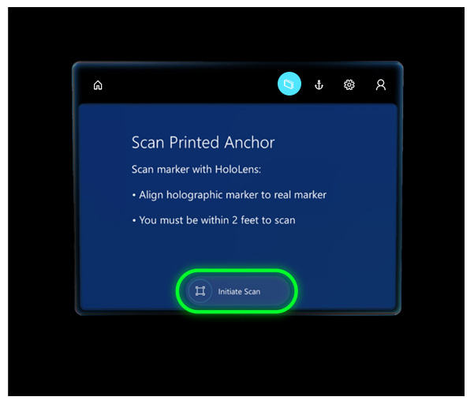
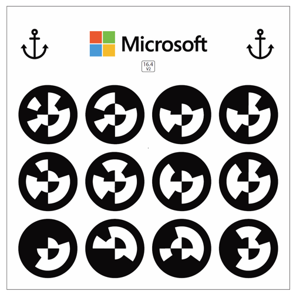
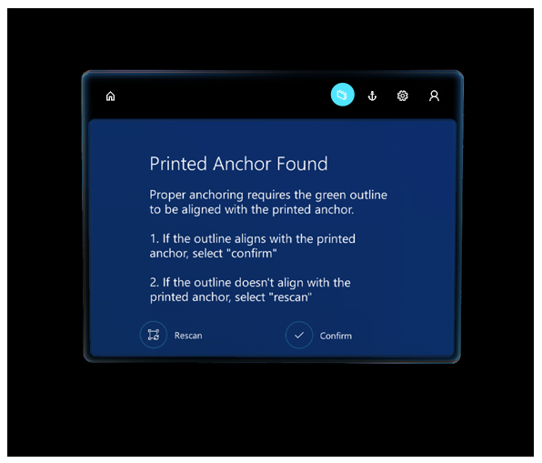
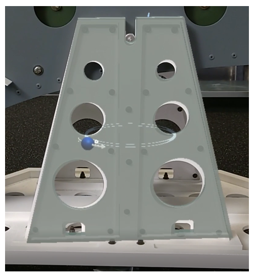

# Anchor a guide in the Dynamics 365 Guides HoloLens app (operators)

The first thing that you see when you open a guide is the anchoring instructions for the guide.

> [!NOTE]
> The page in the previous illustration shows the anchoring instructions for a printed anchor. The page will differ if you must anchor your guide by using a digital anchor. The anchoring instructions will tell you how to anchor your guide.

Like the calibration of [!include[cc-microsoft](../includes/cc-microsoft.md)] [!include[pn-hololens](../includes/pn-hololens.md)], anchoring a guide is a crucial step. You anchor a guide to make sure that the holographic instructions line up with your real-world environment. If the holograms don't line up, operators will likely be confused when they try to do a task. They could even cause damage. For example, an operator might drill a hole in the wrong place.

## Printed anchors versus digital anchors

There are two types of anchors: printed anchors and digital anchors. The method that you use to anchor your guide depends on the type of anchor that is used.

### Anchor your guide by using a printed anchor

1. Look for a printed anchor that is attached to a physical object in your real-world environment. The printed anchor will resemble this illustration.

    

2. On your [!include[pn-hololens](../includes/pn-hololens.md)], you will see a hologram that resembles the printed anchor. Find the printed anchor in your real-world environment, and then align the anchor hologram with the printed anchor.

3. When the green box is aligned with the printed anchor, gaze at **Confirm** to select it.

    

4. When the **Printed Anchor Found** page appears, follow the on-screen instructions, and then select **Confirm** to continue.

    

### Anchor your guide by using a digital anchor

For a digital anchor, you align a hologram on your [!include[pn-hololens](../includes/pn-hololens.md)] with a similar object in the real world.

To align the digital anchor with its real-world counterpart, air tap and hold to move the hologram. Tap and hold the blue spheres to rotate the hologram as required.

## Where alignment information is stored

When you align your guide, if you're using the [!include[cc-microsoft](../includes/cc-microsoft.md)] [!include[pn-hololens](../includes/pn-hololens.md)] Commercial Suite, the alignment information is stored on [!include[pn-hololens](../includes/pn-hololens.md)]. Therefore, you don't have to realign the guide every time that you open it. However, you can realign a guide at any time if you think that the holograms are out of alignment by using the **Anchor** button. For more information, see [Operate a guide](operator-orientation.md).

## What's next?

[Calibrate your HoloLens](operator-calibrate.md) 
[Install the app and sign in](install-sign-in-operator.md) 
[Gestures for navigating the app](operator-gestures.md) 
[Operate a guide](operator-orientation.md)
