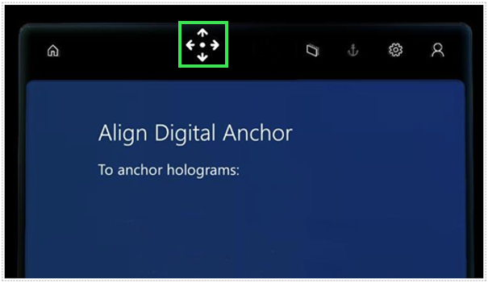

# Operate a guide in Dynamics 365 Guides

 [Watch a video about operating a guide](https://aka.ms/guidesoperate)

When you open a guide as an operator by using the [!include[pn-dyn-365-guides](../includes/pn-dyn-365-guides.md)] HoloLens app, you will see the Step card. The Step card is the hub of everything that you do in a guide. It provides the instructions that you follow to complete a task. It also includes two buttons that you use to navigate through a guide: **Next Step** and **Go Back**. As you go through the steps in a task, the Step card follows you on [!include[pn-hololens](../includes/pn-hololens.md)], to keep the instructions where you need them.

## Get oriented with the Step card

In addition to the **Next Step** and **Go Back** buttons, the Step card includes several buttons and user interface (UI) elements that help you perform various actions.

Here is a description of the buttons and other UI elements on the Step card.

| Number | UI element | Name | Purpose |
|---|---|---|---|
| 1 |  | Home | Select a different guide. |
| 2 |  | Follow mode | Have the Step card follow you around, or lock it to a location.
If you turn off **Follow** mode, the Step card stays where it is. You can move the Step card wherever you want at any time. Just grab it by using the navigation bar. For more information, see the "Follow and pinning" section later in this topic.
 |
| 3 |  | Anchor button | Re-anchor (realign) the guide.
[!include[pn-hololens](../includes/pn-hololens.md)] can sometimes lose tracking, which causes holograms to become misaligned. To fix this issue, you must re-anchor the guide by gazing at a printed anchor or digital anchor again. For more information, see the "Anchor your guide" section earlier in this topic.
 |
| 4 |  | Settings | See the build of [!include[pn-dyn-365-guides](../includes/pn-dyn-365-guides.md)] that you're using. |
| 5 |  | Profile | Sign in and out. |
| 6 |  | Step progress | See where you are in the step. |
| 7 |  | Outline | Go to the **Outline** page.
You can use the **Outline** page to quickly move around your guide. The following illustration shows the **Outline** page for a Pylon wiring guide.

 |
| 8 |  | Task name | See the name of the task that you're working on. |
| 9 |  | Task progress | See where you are in the task. |

## Use a dotted line to help you find the focus area for a step

Step cards are linked by holographic dotted lines to physical areas in your work area. These dotted lines help you find the area where you must take action.

### Dotted line tips and tricks

- Follow the dotted line to find the physical area where you must do the work. Follow the dotted line back to the Step card to read the instructions.

- If the dotted line points behind you, step to the side, and then continue to follow it.

- Note that the dotted line might sometimes go through real-world objects.

## Use Follow mode and pinning

You will notice that, wherever you look, the Step card follows your gaze. Therefore, while you're working, you never have to worry about where your instructions are. You can stop the Step card from following you by turning off **Follow** mode from the navigation bar.

You can also grab the navigation bar at any time to place the card where you want it.

## Access a website that is linked from the Step card

If a Step card includes a **Website link** button, you can go to the website by selecting the button. For example, there might be a link to a parts diagram or a parts inventory system. The website is opened in the HoloLens Edge browser. When you close the browser, you go back to the step that you were working on.

## Turn off holograms

If you ever feel that holograms are getting in the way, you can turn them off with a glance. (You can also turn them back on.) To turn off a hologram, gaze at the eye symbol in the middle of the dotted line.

## See also

 [Watch a video about operating a guide](https://aka.ms/guidesoperate) 
 [Calibrate your HoloLens](https://docs.microsoft.com/windows/mixed-reality/calibration)
