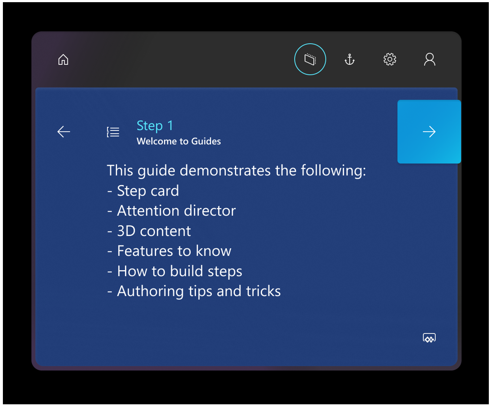

# Operate a guide in Dynamics 365 Guides

 [Watch a video on operating a guide](https://aka.ms/guidesoperate)

When you open a guide as an operator with the [!include[pn-dyn-365-guides](../includes/pn-dyn-365-guides.md)] HoloLens app, you’ll see the Step card, which is the hub of everything you do in a guide. The Step card  provides the instructions that you follow to complete a task. It also includes the two buttons that you use to navigate through a guide—the **Next Step** and **Go Back** buttons. As you go through the steps in a task, the Step card follows you on [!include[pn-hololens](../includes/pn-hololens.md)] to keep your instructions where you need them. 

  

## Get oriented with the Step card

In addition to the **Next Step** and **Go Back** buttons, the Step card includes a number of different buttons and UI elements to help you take various actions. 

   

Here’s a description of the buttons and other UI elements in the Step card:

|Number|Button/Example|Name|Description|
|---|--|------------------|------------------------------------------------------------------------------------|
|1||Home|Choose a different guide.|
|2||Follow mode|Have the Step card follow you around or lock it to a location.  If you turn off Follow mode, the Step card stays where it is. You can grab the card at any time by using the navigation bar to move it wherever you like. For more information, see the **Follow and pinning** section later in this topic.|
|3||Anchor button|Re-anchor (realign) the guide.  [!include[pn-hololens](../includes/pn-hololens.md)] can sometimes lose tracking, which causes holograms to be misaligned. To fix this, you need to re-anchor the guide by gazing at a printed anchor or digital anchor again. For more information, see “Anchor your guide” earlier in this topic.|
|4||Settings|Shows the build of [!include[pn-dyn-365-guides](../includes/pn-dyn-365-guides.md)] that you’re using.| 
|5||Profile|Sign in and out.| 
|6||Step progress|Shows where you are in the step.|
|7||Outline|Go to the **Outline** page.  Use the **Outline** page to quickly navigate around your guide. Here’s what the **Outline** page looks like for the Pylon wiring guide:  | 
|8||Task name|The name of the task you're working on.| 
|9||Task progress|Shows where you are in the task.| 
 
## Use a dotted line to help you find the focus area for a step 
Step cards are linked by holographic dotted lines to physical areas in your work area. These dotted lines help you find the area where you need to take an action. 

### Dotted line tips and tricks 

- Follow the dotted line to find the physical area where you need to do the work. Follow the dotted line back to the Step card to read the instructions. 

- If the dotted line points behind you, step to the side, and then continue to follow the dotted line. 
Note that the dotted line might go through real-world objects at times. 

## Follow and pinning 

You’ll notice that wherever you look, the Step card follows your gaze. As you’re working, you never have to worry about where your instructions are. You can stop the Step card from following you by turning the Follow mode behavior off from the navigation bar. 

You can grab the navigation bar at any time to place the card where you like.

## Access a website linked from the Step card

If a Step card includes a **Website link** button, you can go to that website by selecting the button. For example, there might be a link to a parts diagram or a parts inventory system. The website opens in the HoloLens Edge browser. When you close the browser, you go back to the step you were on. 

## Turn off holograms 
You can turn holograms off (or turn them back on) with a glance if you ever feel like they’re getting in the way. To turn off a hologram, gaze at the “eye” in the middle of the dotted line. 

  

## See also?

-  [Watch a video on operating a guide](https://aka.ms/guidesoperate)
- [Calibrate your HoloLens](https://docs.microsoft.com/windows/mixed-reality/calibration)

