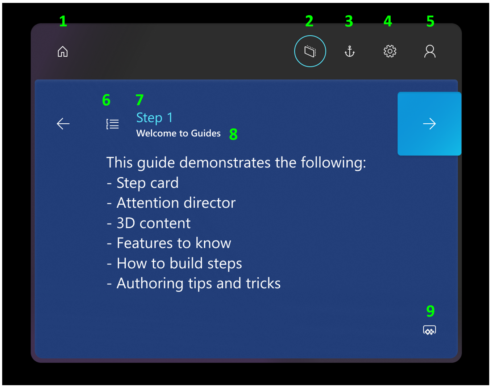
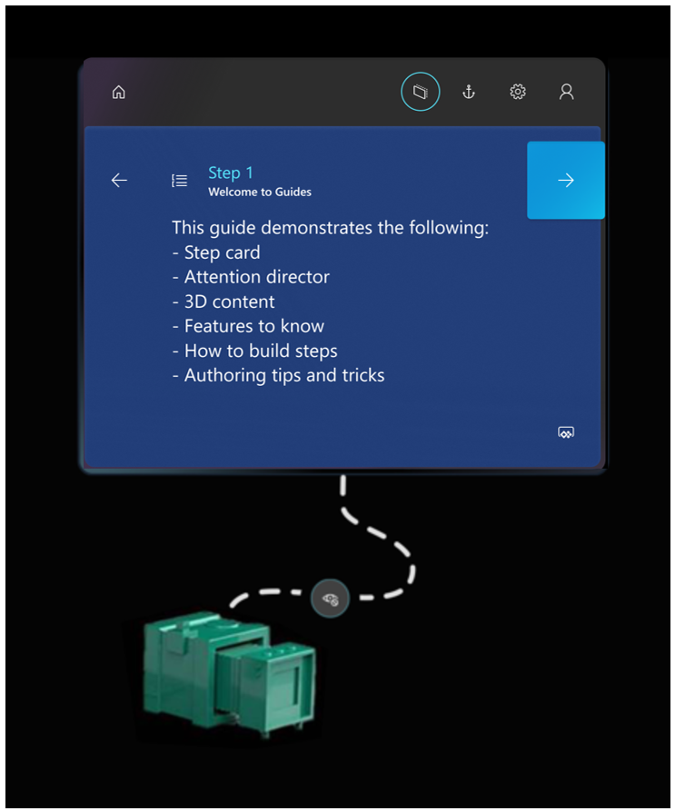
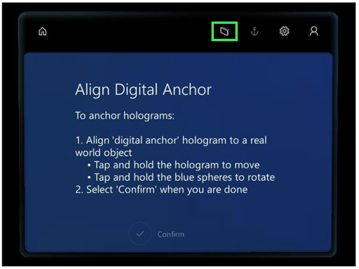

# Operate a guide in Dynamics 365 Guides

 [Watch a video about operating a guide](https://aka.ms/guidesoperate)

When you open a guide as an operator by using the [!include[pn-dyn-365-guides](../includes/pn-dyn-365-guides.md)] HoloLens app, you see the Step card. The Step card is the hub of everything that you do in a guide. It provides the instructions that you follow to complete a task. It also includes two buttons that you use to navigate through a guide: **Next** and **Back**. As you go through the steps in a task, the Step card follows you on [!include[pn-hololens](../includes/pn-hololens.md)], to keep the instructions where you need them.

> [!NOTE]
> When you select the **Back** button in the Step card, it returns you to the most-recently-visited step (similar to a web browser **Back** button). 

## Get oriented with the Step card

In addition to the **Next** and **Back** buttons, the Step card includes several buttons and user interface (UI) elements that help you perform various actions.

Here's a description of the buttons and other UI elements on the Step card.

| Number | UI element | Name | Purpose |
|---|---|---|---|
| 1 |  | Home | Select a different guide. |
| 2 |  | Follow mode | Have the Step card follow you around, or lock it to a location.
If you turn off **Follow** mode, the Step card stays where it is. You can move the Step card wherever you want at any time. Just grab it by using the navigation bar. For more information, see the "Follow and pinning" section later in this topic.
 |
| 3 |  | Anchor button | Re-anchor (realign) the guide.
[!include[pn-hololens](../includes/pn-hololens.md)] can sometimes lose tracking, which causes holograms to become misaligned. To fix this issue, you must re-anchor the guide by gazing at the anchor again. For more information, see the [Anchor your guide](operator-anchor.md).
 |
| 4 |  | Settings | See the build of [!include[pn-dyn-365-guides](../includes/pn-dyn-365-guides.md)] that you're using. |
| 5 |  | Profile | Sign in and out. |
| 6 |  | Outline | Go to the **Outline** page.
You can use the **Outline** page to quickly move around your guide. The following illustration shows the **Outline** page for a Pylon wiring guide.

 |
| 7 |  | Step counter | Shows what step you're on in the task. |
| 8 |  | Task name | Shows the name of the task that you're working on. |
| 9 |  | Action button | Opens a website or Power Apps link. |

## Use a dotted line to help you find the focus area for a step

Step cards are linked by holographic dotted lines to physical areas in your work area. These dotted lines help you find the area where you must take action.

### Dotted line tips and tricks

- Follow the dotted line to find the physical area where you must do the work. Follow the dotted line back to the Step card to read the instructions.

- If the dotted line points behind you, step to the side, and then continue to follow it.

- Note that the dotted line might sometimes go through real-world objects.

## Use Follow mode and pinning

You will notice that, wherever you look, the Step card follows your gaze. Therefore, while you're working, you never have to worry about where your instructions are. You can stop the Step card from following you by turning off **Follow** mode from the navigation bar.

You can also grab the navigation bar at any time to place the card where you want it.

## Use a trigger to move to the next or previous step

Dynamics 365 Guides includes triggers that you can use on HoloLens 2 to go to the next or previous step. Triggers are placed in the real world where you complete your tasks and steps. This saves you from having to gaze at the instruction card after you complete each step, which can disrupt the flow of your work. 

### Visible and invisible triggers

There are two types of triggers:

- **Visible triggers.** These are **Next** and **Back** buttons placed in the real world where you do your work. Just select the trigger with your hand to move to the next step or previous step. **The trigger is activated when your hand leaves the trigger area.**

    
 
    Sometimes, an author might add a dotted line to link the trigger to a place in the real world to help you complete the step.

- **Invisible triggers.** An invisible trigger automatically advances you to the next step when you place your hand or hands inside the trigger area. You can’t see an invisible trigger until your hand is inside the trigger area. At that point, you’ll see a light green box so you know you’ve activated the trigger. **The trigger is activated when your hand leaves the trigger area.**

    
 
    Invisible triggers reduce clutter in the real world so you can focus your attention on completing the step.
    
### Visual and audio cues

With either type of trigger, you receive visual and audio cues when you activate the trigger. This confirms that you’ve completed the step and are moving to the next step. For example, if you activate a trigger, you’ll see the following **Next Step** visual cue:
 

## Access a website linked from the Step card

If a Step card includes a **Website link** button, you can go to the website by selecting the button. For example, there might be a link to a parts diagram or a parts inventory system. The website is opened in the HoloLens Microsoft Edge browser. When you close the browser, you go back to the step that you were working on.

>[!NOTE]
>On HoloLens 1, the Dynamics 365 Guides app enters sleep mode when you select a website link from a step. You can tap the Dynamics 365 Guides app at any time to return to the guide and resume where you left off. If you're using HoloLens 2, the Dynamics 365 Guides app remains active when you select a website link.

## Open an app created in Power Apps from the Step card

If a Step card includes a **Power Apps** button, you can open an app by selecting the button. The app is opened in a browser on HoloLens. When you close the browser, you return to the step. To run Power Apps from Dynamics 365 Guides, you must have a Power Apps license. You must also have permission to view the app that was created in Power Apps.

>[!NOTE]
>On HoloLens 1, the Dynamics 365 Guides app enters sleep mode when you select a Power Apps link from a step. You can tap the Dynamics 365 Guides app at any time to return to the guide and resume where you left off. If you're using HoloLens 2, the Dynamics 365 Guides app remains active when you select a Power Apps link.

## Turn off holograms

If you ever feel that holograms are getting in the way, you can turn them off with a glance. (You can also turn them back on.) To turn off a hologram, gaze at the eye symbol in the middle of the dotted line.

## See also

 [Watch a video about operating a guide](https://aka.ms/guidesoperate) 
 [Calibrate your HoloLens](https://docs.microsoft.com/windows/mixed-reality/calibration)
