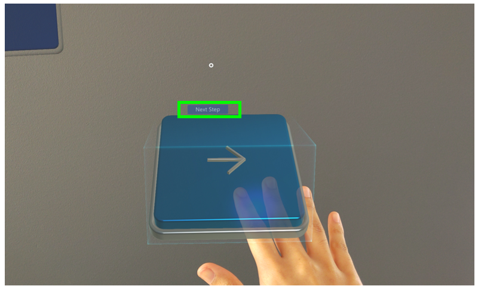

# Use a trigger in the Dynamics 365 Guides HoloLens app to move between steps

Microsoft Dynamics 365 Guides includes triggers that you can use on HoloLens 2 to go to the next or previous step. Triggers are placed in the real world where you complete your tasks and steps. This saves you from having to gaze at the instruction card after you complete each step, which can disrupt the flow of your work. 

## Visible and invisible triggers

There are two types of triggers:

- **Visible triggers.** These are **Next** and **Back** buttons placed in the real world where you do your work. Just select the trigger with your hand to move to the next step or previous step. **The trigger is activated when your hand leaves the trigger area.**

    
 
    Sometimes, an author might add a dotted line to link the trigger to a place in the real world to help you complete the step.

- **Invisible triggers.** An invisible trigger automatically advances you to the next step when you place your hand or hands inside the trigger area. You can’t see an invisible trigger until your hand is inside the trigger area. At that point, you’ll see a light green box so you know you’ve activated the trigger. **The trigger is activated when your hand leaves the trigger area.**

    
 
    Invisible triggers reduce clutter in the real world so you can focus your attention on completing the step.
    
## Visual and audio cues

With either type of trigger, you receive visual and audio cues when you activate the trigger. This confirms that you’ve completed the step and are moving to the next step. For example, if you activate a trigger, you’ll see the following **Next Step** visual cue:
 

## What's next?

 [Watch a video about operating a guide](https://aka.ms/guidesoperate) 
 [Calibrate your HoloLens](https://docs.microsoft.com/windows/mixed-reality/calibration)
