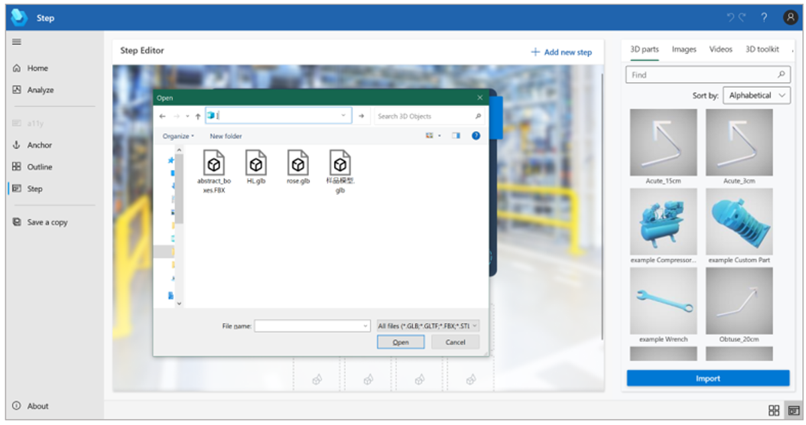

# Add a 3D part in the Dynamics 365 Guides PC app

You can add 3D parts (models specific to your company) in Microsoft Dynamics 365 Guides. A 3D part hologram helps operators find a 3D part in the real world. You can import custom 3D parts as described in this article. 

1. On the right side of the page, select the **3D parts** tab.

    

2. Drag the 3D part that you want to one of the **3D parts** boxes.

    
    
> [!TIP]
> To find items that were recently added to the gallery, you can sort by name or by the date when the item was added.

## Import a custom 3D model to use as a 3D part

You can import your own custom 3D models and add them to the **3D parts** library. To import files, you can drag them from a local file folder or use the **Import** command.

### Import a file by using a drag-and-drop operation

1. Open Windows File Explorer, and go to the folder that contains the 3D models that you want to import.

2. Drag the files to the gallery.

    

### Import a file by using the Import command

1. Select **Import** in the lower-right corner of the page.

    

2. Find the files that you want to import, and then select **Open**.

    

> [!NOTE]
> You can use a combination of third-party tools to prepare your 3D (computer-aided design \[CAD\]) models. For more information, see these topics:
>
> - [Optimize your 3D models](3d-content-guidelines/optimize-models.md)
>
> - [Best practices for 3D models](3d-content-guidelines/best-practices.md)
>
> - [Tutorials overview](3d-content-guidelines/tutorials-overview.md)
