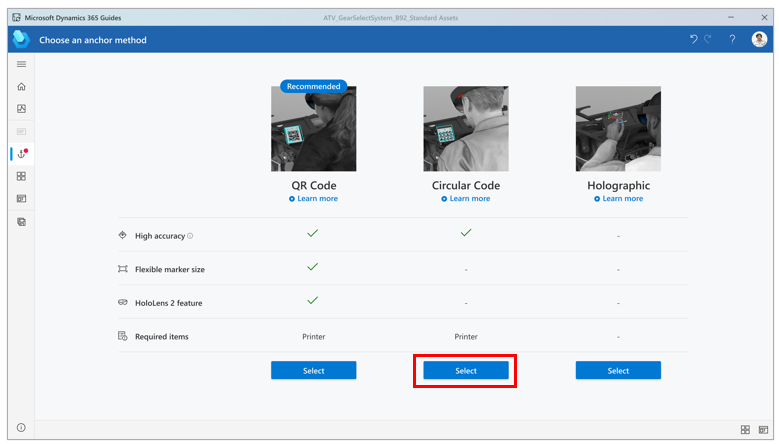
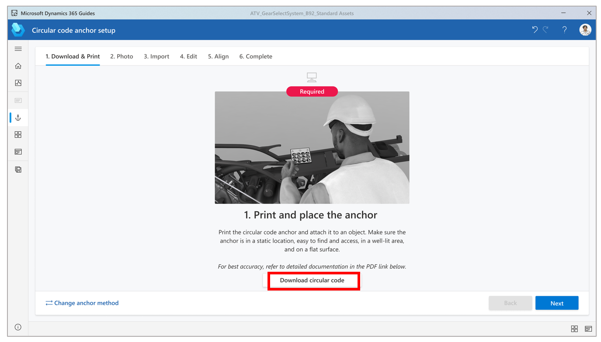
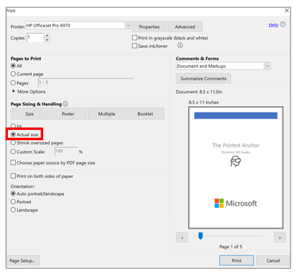
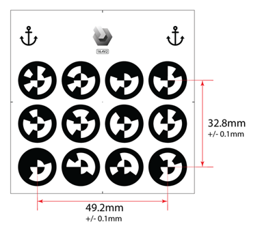
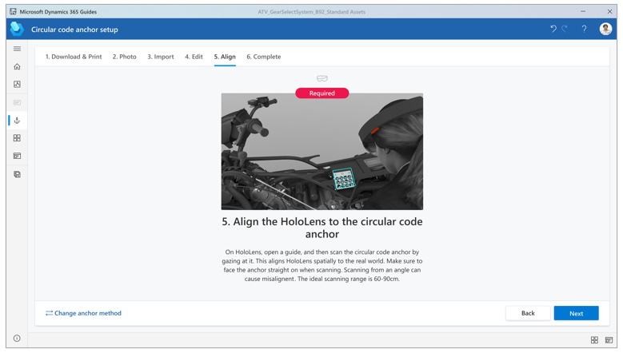

# Anchor a guide in the Dynamics 365 Guides PC app by using a circular code anchor 

 [Watch a video about creating a circular code anchor](https://aka.ms/guidesprintedanchor)

You can anchor your guide to the real world in Microsoft Dynamics 365 Guides by using a QR code anchor, circular code anchor, or holographic anchor. This article shows how to anchor a guide with a circular code anchor. [Learn about other types of anchors and when to use them](pc-app-anchor.md).

## Overall process for creating a circular code anchor

The process of creating a circular code anchor involves four basic steps:

1. Use the **Anchor** wizard to select the circular code anchor method.

2. Print the anchor from the PDF file that the **Anchor** wizard creates.

3. Attach the anchor to a physical object in the real world.

4. Gaze at the anchor on [!include[pn-hololens](../includes/pn-hololens.md)] to anchor the guide.

## Set up a circular code anchor

You can access the **Anchor** wizard from the **Outline** page. The **Outline** page automatically appears after you create or open a guide.

1. On the **Outline** page, select **Set your anchor now**.

    

2. On the **Choose an anchor method** page, select **Select** for the **Circular Code** anchor method.

    

3. In step 1 of the wizard, select **Download circular code** to create a PDF file that is named **Guides-CircularCodeAnchor**. This file includes the anchor that you will 
print in step 6.

    

4. On your computer, in Adobe Acrobat Reader, open the **Guides-CircularCodeAnchor** file.

    > [!IMPORTANT]
    > [!include[pn-dyn-365-guides](../includes/pn-dyn-365-guides.md)] supports one size of circular code anchor. To ensure the best possible alignment accuracy, it's crucial 
    that you print the anchor at the specified size. If you use Adobe Acrobat Reader, you can set the specified size to get the best printing results.

5. Select **File** \> **Print**, and then, under **Page Sizing & Handling**, select the **Actual size** option.

    

6. Print the last page of the document on matte stock and don't laminate it. Glossy materials can affect scanning and will decreaes the anchor detection rate. Bubble jet printers produce a better matte finish.

    > [!NOTE]
    > Also, make sure the anchor is always positioned flat. DO NOT distort or place it on a curved surface as this will negatively affect alignment and detection. 

7. Make sure that the printed marker spacing matches the measurements shown in the following illustration as the size of the anchor can change depending on the printer used. The anchor measurements must be exact.

    

    > [!NOTE]
    > If the anchor spacing isn't within +/– 0.1 mm, in the **Print** dialog box, select the **Custom Scale** option, and then change the percentage to compensate for the 
    size discrepancy. For example, if the result is 49 mm when you print the anchor, change the scale to 100.4 percent to get 49.196 mm, which is within tolerance.

8. Attach the circular code anchor to a physical object in the real world, and then take a picture to help the operator find it.

9. Go back to the **Anchor** wizard in the PC app, and then select **Next** two times. (You can skip step 2 of the wizard if you took a picture of the location in the previous 
step.)

10. In step 3 of the wizard, select **Import** to import the picture that you took in step 8. Then drag it to the **Import anchor placement photo** box. When you've finished, 
select **Next** to move to the next step.

    

11. In step 4 of the wizard, if you want to change the default instructions for the operator, select **Edit Step card text**, and then enter your instructions. When you've 
finished, select **Next** to move to the next step.

    

12. Put on your [!include[pn-hololens](../includes/pn-hololens.md)], open your guide, and then gaze at the circular code anchor to anchor the guide.

    

## Best practices for circular code anchors

Keep the following points in mind when you work with circular code anchors:

- **Material surface.** Make sure to print the anchor on matte stock, and don't laminate it. Glossy materials can negatively affect scanning due to reflected light. Also, 
make sure that the anchor is flat. An anchor that is curved or distorted can affect alignment and detection.

- **Same anchor for authoring and printing.** For best accuracy, use the same circular code anchor for authoring and operating.

- **Size.** Make sure that your anchor is the exact size indicated in this article. Incorrect anchor size will cause guide misalignment.

    - Some applications and printers might change the size of the image.

    - If the anchor is larger than indicated, [!include[pn-hololens](../includes/pn-hololens.md)] interprets the scale difference in distance. Therefore, the anchor is 
    identified as closer than it really is.

    - The best way to make sure that the anchor isn't resized is to print it from the PDF file, as described earlier in this article.

- **Location.** Place the anchor in a location on the physical object that's easy to access and out of the way.

    - Ideally, anchor placement should be central to the steps being done.

    - Content placed farther away from the anchor will be less accurate.

    - Place the anchor where operators can quickly rescan to realign at any time.
    
    - Ideally, the anchor should not be moved after the author places it. If a permanent placement isn't possible, consider creating a mount so that the anchor can be 
    consistently placed in the same location/orientation every time.

    - Take a photo or video to document the anchor placement, and add it to the guide instructions to help increase operator confidence. For 
    information about how to capture a photo or video from [!include[pn-hololens](../includes/pn-hololens.md)], see 
    [Mixed reality capture](https://docs.microsoft.com/windows/mixed-reality/mixed-reality-capture).

- **Scanning angle.** Make sure you're facing the anchor straight on at the correct distance when gazing at it. 

    - Scanning from the same angle every time is important to maintain hologram position consistency across scans.
    
    - Scanning from glancing angles can cause detection failure or misalignment.

    - Ideal scanning range is from 60 to 80 cm.

## What's next?

[Create a QR code anchor](pc-app-anchor-qr-code.md) 
[Create a holographic anchor](pc-app-anchor-holographic.md) 
[Anchor your guide if you're an author](hololens-app-anchor.md) 
[Anchor your guide if you're an operator](operator-anchor.md) 
