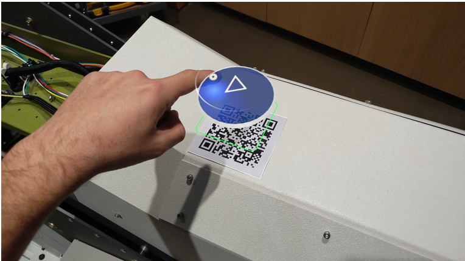

# Embed a link in a QR code to make it easy to open a guide in Dynamics 365 Guides

A Microsoft Dynamics 365 Guides author can embed a link to a guide in a QR code to make it easy for operators to open the guide on Microsoft HoloLens. The link can open a guide or 
go to a specific step within a guide.

An operator can access the QR code in two different ways:

- **Printed QR code**. Operators can use a printed QR code to open a guide and anchor the holographic content at the same time. This makes it easy for operators to 
launch a guide quickly by gazing at a contextual printed QR code attached to the area where they need to do their work, and anchor their holographic content 
to the same QR code.

    
    
- **Digital QR code**. Operators can use a digital QR code to open a guide without anchoring the guide. Using a digital QR code is useful if you want to assign a guide to digital work instructions, or if you need a quick way for an operator to launch a guide when they don't have access to a printed QR code. For example, you could use a digital QR code to include Dynamics 365 Guides in the flow of your existing online/web training modules.

    

    > [!NOTE]
    > With digital QR codes, authors must provide another anchoring method for operators to align their holograms.      

## Embed a link in a QR code

1. Create a guide link by right-clicking a guide and selecting **Copy link to this guide**.

    
    
    > [!NOTE] 
    > You can also [copy a link to a step within a guide](pc-app-copy-link-guide-step.md).

2. Open a third-party QR code generator. Examples of third-party QR code generators include the following:
    
    - [https://www.qr-code-generator.com/](https://www.qr-code-generator.com/)
    
    - [https://www.the-qrcode-generator.com/](https://www.the-qrcode-generator.com/)
 
    > [!NOTE]
    > - Your use of third-party QR code generators is subject to the third party’s terms and privacy policy. Please consult with your legal professionals before using. Microsoft does not endorse any particular third-party QR code generator and assumes no responsibility or liability for any third-party application you elect to use.
    > - When you use any third-party QR code generator, the QR code generator receives access to the string of your guides link.
    
3. Copy the link from step 1 and paste it into the third-party QR code generator.

4. Generate the QR code. We recommend using the following settings:

    - **Border:** Minimum of **4**. This number represents the number of small black square spaces (modules) around the border of the QR code. A value less than **4** will result in degradation in the detection rate of the HoloLens sensors.
    
    - **Foreground color:** Black (Hex#000000)
    
    - **Background color:** Hex#BBBCBF. This provides a 30% gray background to help improve the contrast of the QR code. This setting provides the best adaptability for a wide variety of environments and lighting conditions. If you have trouble detecting an anchor that you provide, try adjusting the anchor's image brightness to match the average environmental brightness around the anchor. 
    
    > [!NOTE]
    > These settings may not be available in all third-party generators.

5. Download the QR code. We recommend downloading as a JPEG file.

6. Do one of the following:

    - Add the digital QR code to a digital document and then make the digital document available to your operators.
    
    - Print the QR code and attach it to a physical part in the real-world environment where the work takes place.
    
    > [!IMPORTANT]
    > When creating a printed QR code with an embedded link, make sure to follow [best practices for QR codes](pc-app-anchor-qr-code.md#best-practices-for-qr-code-anchors) when printing the QR code.
    
## What's next?

[Open a guide by scanning a QR code](operator-open-guide-qr-code.md)

[Learn more anchoring a guide by using a QR code](pc-app-anchor-qr-code.md)

[!INCLUDE[footer-include](../includes/footer-banner.md)]
