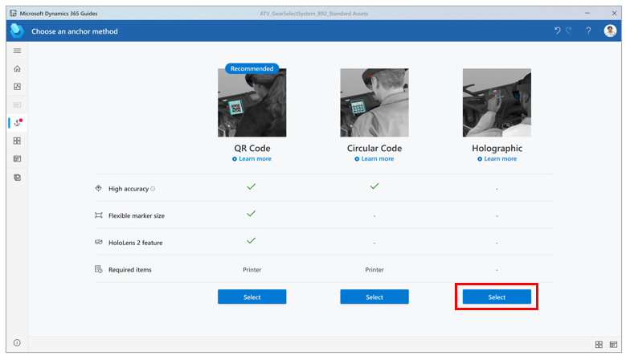
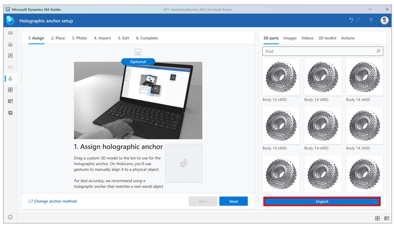
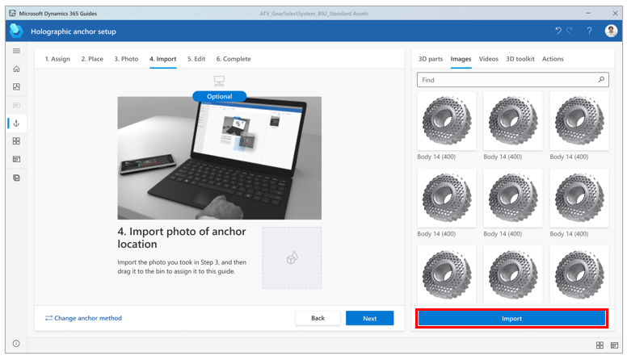
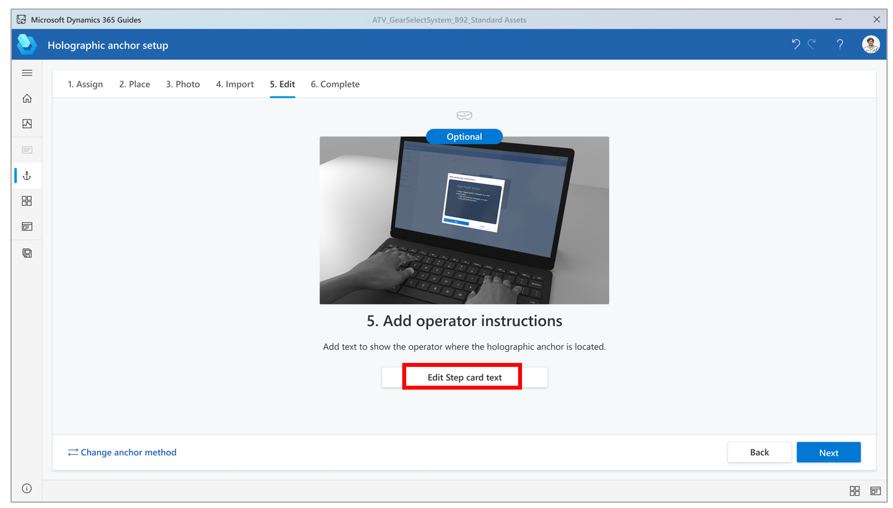

# Anchor your guide in Dynamics 365 Guides by using a holographic anchor

 [Watch a video about creating a holographic anchor](https://aka.ms/guidesdigitalanchor)

The process of creating a holographic anchor involves three basic steps:

1. Use the **Anchor** wizard to select the holographic anchor method.

2. Use the wizard to import a custom 3D model that you want to use as the anchor, and to assign the 3D model as the anchor for the guide. The 3D model can be a representation 
of a physical object or a generic 3D object. If you don't select a custom 3D model, a default holographic anchor will be used. 

3. In the [!include[pn-hololens](../includes/pn-hololens.md)] app, in **Author** mode, use gestures to align the holographic anchor to a physical object in the real world.

## Set up a holographic anchor

You can access the **Anchor** wizard from the **Outline** page. The **Outline** page automatically appears after you create or open a guide.

1. On the **Outline** page, select **Set your anchor now**.

    

2. On the **Choose an anchor method** page, select **Select** for the **Holographic** anchor method.

    

3. In step 1 of the wizard, select **Import**, find your custom 3D model, and then select **Open** to import it. The model is added to the **3D parts** tab in the gallery.

    

4. Drag the 3D model from the **3D parts** tab to the **Assign holographic anchor** box. The 3D model is assigned as the holographic anchor for the guide. When you've finished, 
select **Next** to move to the next step.

    

5. Put on your [!include[pn-hololens](../includes/pn-hololens.md)], open the guide, and then use air tap and hold to move the holographic anchor directly over a physical 
object in your work environment. If you must rotate the object, use air tap and hold to move the blue spheres.

    

    > [!TIP]
    > On [!include[pn-hololens](../includes/pn-hololens.md)] 2, you can use your hand to directly select and place a holographic anchor when you author a guide. For more 
    information, see [HoloLens 2 gestures for authoring and navigating](authoring-gestures-HL2.md).

6. Take a picture of the place where you put the holographic anchor, to help the operator find it.

7. Go back to the PC app, and then select **Next** in the wizard two times. (You can skip step 2 of the wizard if you took a photo of the location in the previous step.)

8. In step 4 of the wizard, select the **Import** button to import the photo that you took in step 6. Then drag it to the **Import photo of anchor location** box. When you've 
finished, select **Next** to move to the next step.

    

9. In step 5 of the wizard, if you want to change the default instructions for the operator, select **Edit Step card text**, and then enter your instructions. When you've 
finished, select **Next** to move to the next step, and then select **Confirm**.

    

## Best practices for holographic anchors

- **Size.** Select a holographic anchor that isn't too small or too big. 

    - Medium-size digital objects are best. Very small or very large holograms are difficult to manipulate. 

    - Shoebox size or slightly larger is ideal.

- **Placement.** Select a holographic anchor that is as close as possible to the center of the work that is being done. The farther you place digital content from the 
holographic anchor, the less accurate it becomes.

- **Shape.** Select a holographic anchor that has a non-uniform or uncommon shape. Unusual shapes are easiest to align to.

    - Avoid objects that are mirrored. This can cause 180-degree misalignment.

    - Select shapes that have clear edges and corners, to help orient your content correctly.

- **Recognizable.** Select a holographic anchor that is obvious, easily recognizable, and easy for the operator to find. Make sure that the operator can access the object 
without encountering any obstructions.

- **Alignment direction.** Always align the holographic anchor to your physical object from the same direction. In this way, you help maximize repeatability for operators.

    - Placement from different perspectives can cause misalignment.

    - Always look at the holographic anchor from multiple angles to make sure that it's aligned to the physical object.

