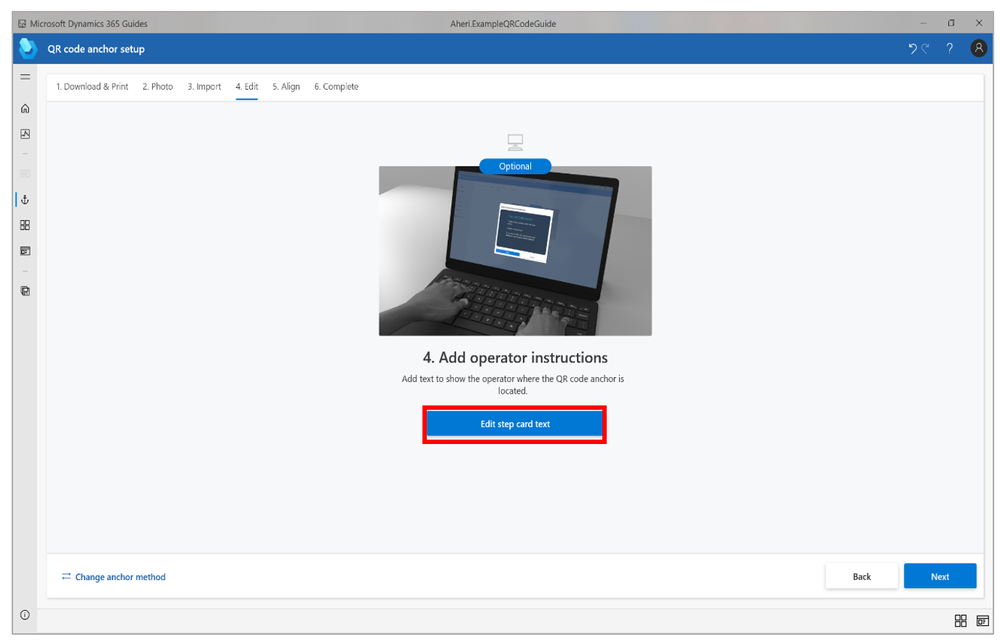
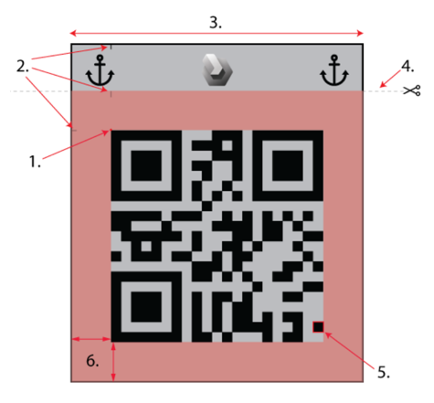

# Anchor a guide in the Dynamics 365 Guides PC app by using a QR code anchor

 [Watch a video about creating a QR code anchor](https://youtu.be/NhdBG3emNUs)

You can anchor your guide to the real world in Microsoft Dynamics 365 Guides by using a QR code anchor, circular code anchor, or holographic anchor. This article shows how to anchor a guide with a QR code anchor. QR code anchoring is recommended because:

- You can use the QR code that comes with Dynamics 365 Guides or any other QR code that you already own.

- You can print the anchor in various sizes (but be sure to always use the same size for the same guide).

- You can embed a link to a guide (deep link) in a QR code. This makes it quicker for the operator to open the appropriate guide.

In certain cases, you may need to use a circular code or holographic anchor, however. [Learn about other types of anchors and when to use them](pc-app-anchor.md). 

> [!IMPORTANT]
> Anchoring a guide with a QR code requires HoloLens 2. This feature is not available on HoloLens 1.

## Overall process for creating a QR code anchor

The process of creating a QR code anchor involves four basic steps:

1. Use the **Anchor** wizard to select the QR code anchor method.

2. Print the anchor from the PDF file that the **Anchor** wizard creates.

3. Attach the anchor to a physical object in the real world.

4. Gaze at the anchor on [!include[pn-hololens](../includes/pn-hololens.md)] to anchor the guide.

## Set up a QR code anchor

You can access the **Anchor** wizard from the **Outline** page. The **Outline** page automatically appears after you create or open a guide.

1. On the **Outline** page, select **Set your anchor now**.

    

2. On the **Choose an anchor method** page, select **Select** for the **QR Code** anchor method.

    

3. In step 1 of the wizard, select **Download QR code** to create a PDF file that is named **Guides-QRCodeAnchor**. This file includes the anchor that you will print in step 5.

    

4. On your computer, open the **Guides-QRCodeAnchor** file.

5. Print the last page of the document on matte stock. (Glossy materials can affect scanning.) Bubble jet printers produce a better matte finish.

6. Make sure that the printed anchor measures between 101 and 400 millimeters (mm) wide. (These figures are based on [Version 1 QR code 
recommendations](https://www.qrcode.com/en/about/version.html).)

6. Attach the QR code anchor to a physical object in the real world, and then take a picture to help the operator find it.

7. Go back to the **Anchor** wizard in the PC app, and then select **Next** two times. (You can skip step 2 of the wizard if you took a picture of the anchor placement in the 
previous step.)

8. In step 3 of the wizard, select **Import** to import the picture that you took in step 6. Then drag it to the **Import anchor placement photo** box. When you've finished, 
select **Next** to move to the next step.

    

9. In step 4 of the wizard, if you want to change the default instructions for the operator, select **Edit step card text**, and then enter your instructions. When you've 
finished, select **Next** to move to the next step.

    

10. Put on your [!include[pn-hololens](../includes/pn-hololens.md)], open your guide, and then gaze at the QR code anchor to anchor the guide.

    

## QR code anchor configuration

The following illustration shows the different parts of the QR code anchor (see step 3 in the previous procedure) provided with Dynamics 365 Guides:

1. **Anchor origin.** This location is used as the guide origin point for all the content in your guide.

2. **Alignment marks.** These marks can assist you in aligning the QR code anchor origin and orientation
with specific feature points in your environment.

3. **Anchor width.** We recommend a width of 101 mm to 400 mm for the provided anchor, or for any QR
code based on version 1.

4. **Optional cutline.** Cut along this line if you want to make the smallest possible anchor. Graphics
above this line visually identify the anchor as a Dynamics 365 Guides anchor. Content below this
line, including the margin marked in red, is required for maximizing detection rate.

5. **Module.** This square is one of many modules that make up the QR code anchor. Measure the width
of a module to ensure that it’s at least 3.5 mm in width and height.

    >[!NOTE]
    > When using deep-link QR codes, make sure they have the recommended minimum module size
so they can be detected at a comfortable scanning distance.

6. **Anchor quiet zone.** This space is required to help locate the QR code anchor. It must be at least
four modules wide. DO NOT CUT THIS PART OFF or you will see degradation in the detection rate. 

## Best practices for QR code anchors

Keep the following points in mind when working with QR code anchors:

- **Printing settings**. Make sure to print the anchor on matte stock and don't laminate it.

    - Glossy materials can negatively affect scanning due to reflected light.
    
    - Bubblejet printers produce a better matte finish.

- **Size**. You can print QR codes in multiple sizes. For best detection and scanning comfort, we recommend printing the provided anchor with a width of **101 mm to 400 mm**. This recommendation is for any QR code anchor following Version 1 QR codes. Anchor sizes outside of this recommended range might result in detection failure or reduced alignment precision for version 1 QR codes.

    > [!NOTE]
    > If you use your own QR code anchor, refer to QRCode.com for additional advanced QR code documentation. QR codes other than version 1 can increase the number of modules, which decreases their relative size. We recommend printing your anchor at a size where each independent module side measures a minimum of 3.5 mm.
    
    Anchors that are smaller than the recommended size impact the user experience while scanning. Due to the position of the QR scanning cameras, users need to aim below the anchor and may need to get uncomfortably close for scanning to succeed. Smaller sizes are also sensitive to variable lighting conditions. Any small reflective highlights on the anchor might cause a smaller anchor to have more of the information obscured, making the anchor unreadable.

    Anchors that are larger than the recommended size require users to move father away from the anchor. Scanning from a greater distance results in decreased accuracy. 

- **Position**. Make sure that the anchor is always positioned flat. Do **not** distort it or place it on a curved surface. Otherwise, alignment and detection will be 
negatively affected.

- **Location**. Place the QR code anchor in a location that is easy to access, so it doesn't interfere with work and is easy to identify (for placement).

    - Ideally, anchor placement should be central to the steps that are being done.

    - Content that is placed farther away from the anchor will be subject to more position variability than content that is placed closer to it.

    - Place the anchor where operators can quickly re-scan it for realignment at any time, if required.

    - If operators must place/remove anchors before run-throughs, position variability of content will increase.

    - Ideally, the anchor should not be moved after the author places it. If a permanent placement isn't possible, consider creating a mount, so that the anchor can be placed 
    consistently in the same location/orientation each time.

    - Take a photo or video to document the anchor placement, and add it to the guide instructions. In this way, you can help increase operator confidence.

- **Orientation**. The way that you orient the anchor can have a big impact on scanning performance.

    - Position the anchor on a vertical surface to minimize light reflections, if possible.

    - Don't use reflective materials for the support surface.

    - Very reflective surfaces that are located behind the anchor, and direct exposure to sun or artificial light, can negatively affect scanning performance.

- **Scanning angle**. When you gaze at the anchor, make sure that you're facing it straight on and at the correct distance.

    - Scanning from glancing angles can cause detection failure or misalignment.

    - The ideal scanning range is from 50 to 150 centimeters (cm).

- **Contrast**. The brightness for the provided anchor is set to a 30-percent gray background. This setting provides the best adaptability for a wide variety of environments.

    - If you have trouble detecting an anchor that you provide, try to adjust the anchor's image brightness so that it matches the average environmental brightness around the 
    anchor.

## What's next?

[Learn about other factors that affect anchoring accuracy](anchor.md) 
[Create a circular code anchor](pc-app-anchor-circular-code.md) 
[Create a holographic anchor](pc-app-anchor-holographic.md) 
[Anchor your guide if you're an author](hololens-app-anchor.md) 
[Anchor your guide if you're an operator](operator-anchor.md) 
