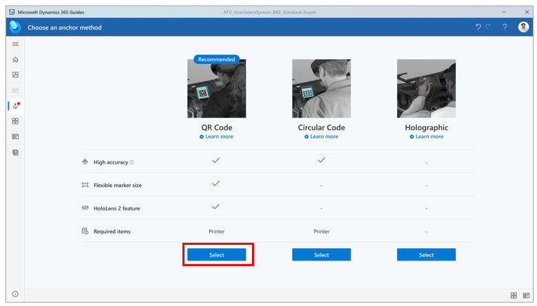
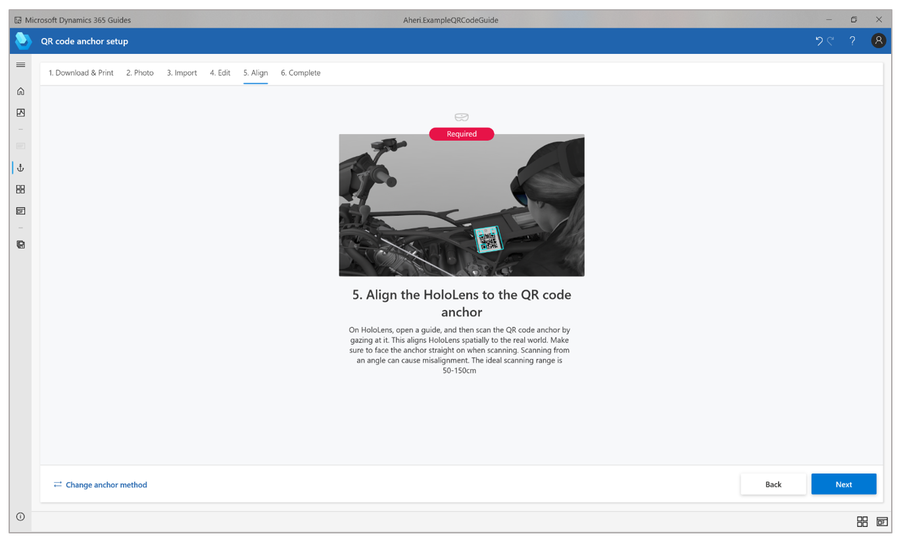

# Anchor a guide in Dynamics 365 Guides by using a QR code anchor

 [Watch a video about creating a QR code anchor](https://youtu.be/NhdBG3emNUs)

You can anchor your guide to the real world in Microsoft Dynamics 365 Guides by using a QR code anchor, circular code anchor, or holographic anchor. This article shows how to anchor a guide with a QR code anchor. [Learn about other types of anchors](pc-app-anchor.md).

## Overall process for creating a QR code anchor

The process of creating a QR code anchor involves four basic steps:

1. Use the **Anchor** wizard to select the QR code anchor method.

2. Print the anchor from the PDF file that the **Anchor** wizard creates.

3. Attach the anchor to a physical object in the real world.

4. Gaze at the anchor on [!include[pn-hololens](../includes/pn-hololens.md)] to anchor the guide.

## Set up a QR code anchor

You can access the **Anchor** wizard from the **Outline** page. The **Outline** page automatically appears after you create or open a guide.

1. On the **Outline** page, select **Set your anchor now**.

    

2. On the **Choose an anchor method** page, select **Select** for the **QR Code** anchor method.

    

3. In step 1 of the wizard, select **Download QR code** to create a PDF file that is named **Guides-QRCodeAnchor**. This file includes the anchor that you will print in step 5.

    

4. On your computer, open the **Guides-QRCodeAnchor** file.

5. Print the last page of the document on matte stock. (Glossy materials can affect scanning.) Bubble jet printers produce a better matte finish.

6. Make sure that the printed anchor measures between 101 and 400 millimeters (mm) wide. (These figures are based on [Version 1 QR code 
recommendations](https://www.qrcode.com/en/about/version.html).)

6. Attach the QR code anchor to a physical object in the real world, and then take a picture to help the operator find it.

7. Go back to the **Anchor** wizard in the PC app, and then select **Next** two times. (You can skip step 2 of the wizard if you took a picture of the anchor placement in the 
previous step.)

8. In step 3 of the wizard, select **Import** to import the picture that you took in step 6. Then drag it to the **Import anchor placement photo** box. When you've finished, 
select **Next** to move to the next step.

    

9. In step 4 of the wizard, if you want to change the default instructions for the operator, select **Edit step card text**, and then enter your instructions. When you've 
finished, select **Next** to move to the next step.

    

10. Put on your [!include[pn-hololens](../includes/pn-hololens.md)], open your guide, and then gaze at the QR code anchor to anchor the guide.

    

## Best practices for QR code anchors

Keep the following points in mind when you work with QR code anchors:

- **Position**. Make sure that the anchor is always positioned flat. Do **not** distort it or place it on a curved surface. Otherwise, alignment and detection will be 
negatively affected.

- **Location**. Place the QR code anchor in a location that is easy to access, so it doesn't interfere with work and is easy to identify (for placement).

    - Ideally, anchor placement should be central to the steps that are being done.

    - Content that is placed farther away from the anchor will be subject to more position variability than content that is placed closer to it.

    - Place the anchor where operators can quickly re-scan it for realignment at any time, if required.

    - If operators must place/remove anchors before run-throughs, position variability of content will increase.

    - Ideally, the anchor should not be moved after the author places it. If a permanent placement isn't possible, consider creating a mount, so that the anchor can be placed 
    consistently in the same location/orientation each time.

    - Take a photo or video to document the anchor placement, and add it to the guide instructions. In this way, you can help increase operator confidence.

- **Orientation**. The way that you orient the anchor can have a big impact on scanning performance.

    - Position the anchor on a vertical surface to minimize light reflections, if possible.

    - Don't use reflective materials for the support surface.

    - Very reflective surfaces that are located behind the anchor, and direct exposure to sun or artificial light, can negatively affect scanning performance.

- **Scanning angle**. When you gaze at the anchor, make sure that you're facing it straight on and at the correct distance.

    - Scanning from glancing angles can cause detection failure or misalignment.

    - The ideal scanning range is from 50 to 150 centimeters (cm).

- **Contrast**. The brightness for the provided anchor is set to a 30-percent gray background. This setting provides the best adaptability for a wide variety of environments.

    - If you have trouble detecting an anchor that you provide, try to adjust the anchor's image brightness so that it matches the average environmental brightness around the 
    anchor.

