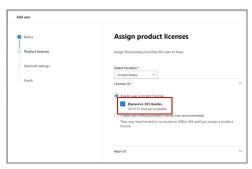
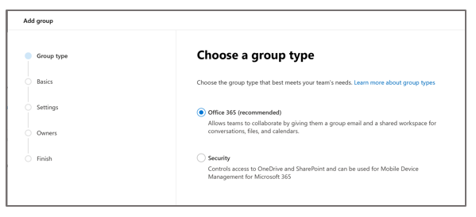
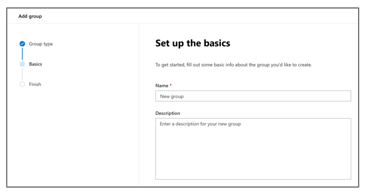
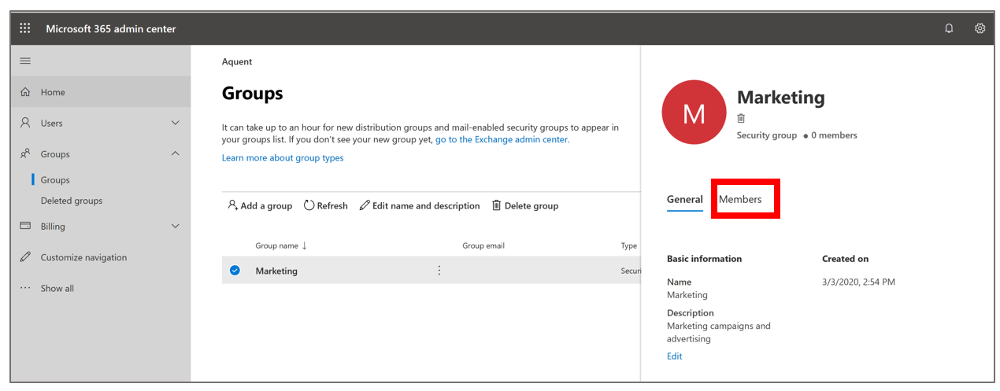
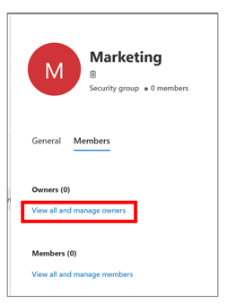
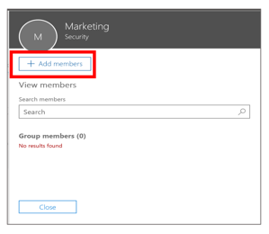
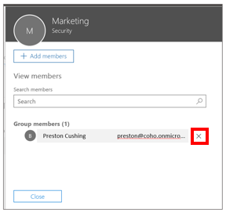
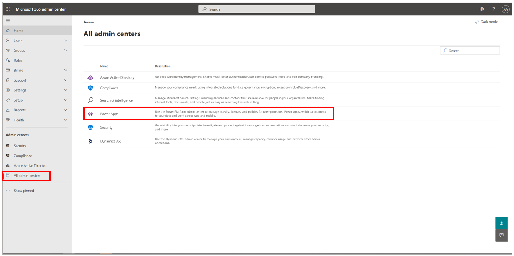

# Restrict access to an instance

If your company has multiple Dynamics 365 Guides instances, you can use security groups to control which users can access which instances.

For example, you could create three security groups to control access to these specific instances.

|Instance|Security Group|Purpose|
|-------------------|----------------------|------------------------------------------------------------------------|
|Coho Manufacturing Sales|Sales_SG|Provide access to the organization that creates sales opportunities, handles quotes, and closes deals.|
|Coho Manufacturing Maintenance|Maintenance_SG|Provide access to the organization that does service and machinery maintenance.|
|Coho Manufacturing Dev|Developer_SG|Provide access to the sandbox instance used for development and testing.|

## Create a user and assign a license

Use this procedure if you haven't already created users and assigned licenses. If you've already done this step, you can skip to the next procedure. 

1. In the [Microsoft 365 admin center](https://admin.microsoft.com/Adminportal/Home#/homepage), select **Users** > **Active users**, and then select **Add a user**. 

    

2. In the **Set up the basics** screen, enter the first name, last name, display name, and username. 

    

3. Under **Password settings**: 
 
   1. Select whether you want to have the password automatically generated or whether you want to create the password yourself. 
   
   2. Select whether you want to require the user to change their password when they first sign in.
   
   3. Select whether you want to send the password in email.
   
   4. Select **Next**.

4. In the **Assign product licenses** screen, select a location, select the check box next to **Dynamics 365 Guides** if it's not already selected, and then select **Next**. 

    

5. In the **Optional** settings screen, add roles or profile info if you want, and then select **Next**.

6. Review the settings, and then select **Finish adding**, and then select **Close**. 

>[!TIP]
>To add multiple users at the same time, see [Add several users at the same time](https://docs.microsoft.com/en-us/office365/enterprise/add-several-users-at-the-same-time?redirectSourcePath=%252farticle%252fAdd-several-users-at-the-same-time-to-Office-365-Admin-Help-1f5767ed-e717-4f24-969c-6ea9d412ca88).

## Create a security group and add members (users) to the group

1. Sign in to the [Microsoft 365 admin center](https://admin.microsoft.com/Adminportal/Home#/homepage).

2. On the left side of the screen, select **Groups** > **Groups**, and then select **Add a group**.

    

4. In the **Choose a group type** screen, select **Security**, and then select **Next**.

    

5. In the **Set up the basics** screen, add a name and description, and then select **Next**.

    

6. In the **Review and finish adding group** screen, select **Create group**, and then in the next screen, select **Close**.

    

7. In the **Groups** screen, select **Refresh** if you don't see your new group.

8. Select the group you created, and then in the pane that appears on the right, select the **Members** tab.

    

9. On the **Members** tab, select **View all and manage members**.

    

10. In the page that appears, select **Add members**. 

    

11. Select the users to add to the security group, select **Save**, and then select **Close** two times to return to the **Groups** page.

>[!NOTE]
>To remove a user from a security group, repeat this procedure, but select the **X** next to any member you want to remove. .

## Associate a security group with an instance

1. In the [Microsoft 365 admin center](https://admin.microsoft.com/Adminportal/Home#/homepage), select **All Admin centers**, and then select **Dynamics 365**.

    

!!NOT TESTED FROM HERE ON!!

2. Select the **Instances** tab, select an instance, and then select **Edit**.

3. In the security settings, search for a specific security group, and then select **Next** > **Save**.

## Additional info on security groups

Note the following about security groups:

- When users are added to a security group, they are added to the instance.

- When users are removed from a security group, they are disabled in the instance.

- When a security group is associated with an existing instance that has users, all users in that instance that are not members of the 
security group will be disabled.

- If an instance does not have an associated security group, all users with a license will be created as users and enabled in the 
instance.

- If a security group is associated with an instance, only users with licenses that are members of the security group will 
be created as users in the instance.

- When you remove a security group that is associated with a instance, either by editing the instance and removing the security 
group or by deleting the security group, licensed users who were members of the security group will have the same access to 
model-driven apps in Dynamics 365.

- When you assign a security group to an instance, that instance will not show up in the **Instances** tab in the 
Dynamics 365 admin center for users that aren't in the group.

- If you don't assign a security group to an instance, the instance will show up in the **Instances** tab in the 
Dynamics 365 admin center even for those users who have not been assigned a security role in that instance.

- Nested security groups are not supported.

>[!NOTE]
>All licensed users, whether or not they are members of security groups, must be assigned security roles to access model-driven apps in Dynamics 365. You assign security roles in the web application. Users can’t access instances until they are assigned at least one security role for that instance. For more information, see [Grant users access](https://docs.microsoft.com/en-us/power-platform/admin/grant-users-access).

## See also

[Add several users at the same time](https://docs.microsoft.com/en-us/office365/enterprise/add-several-users-at-the-same-time?redirectSourcePath=%252farticle%252fAdd-several-users-at-the-same-time-to-Office-365-Admin-Help-1f5767ed-e717-4f24-969c-6ea9d412ca88)

