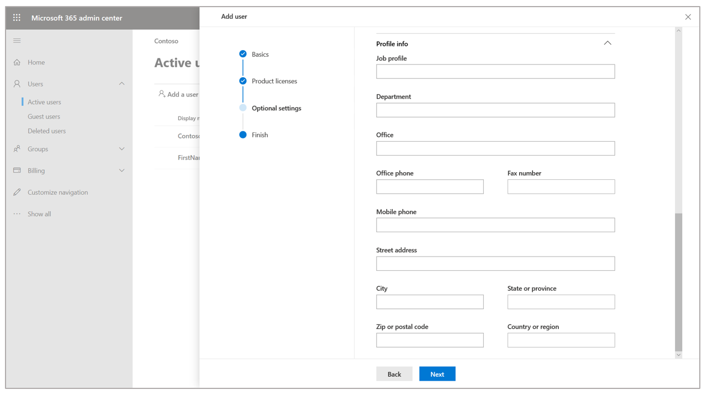
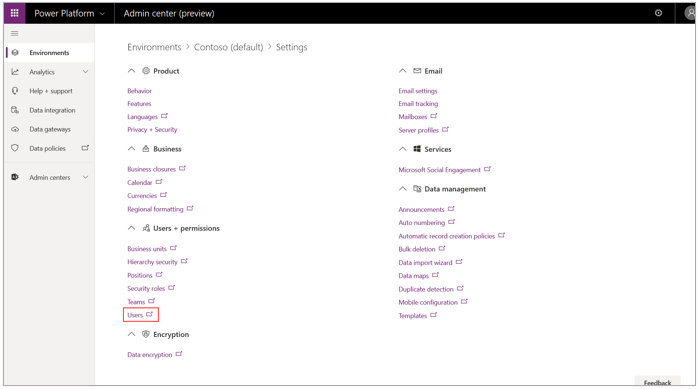

# Setup Step 5: Add additional user accounts to Dynamics 365 Guides (optional)

If you want to add additional users to [!include[pn-dyn-365-guides](../includes/pn-dyn-365-guides.md)], you need to assign the [!include[pn-dyn-365-guides](../includes/pn-dyn-365-guides.md)] license to them in the Microsoft 365 admin center, and then configure the roles they will have access to in the Power Platform admin center.

## Add a user account

1. Go to the [Microsoft 365 admin center](https://admin.microsoft.com/AdminPortal/Home).

2. In the left pane, select **Users**, and then select **Active users**. 

3. On the **Active users** page, select **Add a user**.

    

4. On the **Set up the basics** page, fill in the information for the new user. Select **Next** when you're done.

   

   > [!NOTE]
   > By default, an auto-generated password will be generated for the user. The user is required to change the password the first time they sign in with this account. If you want to change the password to a permanent password instead of using the auto-generated password, select the **Let me create the password** option, and then clear the **Require this user to change their password when they first sign in** check box. 
 
5. Select the location for this user, and then under **Licenses**, select the **Dynamics 365 Guides** check box. 

     

     Select **Next** when you're done.
   
6. On the **Optional settings** page, leave the **User (no administrator access)** box selected unless this new user will be an administrator. In that case, select the **Global administrator** check box. 

    
   
7. To fill out the new user's profile info, scroll down, and then expand **Profile info**. Select **Next** when you're done.
   
   
   
8. Review the information on the last page. To make changes, select the **Edit** button below each section. Select **Finish Adding** when you're done.

   

8. If you selected **Auto-generate password** in step 4, make note of the password. The user will need this password to sign in.

    
   
9. Select **Close**.

10. Set up user roles for the solution as described in the next procedure.

## Set up user roles for the solution

1. Go to the [Power Platform admin center](https://admin.powerplatform.microsoft.com/). 

2. On the **Environments** page, select the appropriate environment, select the **More environment actions** (...) button, and then select **Settings**. 

    

3. On the **Settings** page, expand **Users + permissions**, and then select **Users**.

        
    
4. On the **Enabled Users** page, select the user, and then select **Manage Roles**. 

    
 
5. In the **Manage User Roles** dialog box, make sure the **Common Data Service User** check box is selected.
         
    
    
6. Select the **Dyamics 365 Guides Author** or **Dynamics 365 Guides Operator** check box, depending on the privileges you want the user to have.

    
    
    The following table describes the privileges provided by each role:
    
    |Role|Description|
    |-----------------------|----------------------------------------------------------------------|
    |**Author**|Users with this role can use the PC app and HoloLens app to create, edit, and operate guides. They can also rename and deactivate existing guides.|
    |**Operator**|Users with this role can use the HoloLens app to view/operate a guide. If the **Operator** role is set, operators can also save time when opening a guide by skipping the **Select Mode** dialog box.|
      
## What's next?

If you have trouble with any of the procedures in this step, please:

- Ask on our community site at https://community.dynamics.com/365/guides.

- Contact customer service at https://dynamics.microsoft.com/support/.

### Other useful links

[Learn about resources you can use to get started with Dynamics 365 Guides](get-started.md) 
[Author a guide](authoring-overview.md) 
[Overview of operating a guide](operator-overview.md) 
[Analyze your guides to improve process efficiencies](analytics-guide.md) 
[FAQ](faq.md)
