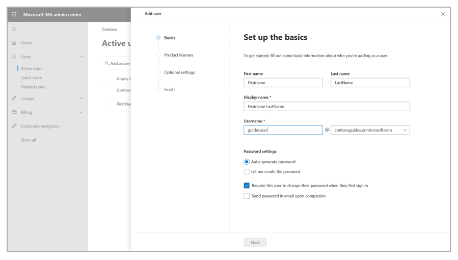
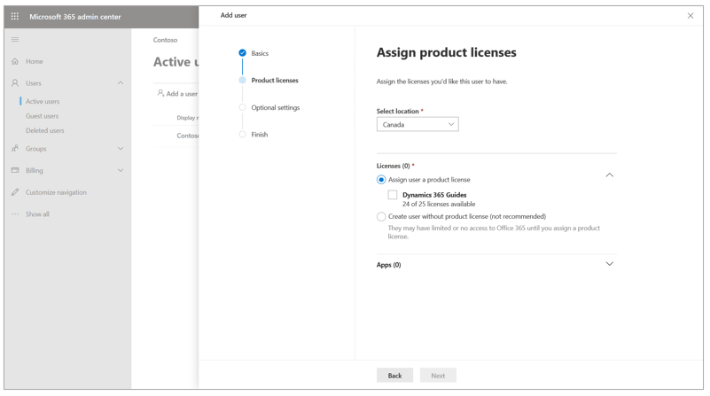

## Step 5: Add additional user accounts (optional)

If you want to add additional users, you need to assign the [!include[pn-dyn-365-guides](../includes/pn-dyn-365-guides.md)] license to them and configure the roles they will have access to in the Dynamics 365 admin center.

### Add a user account

1. Go to the [Microsoft 365 admin center](https://admin.microsoft.com/AdminPortal/Home).

2. In the left pane, select **Users**, and then select **Active users**. 

3. On the **Active users** page, select **Add a user**.

    

4. On the **Set up the basics** page, fill in the information for the new user. Select **Next** when you're done.

   

   > [!NOTE]
   > By default, an auto-generated password will be generated for the user. The user is required to change the password the first time they sign in with this account. If you want to change the password to a permanent password instead of using the auto-generated password, select the **Let me create the password** option, and then clear the **Require this user to change their password when they first sign in** check box. 
 
5. Select the location for this user, and then under **Licenses**, select the **Dynamics 365 Guides** check box. 

     

     Select **Next** when you're done.
   
7. On the **Optional settings** page, leave the **User (no administrator access)** box selected unless this new user will be an administrator. In that case, select the **Global administrator** check box. 

    
   
8. To fill out the new user's profile info, scroll down, and then expand **Profile info**. Select **Next** when you're done.
   
   
   
8. Review the information on the last page. To make changes, select the **Edit** button below each section. Select **Finish Adding** when you're done.

   

9. If you selected **Auto-generate password** in step 4, make note of the password. The user will need this password to sign in.

    
   
10. Select **Close**.

11. [Set up user roles for the solution](#user-roles) as described earlier in this topic.

### See also

[Get started with Dynamics 365 Guides](get-started.md) 
[Author a guide](authoring-overview.md) 
[Overview of operating a guide](operator-overview.md) 
[Analyze your guides to improve process efficiencies](analytics-guide.md) 
[FAQ](faq.md)
