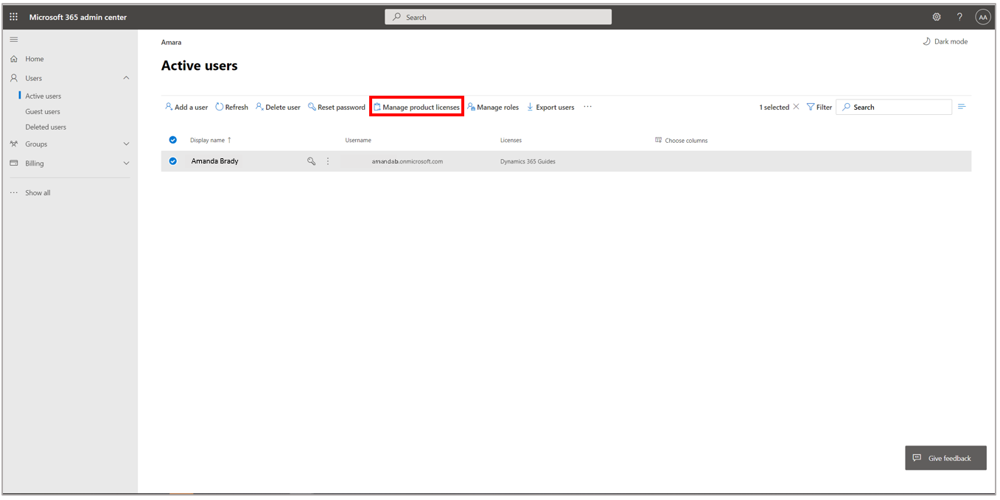

# Dynamics 365 Guides setup Step 1: Buy a subscription or sign up for a free trial 

>[!NOTE]
>Before completing this step, make sure to see [Overview of setting up Dynamics 365 Guides](setup.md)

There are two ways to get a [!include[pn-dyn-365-guides](../includes/pn-dyn-365-guides.md)] subscription:

- If you have a Microsoft work account, you can go directly to the [Microsoft 365 admin center](https://admin.microsoft.com/AdminPortal/Home) and search for a [!include[pn-dyn-365-guides](../includes/pn-dyn-365-guides.md)] subscription there.

- Go to the [Get started](https://aka.ms/GetGuides) page. You can use this page to buy a subscription or to sign up for a free 30-day trial. If you sign up for a trial, you can use credentials for an existing Dynamics 365 account or you can create new credentials. 

    > [!IMPORTANT] 
    > If you don't have administrator permissions associated with your work account, you won't be able to complete step 2 ([create a Common Data Service environment and install the solution](setup-step-two.md)) of the Setup process. Please coordinate setup with your administrator. If that's not possible, you can create user credentials to try out [!include[pn-dyn-365-guides](../includes/pn-dyn-365-guides.md)] by following the steps on the [Getting started](https://aka.ms/GetGuides) page. In this case, you'll create a new tenant and the user account you create will have administrator permissions. 

## Assign the Dynamics 365 Guides license to user accounts

After you sign up for a [!include[pn-dyn-365-guides](../includes/pn-dyn-365-guides.md)] subscription, you need to assign the [!include[pn-dyn-365-guides](../includes/pn-dyn-365-guides.md)] license to user accounts. To do this:

1. Go to the [Microsoft 365 admin center](https://admin.microsoft.com/AdminPortal/Home) and make sure that the slider for **The new admin center** option in the top right of the page is set to **on**.

    

2.  Make sure that the [!include[pn-dyn-365-guides](../includes/pn-dyn-365-guides.md)] license is assigned to a user. To do this, in the left pane, select **Users**, select **Active users**, and then select the check box for the user you want to add. 

    
    
3.  Select **Manage product licenses**.

     

4.  On the **Product licenses** page, select the check box for **[!include[pn-dyn-365-guides](../includes/pn-dyn-365-guides.md)]**.
  
     
 
## What's next?

When you're done with this step, go to [Step 2: Create a Common Data Service environment and install the solution](setup-step-two.md).

If you have trouble with any of the procedures in this step, please:

- Ask on our community site at https://community.dynamics.com/365/guides.

- Contact customer service at https://dynamics.microsoft.com/support/.
