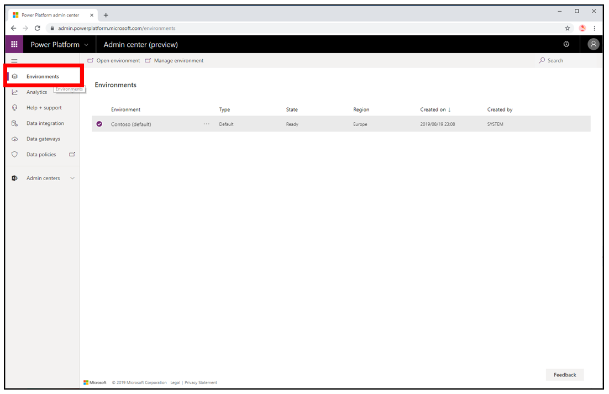
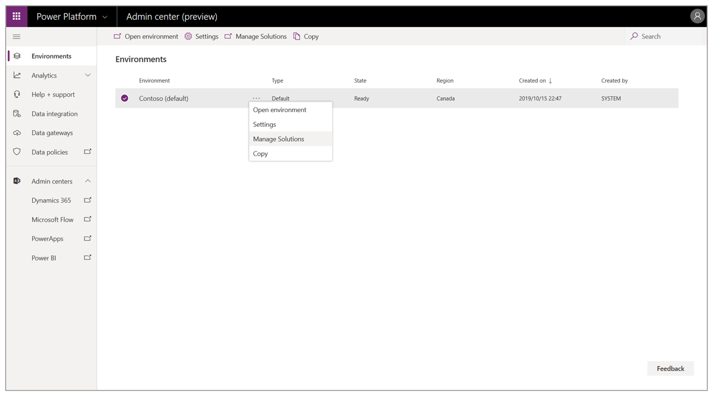
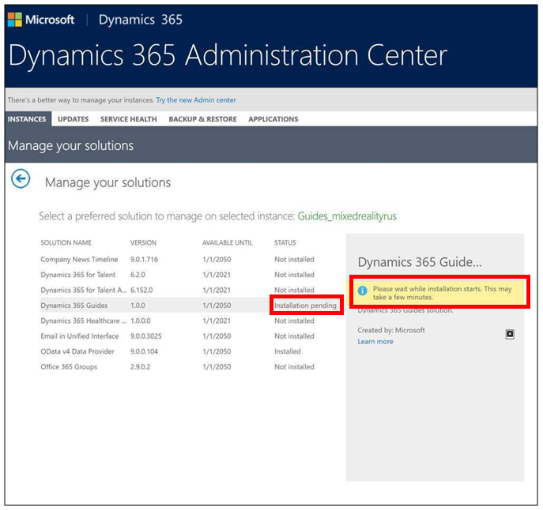
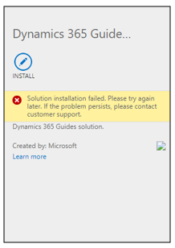

# Dynamics 365 Guides setup Step 2: Install the solution

>[!NOTE]
>Before completing the procedures in this step, make sure to see step 1 in the Dynamics 365 Guides setup process: [Buy a subscription or sign up for a free trial](setup-step-one.md)

After acquiring a [!include[pn-dyn-365-guides](../includes/pn-dyn-365-guides.md)] subscription and assigning licenses, you need to create an environment where you can install the [!include[pn-dyn-365-guides](../includes/pn-dyn-365-guides.md)] solution. The type of environment you create depends on whether you're creating a trial or production environment. If you bought a license for [!include[pn-dyn-365-guides](../includes/pn-dyn-365-guides.md)], set up a production environment. A production environment provides backup and restore capabilities. 

>[!NOTE]
>If you already have an environment (for example, an instance in your company's Dynamics 365 tenant), you can skip to [Change maximum upload file size](#upload).

## Set up a trial environment
    
1.  Go to the [Power Platform Admin center](https://admin.powerplatform.microsoft.com/environments) and sign in with the admin user credentials for the trial.

2.	In the Power Platform Admin center, select **Environments**.

    
    
3.	Select the **More environment actions** button (...) next to the default instance, and then select **Manage environment**.

        
     
4. Change the name of the environment (for example, Guides_*anyname*), and then select **Create my database**.

    
    
5. In the **Create a database for this environment** dialog box, choose your currency and language.

    
  
6.	Select **Create database.**

    The following page appears while the database is being created and provisioned:
    
     
 
     > [!NOTE]
     > Database creation usually takes several minutes. If, after five minutes, the "Provisioning database" message still appears, try refreshing the page.

7.	After you've successfully created the database, return to the **Environments** page and go to the [Change maximum upload file size](#upload) procedure.

## Set up a production environment

1.	Go to the [Power Platform Admin center](https://admin.powerplatform.microsoft.com/environments), select **Environments** if it's not already selected, and then select **New**.

     

    The **New environment** pane appears on the right side of the screen.

     

3.	In the **New environment** pane:

    a.	Enter a name for the environment.

    b.	In the **Type** list, select **Production**.

    c.	In the **Region** field, keep the default setting.  

    d.	In the **Create a database for this environment?** field, move the slider to **Yes**.

    e.	Select **Next** at the bottom of the screen. 

3. In the **Add database** pane that appears, choose your language and currency, leave the other default settings, and then select **Save**.

    

   >[!NOTE]
   > To learn about security groups, see [Control user access to instances](https://docs.microsoft.com/dynamics365/admin/add-instance-subscription#BKMK_man_sec_group).

   The following page appears while the production environment is being prepared. 
   
     

4.	After the new environment is active (listed as **Ready** in the **State** column), go to the next procedure for changing the maximum upload file size.

>[!NOTE]
>If you set up a production environment instead of a trial environment, in subsequent procedures throughout this topic, use the production environment instead of the default environment shown in the screenshots.

## Change maximum upload file size

In the [!include[pn-dyn-365-guides](../includes/pn-dyn-365-guides.md)] PC application, you can upload your own 3D files in addition to videos and 2D images. Many of these files will be larger than 5 MB, so you need to change the maximum file size for uploaded files. To do this, you'll change the setting for the email attachment size.

1. On the Power Platform Admin center **Environments** page, select the newly created environment, select the **More environment actions** (...) button, and then select **Settings**. 

    
       
2. Under **Email**, select **Email settings**. 

    

3. Scroll down to the bottom of the page, and then under **Attachments**, set the **Maximum file size for attachments** field to 131072. Select **Save** when you're done.

    

4. Go back to the **Environments** page to prepare for the next step. 

## Install and configure the solution

1. In the [Power Platform Admin center](https://admin.powerplatform.microsoft.com/environments), select the **More environment actions** (...) button next to the configured environment, and then select **Manage Solutions**.

    
     
    >[!NOTE]
    > You can also get to the [!include[pn-dyn-365](../includes/pn-dyn-365.md)] Administration Center from the PowerApps portal.
    
2. Select the [!include[pn-dyn-365-guides](../includes/pn-dyn-365-guides.md)] solution in the list, and then select **Install**.

    
    
3. In the **Terms of Service** dialog box, review the terms, and then select **Install**.

    On the [!include[pn-dyn-365](../includes/pn-dyn-365.md)] Administration Center page, you'll see the following message highlighted in yellow, showing that the solution is about to be installed: "Please wait while installation starts." 
        
     
     
    The **Status** field to the left of the installation message will say **Installation pending** while the solution is being installed. When the solution has finished installing, the **Status** field changes to **Installed**.
    
    > [!NOTE]
    > The installation process can take up to one hour and is variable based on the time of day and region. If the status hasn't changed after an hour, try refreshing the page. If the installation fails, you'll see this message: "Solution installation failed. Please try again later. If the problem persists, please contact customer support." 

## Set up user roles for the solution

> [!NOTE]
> It can take up to one hour for a user to appear in the [!include[pn-dyn-365](../includes/pn-dyn-365.md)] admin center after the licenses are added in the [!include[cc-microsoft](../includes/cc-microsoft.md)] 365 admin center.

1. After the solution has finished installing, go to the [Power Platform admin center](https://admin.powerplatform.microsoft.com/). 

2. On the **Environments** page, select the environment you created, select the **More environment actions** (...) button, and then select **Settings**. 

    

3. On the **Settings** page, expand **Users + permissions**, and then select **Users**.

    
    
    > [!IMPORTANT]
    > You can access [!include[pn-dyn-365-guides](../includes/pn-dyn-365-guides.md)] data through the Guides Hub tile on the preceding page, but we recommend that you not make any changes in the Guides Hub. Any changes you make can have unintended consequences for the [!include[pn-dyn-365-guides](../includes/pn-dyn-365-guides.md)] apps.
 
4. On the **Enabled Users** page, select the user, and then select **Manage Roles**. 

    
 
5. In the **Manage User Roles** dialog box, make sure the **Common Data Service User** check box is selected.
         
    
    
6. Select the **Dyamics 365 Guides Author** or **Dynamics 365 Guides Operator** check box, depending on the privileges you want the user to have.

    
    
    The following table describes the privileges provided by each role:
    
    |Role|Description|
    |-----------------------|----------------------------------------------------------------------|
    |**Author**|Users with this role can use the PC app and HoloLens app to create, edit, and operate guides. They can also rename and deactivate existing guides.|
    |**Operator**|Users with this role can use the HoloLens app to view/operate a guide. If the **Operator** role is set, operators can also save time when opening a guide by skipping the **Select Mode** dialog box.|
      
7. If you want this user to have administrator privileges, select the **System Administrator** check box. 
     
## What's next?

When you're done with this step, go to [Step 3: Download and install the apps](setup-step-three.md) 

If you have trouble with any of the procedures in this step, please:

- Ask on our community site at https://community.dynamics.com/365/guides.

- Contact customer service at https://dynamics.microsoft.com/support/.

