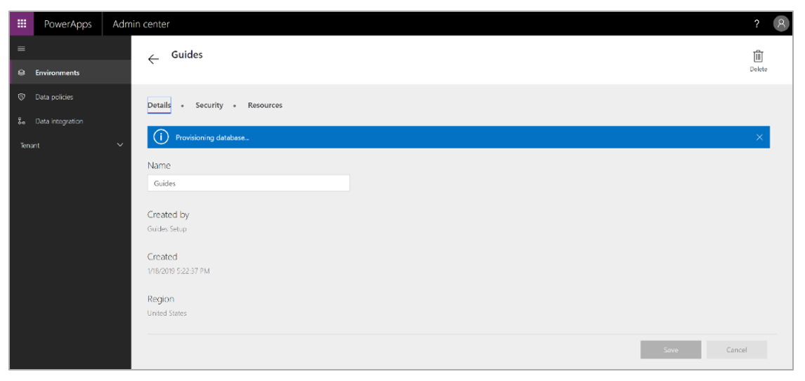
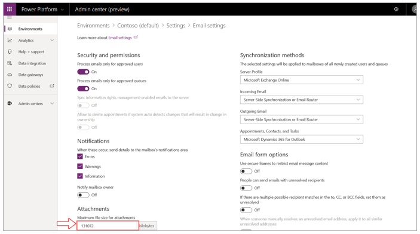
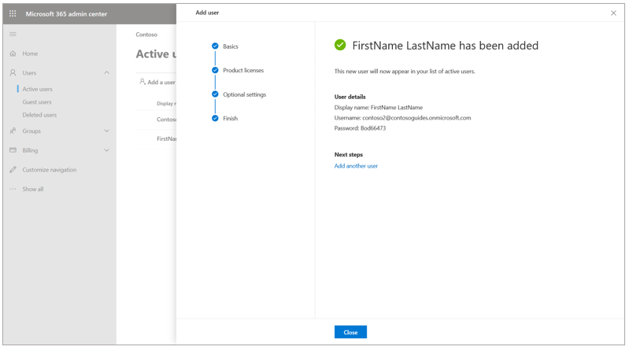

# Buy and deploy Dynamics 365 Guides

We're thrilled to introduce [!include[cc-microsoft](../includes/cc-microsoft.md)] [!include[pn-dyn-365-guides](../includes/pn-dyn-365-guides.md)] for general availability! [Learn about Guides capabilities](index.md).

To get started with [!include[pn-dyn-365-guides](../includes/pn-dyn-365-guides.md)], you need to:

1. Buy a [!include[pn-dyn-365-guides](../includes/pn-dyn-365-guides.md)] subscription or sign up for a free, 30-day trial subscription.

2. Create a Common Data Service environment (if you don't already have one) and install the [!include[pn-dyn-365-guides](../includes/pn-dyn-365-guides.md)] solution in the environment (instance).

3.	Download and install the [!include[pn-dyn-365-guides](../includes/pn-dyn-365-guides.md)] apps on a [!include[pn-ms-windows-short](../includes/pn-ms-windows-short.md)] 10 PC and [!include[cc-microsoft](../includes/cc-microsoft.md)] [!include[pn-hololens](../includes/pn-hololens.md)].

4. Set up Guides Analytics reports.

5. Add additional user accounts (optional).

This topic provides step-by-step instructions for all of the above.

## Step 1: Buy a Dynamics 365 Guides subscription or sign up for a free trial subscription

There are multiple ways to get a [!include[pn-dyn-365-guides](../includes/pn-dyn-365-guides.md)] subscription:

- If you have a Microsoft work account, you can go directly to the [Microsoft 365 admin center](https://admin.microsoft.com/AdminPortal/Home) and search for a [!include[pn-dyn-365-guides](../includes/pn-dyn-365-guides.md)] subscription there.

- Go to the [Getting started](https://aka.ms/GetGuides) page. You can use this page to buy a subscription or to sign up for a free, 30-day trial subscription. If you sign up for a trial, you can use credentials for an existing Dynamics 365 account or you can create new credentials. 

    > [!IMPORTANT] 
    > If you don't have administrator permissions associated with your work account, you won't be able to complete step 2 of the Setup process. Please coordinate setup with your administrator. If it's not possible to coordinate setup with your administrator, you can choose to create user credentials to try out [!include[pn-dyn-365-guides](../includes/pn-dyn-365-guides.md)] by following the steps on the [Getting started](https://aka.ms/GetGuides) page. In this case, the new tenant will be created and the newly created user account will have administrator permissions. Note that you'll need to provide the domain name in the form: *guidesYourCompanyName*
    
### Assign the Dynamics 365 Guides license to user accounts
    
After you sign up for a [!include[pn-dyn-365-guides](../includes/pn-dyn-365-guides.md)] subscription, you need to assign the [!include[pn-dyn-365-guides](../includes/pn-dyn-365-guides.md)] license to user accounts. To do this:

1. Go to the [Microsoft 365 admin center](https://admin.microsoft.com/AdminPortal/Home) and make sure that the slider for **The new admin center** option in the top right of the page is set to **on**.

    

2.  Make sure that the [!include[pn-dyn-365-guides](../includes/pn-dyn-365-guides.md)] license is assigned to a user. To do this, in the left pane, select **Users**, select **Active users**, and then select the check box for the user you want to add. 

    
    
3.  Select **Manage product licenses**.

     

4.  On the **Product licenses** page, select the check box for **[!include[pn-dyn-365-guides](../includes/pn-dyn-365-guides.md)]**.
  
     
 
## Step 2: Create a Common Data Service environment and install the Dynamics 365 Guides solution

After acquiring a [!include[pn-dyn-365-guides](../includes/pn-dyn-365-guides.md)] subscription and assigning licenses, you’ll need to create a database on a default environment where you can install the [!include[pn-dyn-365-guides](../includes/pn-dyn-365-guides.md)] solution. If you already have a Common Data Service environment (for example, an instance in your company's Dynamics 365 tenant), you can skip to [Change maxiumum upload size](#upload).
    
1.  Go to the [Power Platform Admin center](https://admin.powerplatform.microsoft.com/environments) and sign in with the admin user credentials (where the [!include[pn-dyn-365-guides](../includes/pn-dyn-365-guides.md)] licenses are assigned).

2.	In the Power Platform Admin center, select **Environments**.

    
    
3.	Select the **More environment actions** button (...) next to the default instance, and then select **Manage environment**.

    
    
4. Change the name of the environment (for example, Guides_*anyname*), and then select **Create my database**.

    
    
5. In the **Create a database for this environment** dialog box, choose your currency and language.

    
  
6.	Select **Create database.**

    The following page appears while the database is being created and provisioned:
    
     
 
     > [!NOTE]
     > Database creation usually takes several minutes. If, after 5 minutes, the “Provisioning database” message still appears, try refreshing the page.    

7.	After you have successfully created the database, return to the **Environments** page.

### Change maximum upload file size

In the [!include[pn-dyn-365-guides](../includes/pn-dyn-365-guides.md)] PC application, you can upload your own 3D files, as well as videos and 2D images. Many of these files will be larger than 5 MB, so you need to change the maximum file size for files that are uploaded. To do this, you'll change the setting for the email attachment size to 128 MB (131072 KB).

1. On the Power Platform Admin center **Environments** page, select the newly created environment, and then select the **Settings** button in the title bar. 

    
   
2. Under **Email**, select **Email settings**. 

    

3. Scroll down to the bottom of the page, and then under **Attachments**, set the **Maximum file size for attachments** field to 131072. Select **Save** when you’re done.

    

4. Go back to the **Environments** page to prepare for the next step. 

### Install and configure the Dynamics 365 Guides solution

1. In the [Power Platform Admin center](https://admin.powerplatform.microsoft.com/environments), select the **More environment actions** (...) button next to the configured environment, and then select **Manage Solutions**.

    
     
    >[!NOTE]
    > You can also get to the [!include[pn-dyn-365](../includes/pn-dyn-365.md)] Administration Center from the PowerApps portal.
    
2. Select the [!include[pn-dyn-365-guides](../includes/pn-dyn-365-guides.md)] solution in the list, and then select **Install**.

    
    
3. In the **Terms of Service** dialog box, review the terms, and then select **Install**.

    On the [!include[pn-dyn-365](../includes/pn-dyn-365.md)] Administration Center page, you'll see the following message highlighted in yellow showing that the solution is about to be installed: "Please wait while installation starts." 
        
     
     
    The **Status** field to the left of the installation message will say **Installation pending** while the solution is being installed. When the solution has finished installing, the **Status** field changes to **Installed**.
    
    > [!NOTE]
    > The installation process can take up to one hour and is variable based on the time of day and region. If the status hasn't changed after an hour, try refreshing the page. If the installation fails, you'll see this message: "Solution installation failed. Please try again later. If the problem persists, please contact customer support." 

### Set up user roles for the solution

> [!NOTE]
> It can take up to one hour for a user to appear in the [!include[pn-dyn-365](../includes/pn-dyn-365.md)] admin center after the licenses are added in the [!include[cc-microsoft](../includes/cc-microsoft.md)] 365 admin center. 

1. After the solution has finished installing, go to the [Power Platform admin center](https://admin.powerplatform.microsoft.com/). 

2. On the **Environments** page, select the environment you created, and then select the **Settings** button in the title bar. 

3. On the **Settings** page, under **Users + permissions**, select **Users**.

    
    
    > [!IMPORTANT]
    > You can access [!include[pn-dyn-365-guides](../includes/pn-dyn-365-guides.md)] data through the Guides Hub tile on the preceding page, but we recommend that you not make any changes in the Guides Hub. Any changes you make can have unintended consequences for the [!include[pn-dyn-365-guides](../includes/pn-dyn-365-guides.md)] apps.
 
4.	On the **Enabled Users** page, select the user, and then select **Manage Roles**. 

    
 
5.	In the **Manage User Roles** dialog box, select the following roles: 

    - Common Data Service User    

    - [!include[pn-dyn-365-guides](../includes/pn-dyn-365-guides.md)] Author    
         
      
      
      > [!NOTE]
      > Also select the System Administrator role if this is the main user/admin. Otherwise, do not select that role. 
     
## Step 3: Download and install the apps

There are two [!include[pn-dyn-365-guides](../includes/pn-dyn-365-guides.md)] applications: 

- PC authoring application

- [!include[pn-hololens](../includes/pn-hololens.md)] application, which has an Author mode and an Operator mode

You can install both apps from [!include[cc-microsoft](../includes/cc-microsoft.md)] Store as described in the next section.

> [!NOTE]
> If you can’t access [!include[cc-microsoft](../includes/cc-microsoft.md)] Store due to company policies, please contact your administrator to distribute the app.

If you use [!include[cc-microsoft](../includes/cc-microsoft.md)] Store for Business to distribute your apps, you can have users install the apps from your organization’s private store or from an email link that you send. Instructions are provided later in this topic.

### Install the apps from Microsoft Store

#### Install the PC authoring app 
1.	Check to make sure your [!include[pn-ms-windows-short](../includes/pn-ms-windows-short.md)] 10 PC is running the latest [!include[pn-ms-windows-short](../includes/pn-ms-windows-short.md)] build (must be build 10.0.17134, April 2018 update, or later).

2.	On your PC, go to **Start**  > **[!include[cc-microsoft](../includes/cc-microsoft.md)] Store** , and then search for “[!include[pn-dyn-365-guides](../includes/pn-dyn-365-guides.md)].”

3.	In [!include[cc-microsoft](../includes/cc-microsoft.md)] Store, select **Get** for the [!include[pn-dyn-365-guides](../includes/pn-dyn-365-guides.md)] app to download, and install the application.

    > [!NOTE]
    > For instructions on opening and signing in to the app, see the [authoring guide](authoring-overview.md).

#### Install the HoloLens app

1.	Make sure [!include[pn-hololens](../includes/pn-hololens.md)] is running build 10.0.17134 or later. We recommend updating [!include[pn-hololens](../includes/pn-hololens.md)] to newer versions when available. For instructions on using [!include[pn-ms-windows-short](../includes/pn-ms-windows-short.md)] Update for Business, see [Manage updates to HoloLens](https://docs.microsoft.com/HoloLens/hololens-updates).

2.	On your [!include[pn-hololens](../includes/pn-hololens.md)], use the bloom gesture to open the **Home** menu, and then open the [!include[cc-microsoft](../includes/cc-microsoft.md)] Store app and search for “[!include[pn-dyn-365-guides](../includes/pn-dyn-365-guides.md)]”.

3.	To download and install the [!include[pn-dyn-365-guides](../includes/pn-dyn-365-guides.md)] application, select **Install**.

> [!NOTE] 
> If you're an author, for instructions on opening and signing in to the app, see the [HoloLens authoring topic](hololens-authoring.md). Operators can use the [Dynamics 365 Guides Operator's manual](operator-guide.md).

### Distribute the apps through Microsoft Store for Business

1.	Go to [Microsoft Store for Business](https://businessstore.microsoft.com/store).

2.	[Acquire the app(s)](https://docs.microsoft.com/microsoft-store/acquire-apps-microsoft-store-for-business).

3.	Choose one of the following distribution methods:

    - [Private store](https://docs.microsoft.com/microsoft-store/distribute-apps-from-your-private-store)
    
    - [Email link](https://docs.microsoft.com/microsoft-store/assign-apps-to-employees)
    
    - [Mobile device management](https://docs.microsoft.com/microsoft-store/configure-mdm-provider-microsoft-store-for-business)

For information about opening and signing in to the PC application after installing it, see the [authoring guide](authoring-overview.md).

For information about opening and signing in to the [!include[pn-hololens](../includes/pn-hololens.md)] application, go to one of the following, depending on whether you're an author or an operator:

   - [HoloLens authoring](hololens-authoring.md)
   
   - [Operator's manual](operator-guide.md)

## Step 4: Set up Guides Analytics reports 

[!include[pn-dyn-365-guides](../includes/pn-dyn-365-guides.md)] includes [!include[pn-power-bi](../includes/pn-power-bi.md)] reports (called Guides Analytics) that you can use to analyze [!include[pn-dyn-365-guides](../includes/pn-dyn-365-guides.md)] processes. Follow the instructions for how to [Open Guides Analytics](https://docs.microsoft.com/dynamics365/mixed-reality/guides/analytics-guide#open-guides-analytics) using the free [Power BI Desktop application](https://powerbi.microsoft.com/get-started/).

If you have a [!include[pn-power-bi](../includes/pn-power-bi.md)] Pro license, you can share your Guides Analytics [!include[pn-power-bi](../includes/pn-power-bi.md)] reports within your organization by publishing them to the [!include[pn-power-bi](../includes/pn-power-bi.md)] Service. This allows anyone in your organization with a [!include[pn-power-bi](../includes/pn-power-bi.md)] Pro license to access the report through the [!include[pn-power-bi](../includes/pn-power-bi.md)] Service web interface accessible at [https://powerbi.microsoft.com](https://powerbi.microsoft.com). To learn about [!include[pn-power-bi](../includes/pn-power-bi.md)] cloud collaboration and sharing and to sign up for a free trial of [!include[pn-power-bi](../includes/pn-power-bi.md)] Pro, visit [Getting Started with Power BI Desktop](https://powerbi.microsoft.com/get-started/) and [Ways to share your work in Power BI](https://docs.microsoft.com/power-bi/service-how-to-collaborate-distribute-dashboards-reports).

## Step 5: Add additional user accounts (optional)

If you want to add additional users, you need to assign the [!include[pn-dyn-365-guides](../includes/pn-dyn-365-guides.md)] license to them and configure the roles they will have access to in the Dynamics 365 admin center.

### Add a user account

1. Go to the [Microsoft 365 admin center](https://admin.microsoft.com/AdminPortal/Home).

2. In the left pane, select **Users**, and then select **Active users**. 

3. On the **Active users** page, select **Add a user**.

    

4. On the **Set up the basics** page, fill in the information for the new user. Select **Next** when you're done.

   

   > [!NOTE]
   > By default, an auto-generated password will be generated for the user. The user is required to change the password the first time they sign in with this account. If you want to change the password to a permanent password instead of using the auto-generated password, select the **Let me create the password** option, and then clear the **Require this user to change their password when they first sign in** check box. 
 
5. Select the location for this user, and then under **Licenses**, select the **Dynamics 365 Guides** check box. 

     

     Select **Next** when you're done.
   
7. On the **Optional settings** page, leave the **User (no administrator access)** box selected unless this new user will be an administrator. In that case, select the **Global administrator** check box. 

    
   
8. To fill out the new user's profile info, scroll down, and then expand **Profile info**. Select **Next** when you're done.
   
   
   
8. Review the information on the last page. To make changes, select the **Edit** button below each section. Select **Finish Adding** when you're done.

   

9. If you selected **Auto-generate password** in step 4, make note of the password. The user will need this password to sign in.

    
   
10. Select **Close**.

11. [Set up user roles for the solution](#user-roles) as described earlier in this topic.

### See also

[Get started with Dynamics 365 Guides](get-started.md) 
[Author a guide](authoring-overview.md) 
[Operator's manual](operator-guide.md) 
[Analyze your guides to improve process efficiencies](analytics-guide.md) 
[FAQ](faq.md)

