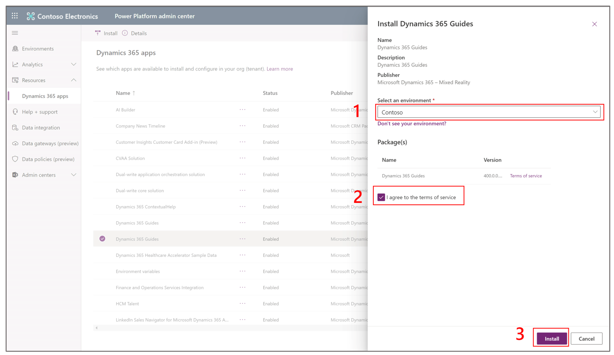

# Upgrade the Dynamics 365 Guides solution

This topic is for [!include[cc-microsoft](../includes/cc-microsoft.md)] [!include[pn-dyn-365](../includes/pn-dyn-365.md)] administrators. Some releases of [!include[pn-dyn-365-guides](../includes/pn-dyn-365-guides.md)] require an update to the [!include[pn-dyn-365-guides](../includes/pn-dyn-365-guides.md)] solution. When an update is required, the user will see a notification in the **What's new** panel. 

Keep the following in mind:

- Before you update the solution in the Power Platform admin center, make sure that the [!include[pn-dyn-365-guides](../includes/pn-dyn-365-guides.md)] PC and [!include[pn-hololens](../includes/pn-hololens.md)] apps have been updated to the latest version from the [!include[cc-microsoft](../includes/cc-microsoft.md)] Store.

- Updates to the solution must be done when the PC and [!include[pn-hololens](../includes/pn-hololens.md)] apps are not in use.  

To upgrade the solution:

1. Go to the [Power Platform admin center](https://admin.powerplatform.microsoft.com/environments) and sign in with the user credentials that have admin permissions for [!include[pn-dyn-365-guides](../includes/pn-dyn-365-guides.md)]. Admins must also have a [Dynamics 365 Guides license assigned to their user account](https://docs.microsoft.com/dynamics365/mixed-reality/guides/add-users). 

2. To select the environment, select **Resources**, and then select **Dynamics 365 apps**. 

   

3. Next to **Dynamics 365 Guides**, select the **More application actions** (...) button, and then select **Install**.
 
     
  
4. In the dialog box that appears, select the environment that you want to upgrade the solution for, select the **I agree to the terms of service** check box, and then select **Install**.  
    
     

## Troubleshooting: You receive a "Guide cannot be opened" error message

As a part of the update to the Dynamics 365 Guides solution that is released on April 28, 2020, all your guides should automatically be converted from schema v3 to v4. Schema v4 enables Dynamics 365 Guides content to be stored in entities instead of inside a single JavaScript Object Notation (JSON) file. Therefore, you can take advantage of the Common Data Service Web application programming interface (API) and Microsoft Power Platform functionality by using Dynamics 365 Guides content.

In rare cases, the conversion of a guide from schema v3 to v4 might be unsuccessful, for reasons that include but aren't limited to the following:

- A guide was being authored in the PC or HoloLens app when the solution was updated.

- The JSON file has been edited in a way that isn't supported. (For example, the guide doesn't have a task, or too many 3D parts have been programmatically added to the **Step Editor** bin.)

If a guide wasn't successfully converted, authors or operators will receive the following error message when they try to open it: "Guide cannot be opened."

### Manually update a guide from schema v3 to v4

To fix this issue, we recommend that you first try to upgrade the guide schema from v3 to v4.  

> [!NOTE]
> You can't manually update the schema for guides that have already been updated to schema v4. The schema version number appears on the **General** tab when you open a guide in the Guides model-driven app. 

#### Update the schema

1. In the PC app, sign in to the instance that includes the guide where the issue occurs.

2. On the **Analyze** tab, select **Copy** to copy the **Instance URL** value, and then paste the value into the address bar of a web browser.

    

3. Sign in, and then select the **Guides** model-driven app.

    

4. Select the guide where the issue occurs.

    

5. At the top of the page, select **Flow**, and then select **Upgrade guide schema**.

    
    
>[!NOTE]
>If the issue isn't fixed when you update the guide schema, the guide's JSON file has probably been edited in a way that isn't supported (for example, too many 3D objects have been programmatically added to the **Step Editor** bin). Contact the Dynamics 365 Guides team directly for guidance, through your Microsoft Account team.

## See also

[What's new in Dynamics 365 Guides](new.md)

