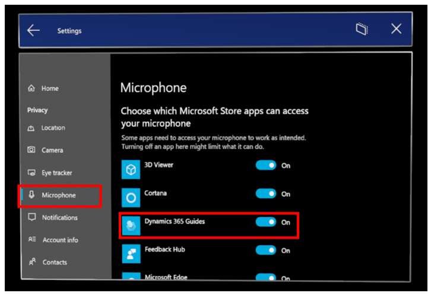
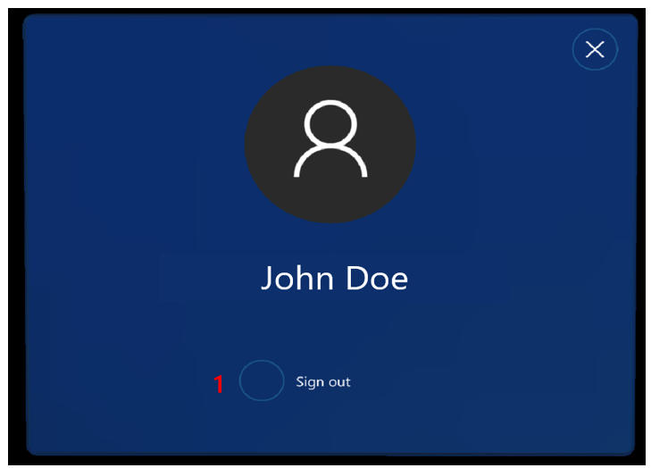

# Use voice commands in Dynamics 365 Guides

You can use voice commands in Microsoft Dynamics 365 Guides as a substitute for hand gestures or gaze. Most voice commands are contextual; they only work in certain areas of the user interface. 

>[!NOTE]
>Voice commands work best on HoloLens 2. You can use voice commands on HoloLens 1, but HoloLens 1 is not optimized for voice.  

## Prerequisites

- Speech must be enabled on the device.

- You must give permission to Dynamics 365 Guides to use your microphone during the first run of the app or by going to **Settings** > **Privacy** > **Microphone** > 
**Dynamics 365 Guides**.

    
    
> [!NOTE]
> Voice commands in Dynamics 365 Guides are supported in [certain languages only](https://docs.microsoft.com/dynamics365/mixed-reality/guides/faq#what-languages-is-dynamics-365-guides-available-in). 
The language is based on the Windows display language, not the keyboard language. You can verify the Windows display language by selecting **Settings** > **Time and Language** > 
**Language**.

## Use voice commands

This section shows Dynamics 365 Guides pages and the voice commands to use for those pages.

> [!NOTE]
> The [Select](https://docs.microsoft.com/hololens/hololens-cortana#general-speech-commands) voice command works anywhere in the app in the same way as an air tap. 

## Sign-in page

||Say this|To do this|
|---|-----------------|-------------------------------------------|
|1|"Sign in"|Start the sign-in process.|
|2|"Get started"|Open the **Get started with Guides** dialog box.|
|3|"Try the demo"|Open the Dynamics 365 Guides demo.|

## Select mode page

||Say this|To do this|
|---|-----------------|-------------------------------------------|
|1|"Operate"|Select **Operate** mode.|
|2|"Author"|Select **Author** mode.|

## Align holographic anchor page

||Say this|To do this|
|---|-----------------|-------------------------------------------|
|1|"Confirm"|Confirm the position of the anchor so you can start using the guide.|

## Scan anchor page (QR code and circular code)

||Say this|To do this|
|---|-----------------|-------------------------------------------|
|1|"Initiate scan"|Start anchor scanning.|

## Anchor found page (QR code and circular code)

||Say this|To do this|
|---|-----------------|-------------------------------------------|
|1|"Rescan"|Rescan the anchor if holograms aren’t aligned correctly.|
|2|"Confirm"|Confirm the position of the anchor so you can start using the guide.|

## Step card page

||Button or element|Say this|To do this|
|---|----------|-------------------|-------------------------------------|
|1||"Exit guide"|Exit the current guide.|
|2|")|"Follow me"|Turn on **Follow** mode.|
|3|")|"Place here"|Turn off **Follow** mode.|
|4||"Go to anchor"|Go to the anchor page to re-anchor the guide (if holograms aren’t aligned correctly).|
|5||"Go to settings"|Go to the **Settings** page.|
|6||"Go to my profile"|Go to your profile page.|
|7||"Go back"|Go to the previous step.|
|8||"Next step|Go to the next step.|
|9||"Go to outline"|Go to the task/step Outline view. ||
|10||"Hide holograms"|Turn off visibility for 3D parts (assuming 3D parts have been placed and they’re visible).|
|11||"Show holograms"|Turn on visibility for 3D parts (assuming 3D parts have been placed and they’re hidden).|
|12||"Play video"|Start the video attached to the step (assuming the step has a video).|
|13||"Pause video"|Pause the video.|
|14||"Restart guide"|Go to the first step in the guide. **Note:** You must be on the completion step to use this voice command.|

## Task list/guide list

||Button or element|Say this|To do this|
|---|----------|-------------------|-------------------------------------|
|1||"Scroll up"|Scroll up the list.|
|2||"Scroll down"|Scroll down the list.|

## Profile page

||Say this|To do this|
|---|-----------------|-------------------------------------------|
|1|"Sign out"|Sign out of Dynamics 365 Guides.|

## User profile/Settings/Task list pages

|Button or element|Say this|To do this|
|-----|-------------------|-------------------------------------|
||"Close window"|Close the active window.|

## Dialog boxes 

For dialog boxes, read the label of the button (for example, say **Yes** or **No**). 

## Author mode commands

|Button or element|Say this|To do this|
|-----|-------------------|-------------------------------------|
||"Undo changes"|Undo the last change.| 
||"Redo changes"|Redo the last change.|
||"Save guide"|Save your latest changes.|

