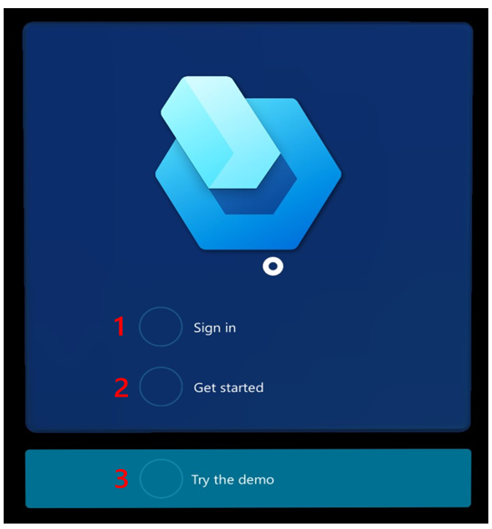
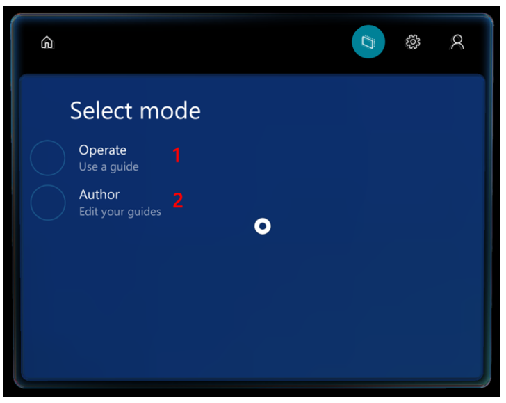
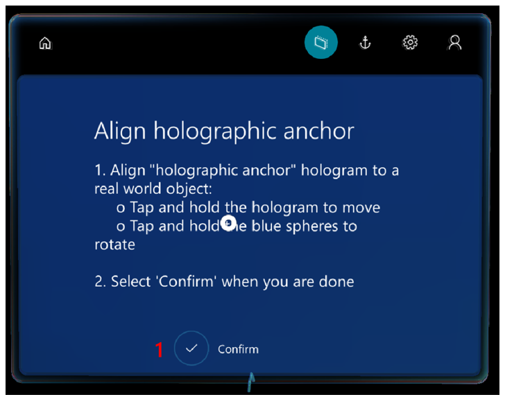
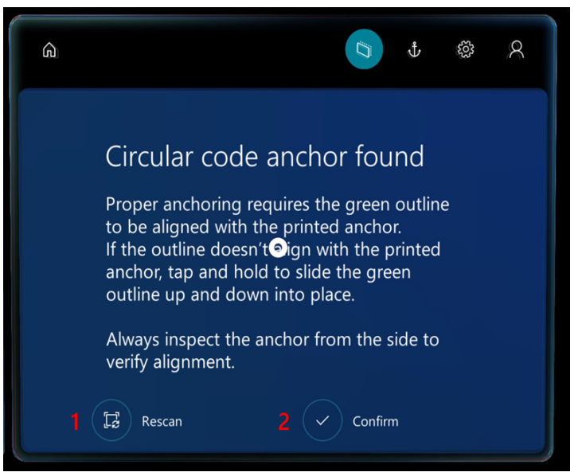
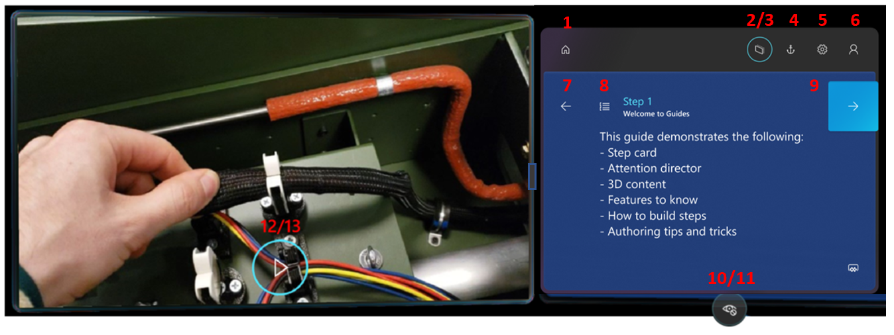
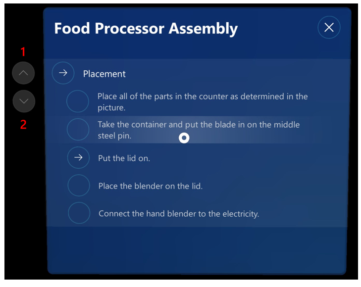
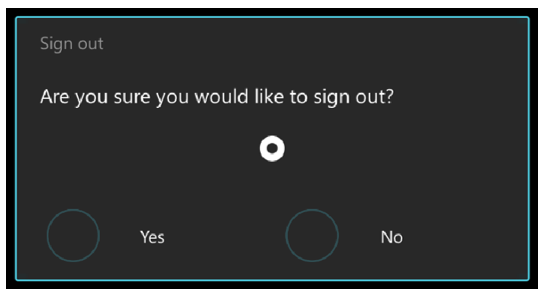

# Use voice commands in Dynamics 365 Guides as a substitute for hand gestures or gaze

You can use voice commands in Microsoft Dynamics 365 Guides as a substitute for hand gestures or gaze. Voice commands save you time and keep you in the flow of your work, because you don't have to gaze at buttons to take actions.

For increased accuracy, most voice commands are contextual. In other words, they work only when the appropriate page is open.

> [!NOTE]
> Voice commands work best on HoloLens 2. Although you can use voice commands on HoloLens 1, HoloLens 1 isn't optimized for voice in loud environments.

## Prerequisites

- Speech must be enabled on the device.

- You must give Dynamics 365 Guides permission to use your microphone during the first run of the app. Alternatively, go to **Settings** \> **Privacy** \> **Microphone**, and set the **Dynamics 365 Guides** option to **On**.

    

> [!NOTE]
> Voice commands are supported for [all languages that Dynamics 365 Guides supports](https://docs.microsoft.com/dynamics365/mixed-reality/guides/faq#what-languages-is-dynamics-365-guides-available-in). The language is based on the Windows display language, not the keyboard language. You can verify the Windows display language by going to **Settings** \> **Time and Language** \> **Language**.

## Use voice commands

This section shows Dynamics 365 Guides pages and the voice commands that you can use for them.

> [!NOTE]
> Regardless of where you are in the app, the [Select](https://docs.microsoft.com/hololens/hololens-cortana#general-speech-commands) voice command works like an air tap.

### Sign-in page

| | Say this | To do this |
|---|---|---|
| 1 | "Sign in" | Start the sign-in process. |
| 2 | "Get started" | Open the **Get started with Guides** dialog box. |
| 3 | "Try the demo" | Open the Dynamics 365 Guides demo. |

### Select mode page

| | Say this | To do this |
|---|---|---|
| 1 | "Operate" | Select **Operate** mode. |
| 2 | "Author" | Select **Author** mode. |

### Align holographic anchor page

| | Say this | To do this |
|---|---|---|
| 1 | "Confirm" | Confirm the position of the anchor so that you can start to use the guide. |

### Scan anchor page (QR code and circular code)

| | Say this | To do this |
|---|---|---|
| 1 | "Initiate scan" | Start anchor scanning. |

### Anchor found page (QR code and circular code)

| | Say this | To do this |
|---|---|---|
| 1 | "Rescan" | Rescan the anchor if holograms aren't correctly aligned. |
| 2 | "Confirm" | Confirm the position of the anchor so that you can start to use the guide. |

### Step card page

| | Button or element | Say this | To do this |
|---|---|---|---|
| 1 |  | "Exit guide" | Exit the current guide. |
| 2 | ") | "Follow me" | Turn on **Follow** mode, and bring the card to the center of the field of view. |
| 3 | ") | "Place here" | Turn off **Follow** mode, and bring the card to the center of the field of view. |
| 4 |  | "Go to anchor" | Go to the anchor step to re-anchor the guide. |
| 5 |  | "Go to settings" | Go to the **Settings** page. |
| 6 |  | "Go to my profile" | Go to your profile page. |
| 7 |  | "Go back" | Go to the previous step. |
| 8 |  | "Next step" | Go to the next step. |
| 9 |  | "Go to outline" | Go to the **Outline** view for the task or step. |
| 10 |  | "Hide holograms" | Turn off visibility for 3D parts (if 3D parts have been placed and they are visible). |
| 11 |  | "Show holograms" | Turn on visibility for 3D parts (if 3D parts have been placed but they are hidden). |
| 12 |  | "Play video" | Start the video that is attached to the step (if the step has a video). |
| 13 |  | "Pause video" | Pause the video. |
| 14 |  | "Restart guide" | Go to the first step in the guide.
**Note:** You must be on the Completion step to use this voice command.
 |

### Outline, guide list, and instance list

| | Button or element | Say this | To do this |
|---|---|---|---|
| 1 |  | "Scroll up" | Scroll up the list. |
| 2 |  | "Scroll down" | Scroll down the list. |

### Profile page

| | Say this | To do this |
|---|---|---|
| 1 | "Sign out" | Sign out of Dynamics 365 Guides. |

### User profile, Settings, and Task list pages

| Button or element | Say this | To do this |
|---|---|---|
|  | "Close window" | Close the active window. |

### Dialog boxes

For dialog boxes, read the label of the button (for example, say "Yes" or "No").

### Author mode commands

| Button or element | Say this | To do this |
|---|---|---|
|  | "Undo changes" | Undo the last change. |
|  | "Redo changes" | Redo the last change. |
|  | "Save guide" | Save your most recent changes. |
