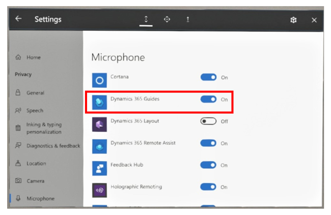

# Use voice commands on HoloLens 2 in Dynamics 365 Guides

In [!include[cc-microsoft](../includes/cc-microsoft.md)] [!include[pn-dyn-365-guides](../includes/pn-dyn-365-guides.md)], you can use voice commands instead of hand gestures or gaze as a form of input. Most voice commands are contextual. In other words, they work only in certain areas of the user interface (UI).

> [!NOTE]
> Voice commands aren't supported on [!include[pn-hololens](../includes/pn-hololens.md)] 1. On [!include[pn-hololens](../includes/pn-hololens.md)] 2, they are supported in the following languages: English, Spanish, German, Dutch, French, Italian, Japanese, Korean, and Chinese. The voice commands that you use are consistent with the display language of the [!include[pn-hololens](../includes/pn-hololens.md)] operating system (OS). To view your display language, go to **Settings** \> **Time and Language** \> **Language**. 

## Provide permission for Dynamics 365 Guides to use the microphone

When you first install [!include[pn-dyn-365-guides](../includes/pn-dyn-365-guides.md)], the app asks for permission to use the microphone.

Voice commands won't work unless you provide this permission. If you don't provide this permission when you first install the app, you can provide it later by going to **Settings** \> **Privacy** \> **Microphone**.

## Voice commands

The following table lists the voice commands that you can use on [!include[pn-hololens](../includes/pn-hololens.md)] 2.

| To do this | Say this | On screen | Notes |
|------------|----------|-----------|-------|
| Select **Operate** mode. | Operate | Select Mode | |
| Select **Author** mode. | Author | Select Mode | |
| Go to the next step. | Next step | Step Card | |
| Go to the previous step. | Go back | Step Card | |
| Turn off visibility of 3D parts. | Hide 3D parts | Step Card | Visible 3D parts must be placed in a step. |
| Turn on visibility of 3D parts. | Show 3D parts | Step Card | The 3D parts in the step must be hidden. |
| Go to your profile. | Go to profile | Step Card | |
| Go to **Settings**. | Go to settings | Step Card | |
| Open the task list. | Got to task list | Step Card | |
| Go to the anchor step. | Re-anchor guide | Step Card | |
| Turn on **Follow** mode for the instruction card. | Follow me | Step Card | **Follow** mode for the instruction card must be off. |
| Turn off **Follow** mode for the instruction card. | Place here | Step Card | **Follow** mode for the instruction card must be on. |
| Exit the guide. | Exit guide | Step Card | |
| Scroll up the list. | Scroll up | Guides List/Task List | |
| Scroll down the list. | Scroll down | Guides List/Task List | |
| Close the window. | Close window | Profile/Settings/Task List | |

## What's next?

[Calibrate your HoloLens](operator-calibrate.md) 
[Install the app and sign in](install-sign-in-operator.md) 
[Gestures for navigating the app](operator-gestures.md) 
[Anchor your guide](operator-anchor.md) 
[Operate a guide](operator-orientation.md)
