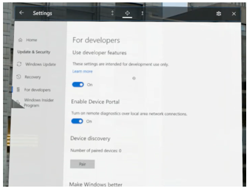
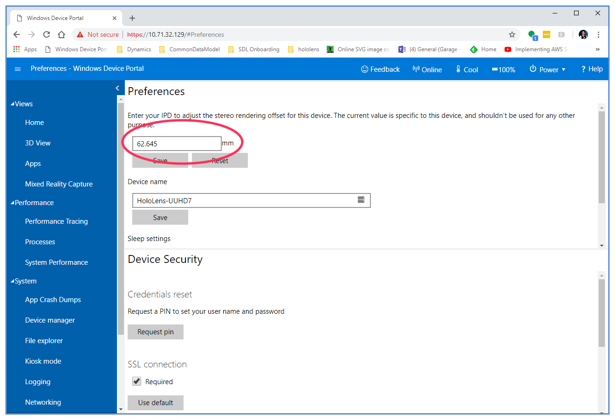

# Use the Windows Device Portal to streamline HoloLens calibration

[!INCLUDE [cc-beta-prerelease-disclaimer](../includes/cc-beta-prerelease-disclaimer.md)]
 
You can use the Windows Device Portal to configure and manage your HoloLens remotely with Wi-Fi or USB. The Windows Device Portal is a web server on your HoloLens that you can connect to from a web browser on your PC. The portal includes many tools that help you manage your HoloLens. The portal also offers a fast way to update interpupillary distance settings (IPDs) when switching users on a HoloLens. Updating an IPD via the portal takes about **2 seconds**. Updating the IPD by recalibrating the HoloLens takes about **2 minutes**.

To use the portal:

1. Get your IPD by calibrating the HoloLens. 

2. Write your IPD down.

3. Enter it in the portal every time you switch users on the HoloLens. 

## Set up your HoloLens to use the Windows Device Portal

Before accessing the Windows Device Portal, you need to set it up on HoloLens:

1.	Put on your HoloLens and turn on the power.

2.	Do the bloom gesture to launch the Start menu.

3.	Gaze at the **Settings** tile, and then do an air tap to select it. Do a second air tap to place the app in your environment. This starts the Settings app.

4.	Select the **Update** menu item.

5.	Select the **For developers** menu item.

6.	Turn on **Developer Mode**.

7.	Scroll down and turn on **Enable Device Portal**.

    
 
## Connect with Wi-Fi

1.	[Connect your HoloLens to Wi-Fi](https://docs.microsoft.com/en-us/windows/mixed-reality/connecting-to-wi-fi-on-hololens).

2.	Look up your device's IP address.

    - To find the IP address on the device, go to **Settings > Network & Internet > Wi-Fi > Advanced Options**.
    
    - To find the IP address from a web browser on your PC, go to https://<your_HoloLens_IP_address>.
    
      The browser will display the following message: "There’s a problem with this website’s security certificate." This happens because the certificate issued to the Device Portal is a test certificate. You can ignore this error for now.

      This will take you to the Windows Device Portal. Then you can set the IPD using the procedure below.

## Connect with USB

1.	[Install the tools](https://docs.microsoft.com/en-us/windows/mixed-reality/install-the-tools) to make sure you have Visual Studio Update 1 with the Windows 10 developer tools installed on your PC. This enables USB connectivity.

2.	Connect your HoloLens to your PC with a micro-USB cable.

3.	From a web browser on your PC, go to [http://127.0.0.1:10080](http://127.0.0.1:10080).

    This will take you to the Windows Device Portal. Then you can set the IPD using the procedure below.

## Use the Windows Device Portal to update your IPD

Now you’re ready to change the IPD settings for the device using the Windows Device Portal. To obtain your IPD for the first time:

1.	In the Windows Device Portal, go to **System > Preferences**. 

    You’ll see your IPD if you were the person that did the HoloLens calibration.

2.	Write the number down. In the future, whenever you need to change the IPD settings on the device, sign in to the device, go to the Windows Device Portal, and then change the IPD information in this same field. 

    
 
> [!TIP]
> Consider keeping a shared file with all your team members’ IPDs or have users memorize their IPD. 

