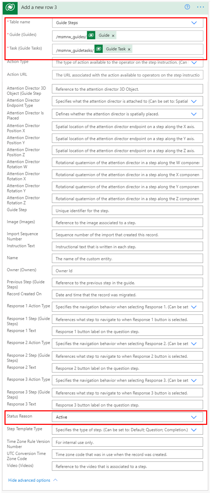

# Tables and fields required to create a guide in Power Automate

When a guide is created with the Microsoft Dynamics 365 Guides PC app, all of the guide's content (instruction text, 3D models, 3D parts, and media) is stored in [Microsoft Dataverse](https://docs.microsoft.com/powerapps/maker/data-platform/data-platform-intro). Using the out-of-the-box PC app that comes with Dynamics 365 Guides makes it easy to get started with authoring, but you can also create a guide programmatically with the [Microsoft Dataverse Web API](https://docs.microsoft.com/powerapps/developer/data-platform/webapi/overview) or a [Microsoft Power Automate flow](https://docs.microsoft.com/power-automate/getting-started#create-your-first-flow) by adding your own content in the right places in Microsoft Dataverse. This method is useful if you have existing text instructions in other systems or documents. You can just map the information to the appropriate Dataverse tables/fields to automatically generate a guide.

At minimum, the tables and fields listed in this article are required to create a guide that opens successfully in the PC app.

## Three tables required for any guide

Any basic guide requires the following three Microsoft Dataverse tables:

- Guides
- Guide Tasks
- Guide Steps

These tables must be created in order since each subsequent table refers to the other tables. In Power Automate, you add a new row to create each table. You can trigger the flow manually or automatically, depending on your scenario. 

The following screen shot shows a manually triggered flow that creates the three required tables.

> [!IMPORTANT]
> The creation of some tables requires references to other tables for a guide to open properly in the PC app. For example, the 
Guide Tasks table requires that you reference the Guides table. 
>
> To add a table reference, you must enter the table name before adding the unique identifier, as shown in the screenshot above. **Note that you must add an "s" at the end of the table name**. To determine the correct table name, see [Table (entity) reference for Dynamics 365 Guides](developer-entity-reference.md). 

## Fields required to create the Guides table

The following fields are required to create the Guides table:

|Field name|What to enter or select|
|-------------------------------|-------------------------------------------------|
|Table name|Select **Guides** from the list.|
|Name|Enter any guide name.|
|Anchor Type|Select a specific anchor type from the list or select **Undecided** if you intend to choose the anchor type in the PC app.|
|Schema Version|Enter the data schema version (currently 5). You'll need to be update this field whenever Microsoft releases a new schema version.
|Status Reason|Must be set to **Active**.|

The following screen shot shows the required fields in the Power Automate UI.

## Fields required to create the Guide Tasks table

The following fields are required to create the Guide Tasks table:

|Field name|What to enter or select|
|-------------------------------|-------------------------------------------------|
|Table name|Select **Guide Tasks** from the list.|
|Guide (Guides)|Enter the table name (**/msmrw_guides/**), and then select **Guide** from the dynamic lookup.|
|Name|Enter any task name.|
|Status Reason|Must be set to **Active**.|

The following screen shot shows the required fields in the Power Automate UI.

## Fields required to create the Guide Steps table

The following fields are required to create the Guide Steps table:

|Field name|What to enter or select|
|-------------------------------|-------------------------------------------------|
|Table name|Select **Guide Steps** from the list.|
|Guide (Guides)|Enter the table name (**/msmrw_guides/**), and then select **Guide** from the dynamic lookup.|
|Task (Guide Tasks)|Enter the table name (**/msmrw_guidetasks/**), and then select **Guide Task** from the dynamic lookup.|

> [!NOTE]
> If you programatically add more than one step to a guide, you need to populate the **Response 1 Action Type** and **Previous Step** fields so users can navigate between steps. 
>
>- If it's a default step and not a question step, set the **Response 1 Action Type** field to **Go To Next Step**.
>
> 
>
>- Populate the **Previous Step** field for the second and subsequent steps. Add the Guide Step Unique Identifier to this field. For example, the following screen shot shows the identifier passed as a stored variable. 
>
> .  

## Test your flow

When you run the flow/manually test it, a new guide will be created and visible in the Guides PC app. 

## See also

- [Table (entity) reference for Dynamics 365 Guides](developer-entity-reference.md)
