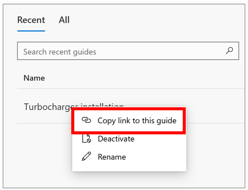
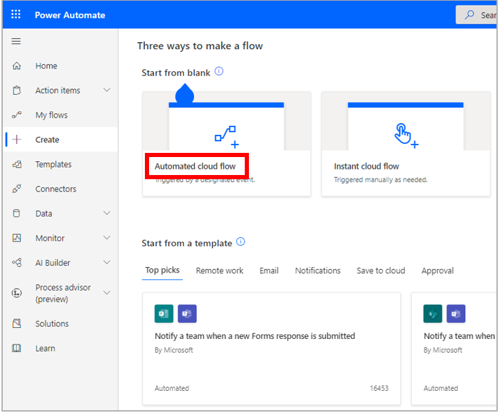
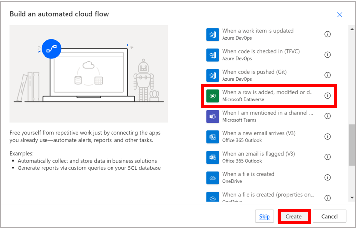
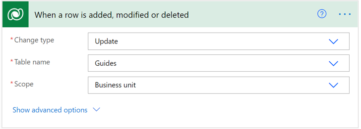
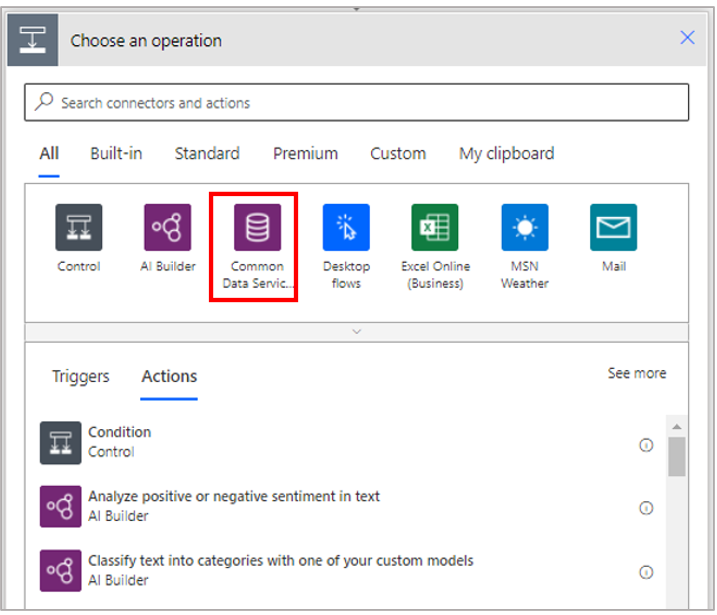
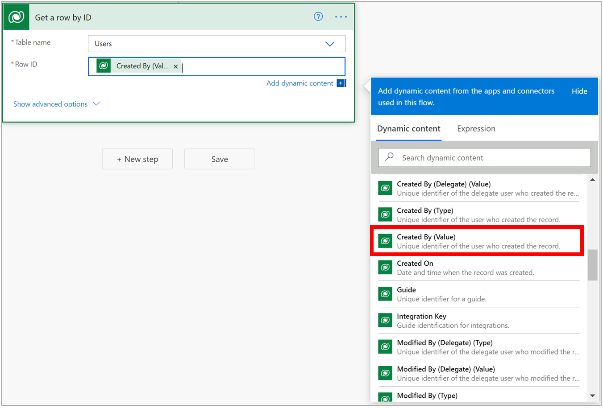
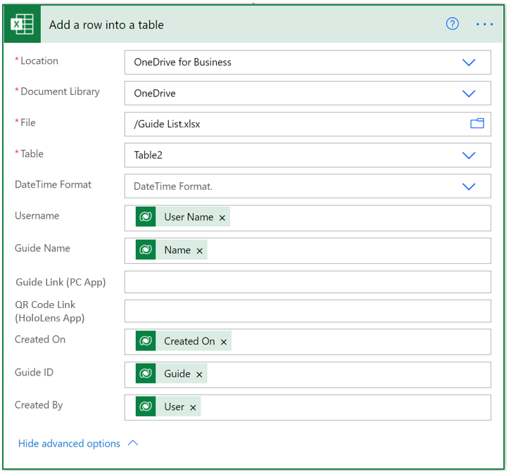

# Workflow example 1: Automatically generate Dynamics 365 Guides deep links to use in an Excel Link Manager

This example shows how to create a Link Manager in Microsoft Excel to easily keep track of your guides and launch them quickly using a PC app deep link or a HoloLens QR code deep link. The same workflow could be used for other scenarios like adding a link to a guide in an approval flow, embedding QR codes with links to guides in a work order, or in a learning management system.

The resulting Excel Link Manager for this example looks like this:

## What you'll learn in this example

In this example you’ll learn how to do three key things:

- Use Microsoft Power Automate to automatically populate a spreadsheet with content from your Dyanmics 365 Guides environment

- Automatically generate a deep link to a guide when the guide is created

- Automatically generate a QR code for the newly created guide

**Estimated time to create the Link Manager:** 10 minutes

## Create the Link Manager

Creating the Link Manager requires two basic steps:

1. Create an Excel spreadsheet with the appropriate columns and formulas.

2. Create a Power Automate flow that populates the data in the spreadsheet from Dynamics 365 Guides data stored in the Microsoft Dataverse.

## Create the Excel spreadsheet

1. Create an Excel spreadsheet that includes the columns you need for the Link Manager. Data for most of the columns will come from the Microsoft Dataverse (formerly known as Common Data Service). Two of the Excel columns will contain data concatenated from other cells in the spreadsheet. 

    The following table shows the columns to add to the spreadsheet and where the data for each column will come from. 

    |Excel column to add|Data source|
    |---------------------------------------------|----------------------------------------------|
    |User Name|	User Name (Microsoft Dataverse)|
    |Guide Name	|Name (Microsoft Dataverse)|
    |Guide Link (PC App)|	Concatenated value|
    |QR Code Link (HoloLens App)|	Concatenated value|
    |Created On	|Created On (Microsoft Dataverse)|
    |Guide ID	|Guide (Microsoft Dataverse)|
    |Created By|	User (Microsoft Dataverse)|

2. After creating the columns, select them, and then select **Insert > Table**. You'll populate this table later using the Power Automate flow.

   

### Create the concatenated value for the PC app link

To create the deep link for the PC app, you need to concatenate the deep link prefix for your instance URL with the Guide ID generated by Power Automate.

1.	To get the deeplink prefix for your instance URL, right-click any guide in the PC app, and then select **Copy link to this guide**.

    
 
2.	Copy just the prefix part of the URL to a cell in your spreadsheet (outside the area for the designated columns). For example, for the following instance URL, the yellow highlighted text is the prefix.

    

3.	In the **Guide Link (PC App)** column of the spreadsheet, add a formula that concatenates the deep link prefix with the Guide ID. For example, if you add the URL prefix in cell K1, and the Guide ID is populated in column F, the formula for the **Guide Link (PC App) column** is: 

    =HYPERLINK(CONCAT($K$1,F2))

    This concatenation will happen whenever a guide is created and will automatically generate the link.
    
### Create the concatenated value for the HoloLens app link

To create the HoloLens app link, you need to concatenate the URL api from the QR code generator with the full deep link (PC app link). The characteristics of the URL api are important. For example, here's a URL api that's good for scanning:

https://api.qrserver.com/v1/create-qr-code/?qzone=4&size=1000x1000&bgcolor=666666&&data=

The following table describes key characteristics of the above QR code.

|URL part|Description|
|-------------------------------|-------------------------------------------------------------|
|**qzone=4**|The quiet zone space from the border to the start of the QR code. It must be at least four modules.|
|**size=1000x1000**|Size of the QR code|
|**bgcolor=666666**|Background color (gray)|
|**data=**|The link to the QR code|

To concatenate this URL with the deep link in column C, if the URL api is in cell K2, add the following formula to the **QR Code Link (HoloLens app)** column:

=HYPERLINK(CONCAT($K$2,C2))

## Create the Power Automate flow

After creating the Excel spreadsheet, you’re ready to populate the data in the spreadsheet by using Power Automate.

1. In Power Automate, select **Create**, and then select **Automated cloud flow**. Automated cloud flows are used to create an automation that’s triggered by an event.

    

2. Enter a name for your flow, and then under **Choose your flow’s trigger**, scroll the list, select the **When a record is updated** trigger, and then select **Create**. 

    
 
    > [!TIP] 
    > You can filter the list of triggers by entering “data” in the **Choose your flow’s trigger** box.

3. In the **When a record is updated trigger**, select the environment where Dynamics 365 Guides is installed, select **Guides** as the entity name, and then select a scope. 

    

4. Select **New step**, and then under **Choose an operation**, select **Common Data Service** to filter the list of actions.

    
  
5. Select the **Get a row by ID** action. 

    

6. In the **Get a row by ID** action box, for the **Table name**, select **Users**, place your cursor in the **Row ID** field, and then select **Created By** from the dynamic list.

     

At this point, we’ve created a Power Automate flow that’s triggered whenever someone adds a record to the Guides table. The flow then uses the ID in the Guides table to look up the user who created the guide from the Users table. 

### Add the actions to populate the Excel spreadsheet from Microsoft Dataverse

Now you’re ready to set up the actions that populate the Excel spreadsheet columns. 

1. In the same flow, select **New step**, select **Excel Online (Business)** to filter the actions in the **Choose an operation** box, and then select **Add a row into a table**.

     selected")
  
2. In the **Add a row into a table** action, make the following selections:
 
    |Option|Description|
    |----------------------------|-------------------------------------------------------------|
    |Location|	The location of your Excel file (for example, OneDrive for Business)|
    |Document Library	|The document library where the Excel file is stored (for example, OneDrive)|
    |File	|The name of your file (for example, **Guide List.xlsx**). You can browse to select the file.|
    |Table|The table in the spreadsheet that you want to write the data to|
    |Username	|User Name|
    |Guide Name	|Name|
    |Guide Link (PC app)|	Leave blank|
    |QR code Link (HoloLens app)|	Leave blank|
    |Created On|	Created On|
    |Guide ID	|Guide|
    |Created By	|User|

    The following screen shot shows values filled in for the **Add a row into a table** action. 

    

## Idea for further customization

To further customize the Link Manager, you could set conditions in the Power Automate flow to populate a specific spreadsheet with the guides from a specific user so all of your power users have their own Link Manager to work from. 

