# Use Autodesk 3ds Max to generate 3D content for Dynamics 365 mixed reality applications

When preparing CAD files for mixed reality, there are numerous performance and quality roadblocks that prevent a smooth transition 
from CAD to real-time. 3ds Max is a digital content creation suite that has a unique ability to bridge parametric models and real-time 
polygon modeling. This topic demonstrates a workflow that utilizes 3ds Max’s conversion and optimization abilities to prepare 3D CAD 
models for use in mixed reality.  
 
> [!IMPORTANT]
> This document is created strictly for informative purposes to demonstrate how Autodesk 3ds Max works with Microsoft Dynamics 365 
Mixed Reality at Work applications. The Microsoft Corporation is not affiliated with, is not a partner to, and does not endorse or 
sponsor Autodesk or any of Autodesk’s products. 

## What is Autodesk 3ds Max?

Autodesk 3ds Max is 3d modeling and rendering software for design visualization, games, and animations. Read more 
about [Autodesk](https://www.autodesk.com/products/3ds-max/overview). 

## Import a file into 3ds Max

1. Open a new scene in 3ds Max, and then on the **File** menu, select **Import>Import** to import your 3D model. 
 
    
 
2. Check the import options to ensure the scene is imported as expected. Import settings might differ depending on the type of file you 
import. You can usually keep the default values with the following exceptions:
   
   - Set **Hierarchy Mode** to **Flatten**
    
   - Set **Mesh Resolution** somewhere between -6 and -10. If your model imports sideways, re-import it with the Up axis set to Y – Up. 

   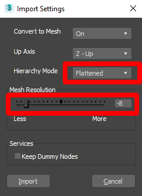   
   
## Optimize a 3D model 

If the polygon count is too high ([see Performance targets](https://docs.microsoft.com/dynamics365/mixed-reality/import-tool/optimize-models#performance-targets)), 
the model won’t perform well in mixed reality applications. You can optimize the 3D model to reduce the polygon count so the model 
performs better. To see the polygon count, first set up the viewport to show polygon statistics. 

### Show polygon statistics 
 
1. To view the number of polygons in your scene, select **+** in the upper-left corner of any viewport window to open the 
**Configure Viewports** options.  
 
    
 
   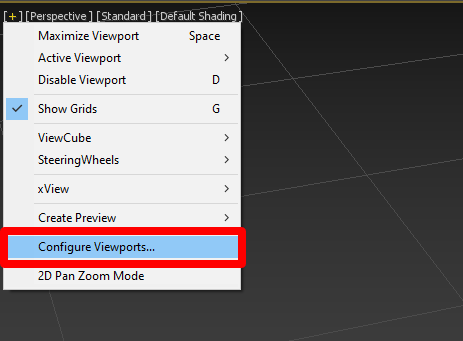 
 
2. On the **Viewport Configuration** menu, go to the **Statistics** tab. In the Setup submenu, select the **Polygon Count** check box, 
and select the **Total + Selection** radial button. In the **Application** submenu, select the **Show Statistics in Active View** 
check box.  
 
    
 
   You can now see the total poly count of your model, and the total poly count of any objects that you have selected. 
 
   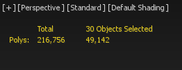 
   
### Add an Edit Poly modifier 

- Select all parts of your 3D model and apply the **Edit Poly** modifier. Adding an edit poly modifier helps eliminate shading issues that occur during the modification. 
 
   
    
### Select high poly objects

The best way to reduce the size of your model while maintaining visual fidelity is to find the objects with the highest poly count, 
and reduce them the most. Objects such as screws and grills can have thousands of polygons that are rarely seen.  

1. Go to **Select from Scene**. 
 
    
 
2. Go to **Customize>Configure Columns**. 
 
    
 
3. Drag **Faces** next to **name** to activate the column. 
 
   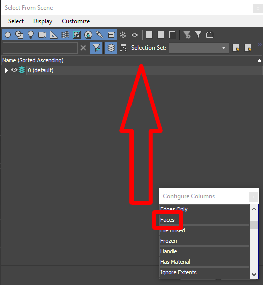 
 
4. Select the **Faces** tab a few times so that your objects are now sorted from highest face count to lowest. 

   >[!TIP]
   > You can also search at the top of this menu. If your model has lots of fillets, try searching for those. Fillets use lots of polygons and can be reduced without affecting the overall fidelity of the model. 
 
5. Select the objects with the highest face counts, and then select **OK**.   
 
    
 
   You now have the highest poly objects selected. For the example model, 136K of the 195K polygons exist in 6 objects. The next section in this topic shows how to reduce the poly count of these objects. 
   
    
   
### Reduce polygon count 

1. Go to the **Modifier List** panel located on the right side of the viewport, and then select the **Modifier List** drop-down.  

   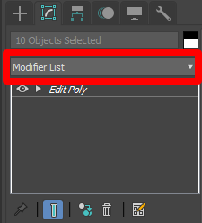 
 
2. Select **ProOptimize** from the list.   

    
  
3. Select **Calculate** to unlock the **Optimization Level** value adjustments. Try different values for **Vertex %** that range from 10 - 30% until you find the highest level of reduction that still maintains a visual fidelity that meets your standards. 
 
4. Go to **Edit -> Select Invert** and add a **Pro Optimizer** to the rest of your model. Follow the same steps as you did before, but don't go as low as 10 - 30%. Reduce these other objects until you reach a polygon count that matches the recommended [Performance targets](https://docs.microsoft.com/dynamics365/mixed-reality/import-tool/optimize-models#performance-targets) for your specific use case and still provides good visual fidelity. 
 
   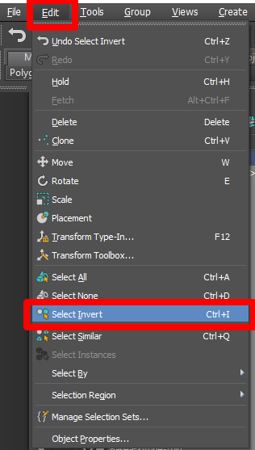 
   
   > [!TIP]
   > You can be as granular with what you reduce as you like. If there are specific parts that need higher fidelity, select them and raise the percentage value to meet your needs. Try different techniques until you find one that works best for you. 
   
## Work with curved surfaces 

When curved surfaces are present on 3D models, they might appear faceted. You can soften the appearance of these surfaces by using **Smooth**.  
 
1. On the **Edit** menu, select **Select All** to select all 3D models in the scene.  
 
   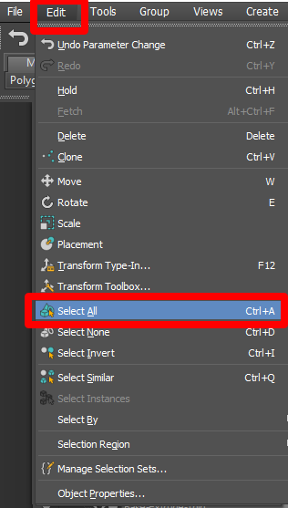 
   
2. In the **Modifier List** panel, select **Smooth** from the drop-down.  

    
 
3. Select the **Auto Smooth** check box, and then adjust the **Threshold** value until the faceted surfaces appear smooth.  The default threshold is 30.0 which is usually pretty good. 
 
   > [!NOTE]
   > You can also apply the **Smooth** modifier to individual 3D models if they each require a different threshold.  
 
At this point, your model may be optimized enough for use in mixed reality. If you think it will work fine in this form, you can skip to exporting your model as a GLB. If the model is still too complex and has lots of materials, go to the next section on texture baking. 
 
## Set up materials

Not all CAD materials are compatible with real-time applications, so they must be converted first. In this section, we’ll change the materials to a GLB-friendly material type called **Physical Material**. This material is very flexible and is compatible with mixed reality technology.  
 
> [!NOTE]
> If your 3D model has 10 or more materials, performance may be an issue. To fix this, skip to the Texture Baking section.  
 
To set up materials in 3ds Max: 
 
1. On the **Rendering** menu, select **Scene Converter**.   
 
     
 
2. In the **Scene Converter** dialog box, expand the **Materials** tab, and then select **Standard Material to Physical Material**. 

    
   
3. Select **Convert Scene**.  
 
## Add or modify existing materials

In cases where you want fine control over materials, this section shows how to apply and change material characteristics, such as color and reflection.  
 
1. On the **Rendering** menu, select **Material Editor>Compact Material Editor**. This provides control over how the materials will look. 
 
     
 
2. The **Material Editor** window includes blank material slots that appear as grey spheres. To load a slot for inspection, select the eye dropper icon near the **Global** drop-down, and then select the 3d model to look at.  
 
   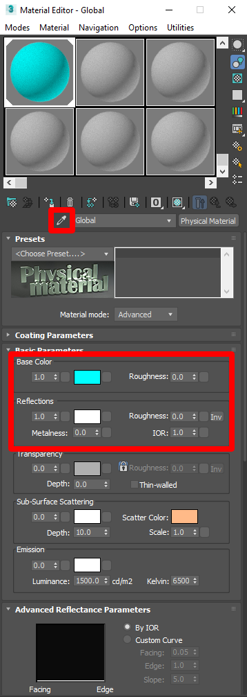 
 
   The important parameters to look at are **Base Color** and **Reflections**. **Reflections** is controlled by the **Metalness** and **Roughnes**s values — the surface finish of the material.  
 
   - To apply a material to another 3D model, drag the active material ball on top of the 3D model you want to change.  
 
     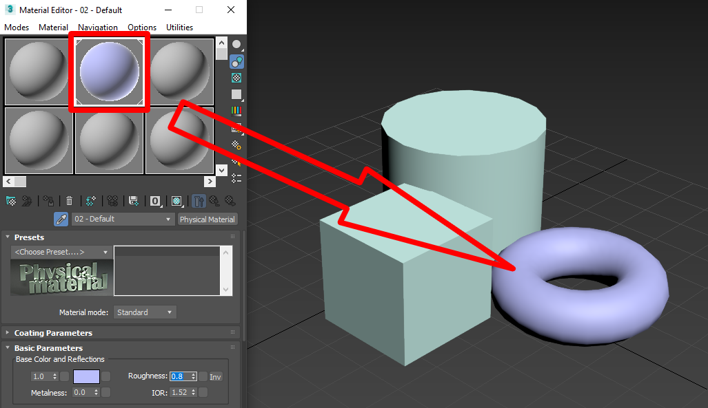 
     
   - To inspect another material, either use the eyedropper again to overwrite the current material slot, or select a new slot to easily switch back and forth between materials.  
   
## Bake textures

If there are more than ten materials on the 3D model, combining them into a single material can increase performance. You can do this by baking material colors into a single image map. This section is optional, but is a good idea if you find that you experience performance issues when viewing your 3D model. The goal is to have one object with colors as the original 3D model, and another that represents the combined 3D models to bake to. 

> [!NOTE]
> - This process only works if the materials have not yet been converted to **Physical Material**. - Baking, UVs, and texture maps are complex. The goal of this tutorial is not to make you an expert in texture baking, but to help you get through the process so that you can use your 3D models in Mixed Reality. For this reason, this tutorial doesn't go into great detail on texture baking. 

### Prepare the 3D model 

1. Choose a single object from your model Hierarchy, rename it to “Original” and add an “Edit Poly” Modifier to it. 

2. Go to the object selection.  

3. Attach all the 3D models by selecting one object and adding another **Edit Poly** modifier to it. It doesn't matter which 3D model you select.  
 
  	 

4. Under the tool menu, select the button to the right of the **Attach** button. This button shows the available models in the scene that you can combine together.  
 
    
 
5. Select all of the 3D models by going to **Edit -> Select All** again, and then select **Add**.  
 
    
 
6. When prompted, select **Match Material IDs to Material**, and then select **OK**.  
 
   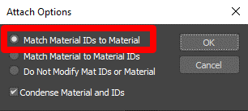 
 
   All of your individual meshes have been combined into one.  
   
7. Rename the mesh **Original** or something similar. Going forward in this tutorial, we'll refer to this mesh as the **Original** mesh. 

### Unwrap UVs 

1. Unwrap the duplicate 3D model by selecting and applying the **Unwrap UVW** modifier from the **Nodifier List** for your original mesh. Select **Polygon** in the drop-down so to edit the UV faces. 
 
    
 
2. On the **Edit UVs** tab, select **Open UV Editor**. 

   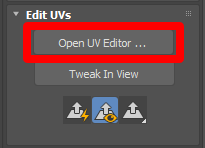 
 
3. In the **Edit UVWs** window, select **Mapping>Flatten Mapping**. In the option box that appears, give the UVs some padding by setting **Spacing** to **0.003**, select the check box for **material grouping**, and then select **OK**. 

   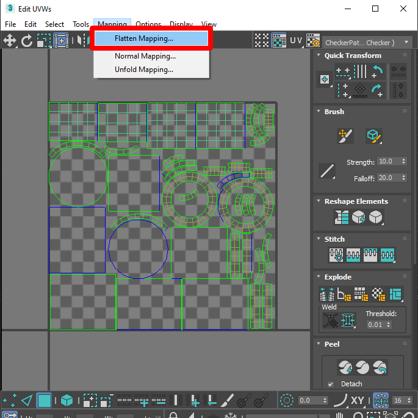 
   
   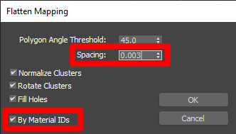 
   
### Create a copy of your original mesh 

Now that the original mesh has been prepared, you need to create a copy of it to bake the texture to. 

1. Clone all meshes/groups that comprise the original set.  

   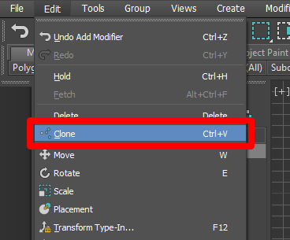 
 
2. Select **copies** and rename the object so that you know it's the cloned object. 
 
    
   
### Bake texture

1. Select the cloned mesh - the one you want to bake the texture onto. 
 
2. On the **Rendering** menu, select **Render To Texture**.

    
 
3. Set up the **Render to Texture** menu in the following ways: 
 
   a. Set the **Output** path to the location where the map will bake. You can leave the default setting if you don't have a specific destination in mind.
   
   b. Change the **Render Settings** to **3dsmax.scanline.no.advanced.lighting.high**. When you're prompted to select Preset Categories, leave them all highlighted and select **Load**.
   
       
 
   c. On the **Projection Mapping** submenu, do the following:
   
      i. Toggle **Projection Mapping** to be enabled.
      
      ii. Select **Pick**, select the original source 3D models you want to bake the color from, and then select **Add**.
      
      iii. Select the **Options** button next to the **Pick** button, and then in the method section select **UV Match** and clear **Use Cage**. 
      
      iv. Clear **Cage**. 
 
       
          
   d. Select **Use Existing Channel** and then set the channel to **1** in the **Mapping Coordinates** submenu.
   
   e. Under **Output**, select **Add**, select **DiffuseMap**,  and then select **Add Elements**.
   
   f. Select the three dots next to **File Name and Type**, and then select .png.
   
   g. In the pop up menu, select **RGB 24 bit** and clear **Alpha channel**. 
   
       
 
   h. In the **Target Map** slot, select **Base Color**. 
   
   i. Select **Automatic map size**. 
   
   j. In the **Automatic Mapping** sub-menu, select **Nearest power of 2**. 
   
   k. Once everything is set correctly, select **Render** to bake the diffuse color map. A preview window may appear, but the final map automatically saves to the Output location. 

       
 
4. If you go to the location where your .png was saved and open it, the baked map may look something like this:  
 
    
   
## Apply the texture 

1. Select **Rendering > Material Editor > Compact Material Editor** to open the Compact Material Editor.

    
 
2. Set up a new material slot in the material editor.  

3. Select one of the grey spheres and drag it to your unwrapped 3D model. At this point, the model will appear grey because it has just one material on it. 

4. Select the **Standard** button to access the material / Map Browser.

    
 
5. Select **Materials > General > Physical Material**. 
 
    
 
6. Set the **Roughness** value to **0.9** and the **Metalness** value to **0.1**. 

   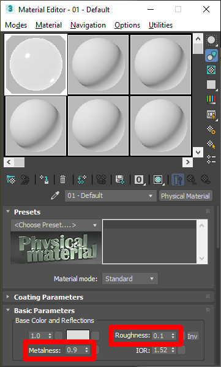 
 
7. To attach the baked color map, select the option box  next to the **Base Color and Reflections** color selector, and then select **Maps > General > Bitmap** from the list of options. 
 
   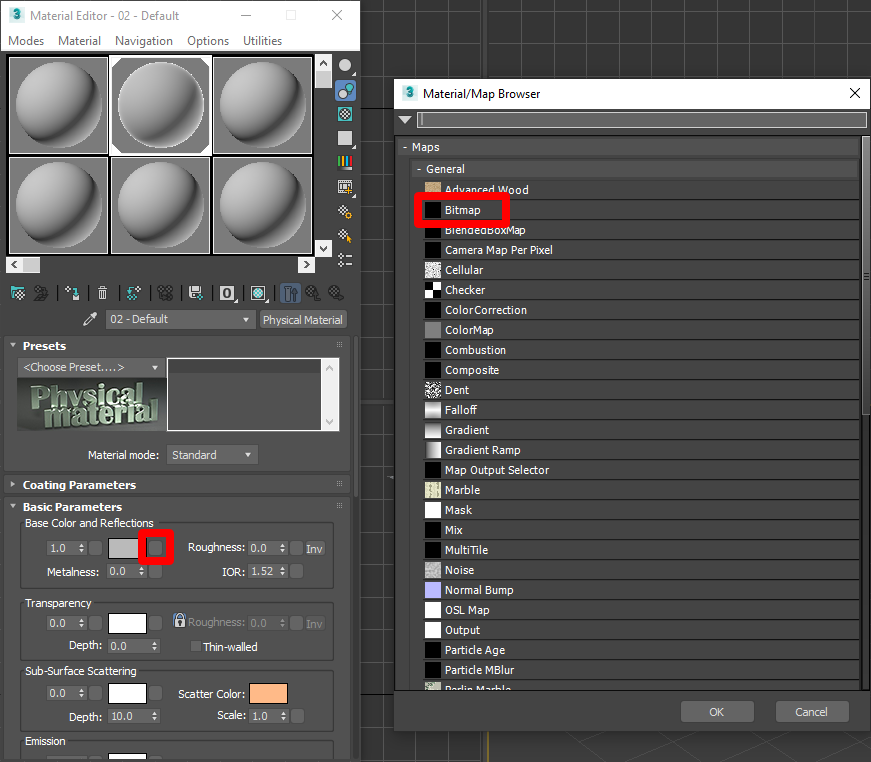 
 
8. When prompted to select the Bitmap Image File, select the texture that was created earlier. 

    
 
9. To view the new texture on the model, in the viewport, go to: **User Defined > Materials > Shaded Materials with Maps**. 
 
    
 
10. Hide the original 3D model so you can see the optimized 3D model with its texture.

    
 
## Export the 3D model 

1. Select your cloned model. 
 
2. On the **Babylon** menu, select [Babylon File Exporter](https://doc.babylonjs.com/resources/3dsmax). 

     
 
3. Make sure **glb** is selected under **Output format**, and then select the **Export only selected** option so all necessary or selected 3D models are exported.  

   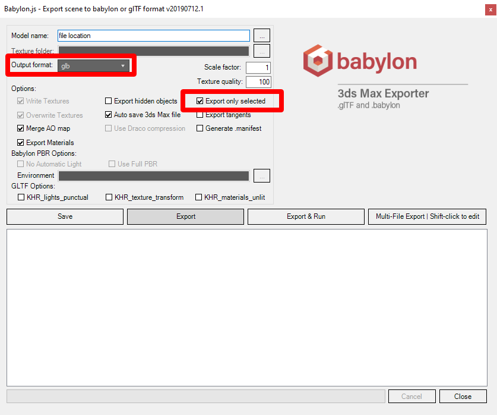 
 
4. Select **Export**. 
 
## View the 3D model in mixed reality 

After you have prepared your 3D models, you can use the following Microsoft Dynamics 365 apps to view your 3D model in mixed reality: 

- [Dynamics 365 Product Visualize](https://docs.microsoft.com/dynamics365/mixed-reality/product-visualize/admin-guide#add-a-model) 

- [Dynamics 365 Layout via Dynamics 365 Import Tool (Preview)](https://docs.microsoft.com/en-us/dynamics365/mixed-reality/import-tool/import-tool)

## For more information

Several screenshots in this document were taken from the Autodesk 3ds Max software program in order to provide clear instructions on how to use Autodesk’s software. More information about Autodesk can be found here: [Autodesk](https://www.autodesk.com/) 
 
You can find more information on these products here: 
 
[Autodesk 3ds Max](https://area.autodesk.com/crush-it-3ds-max-2/?mktvar002=759224&&mkwid=sKU4V0FKc%7cpcrid%7c300714295428%7cpkw%7cmax%203ds%7cpmt%7ce%7cpdv%7cc%7cslid%7c%7cpgrid%7c23187845595%7cptaid%7ckwd-37564256%7c&intent=3ds+Max+-+Brand&utm_medium=cpc&utm_source=google&utm_campaign=GGL_3DS+MAX_US_BR_SEM_EXACT&utm_term=max%203ds&utm_content=sKU4V0FKc%7cpcrid%7c300714295428%7cpkw%7cmax%203ds%7cpmt%7ce%7cpdv%7cc%7cslid%7c%7cpgrid%7c23187845595%7cptaid%7ckwd-37564256%7c&addisttype=g&s_kwcid=AL!8131199977!3!300714295428!e!!g!!max%203ds&gclid=EAIaIQobChMItvLZ4ZC64wIVDtRkCh1r-A0VEAAYASAAEgJhwfD_BwE&gclsrc=aw.ds)  
[Babylon Exporter for 3ds Max](https://doc.babylonjs.com/resources/3dsmax)  
[Dynamics 365 Import Tool (Preview)](https://docs.microsoft.com/dynamics365/mixed-reality/import-tool/import-tool)  
[Dynamics 365 Product Visualize ](https://dynamics.microsoft.com/mixed-reality/product-visualize/)
 
The Microsoft Corporation is not responsible for, and expressly disclaims all liability for damages of any kind arising out of the use of Autodesk 3ds Max, or reliance on these instructions. This document is created only to provide general information to our customers and does not take into consideration any individualized business plans or specifications. 
 
The use in this document of trademarked names and images is strictly for informative and descriptive purposes, and no commercial claim to their use, or suggestion of sponsorship or endorsement, is made by the Microsoft Corporation.  
